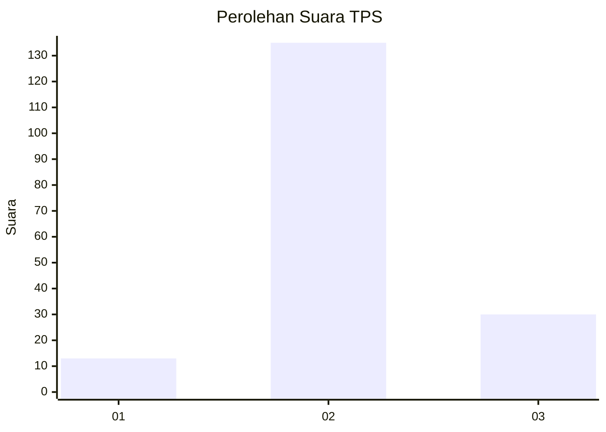
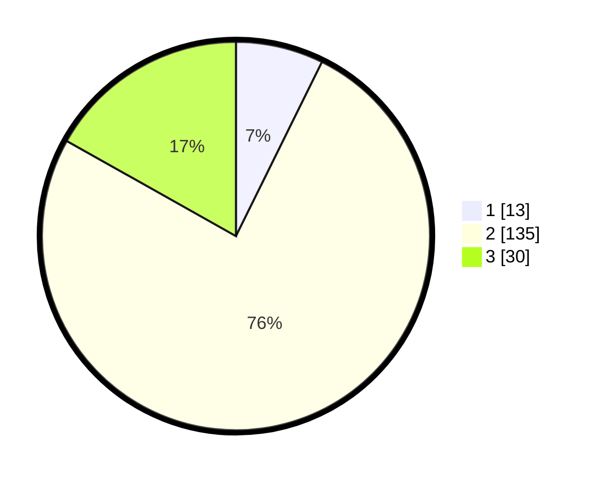

# Hasil

## Grafik

## Tabel

| No. | Nama Paslon    | Suara | Suara (raw) | Persentase |
|:--- |:-------------- | -----:| -----------:| ----------:|
| 1   | ANIES MUHAIMIN | 13    | [13][p-1]   | 7,30       |
| 2   | PRABOWO GIBRAN | 135   | [135][p-2]  | 75,84      |
| 3   | GANJAR MAHFUD  | 30    | [30][p-3]   | 16,85      |

[p-1]: https://github.com/gigit-pemilu/pemilu-2024/blob/main/pilpres/hitung-suara/sub/35-jawa-timur/sub/09-jember/sub/01-jombang/sub/2006-sarimulyo/sub/006-tps/sub/paslon-1.txt
[p-2]: https://github.com/gigit-pemilu/pemilu-2024/blob/main/pilpres/hitung-suara/sub/35-jawa-timur/sub/09-jember/sub/01-jombang/sub/2006-sarimulyo/sub/006-tps/sub/paslon-2.txt
[p-3]: https://github.com/gigit-pemilu/pemilu-2024/blob/main/pilpres/hitung-suara/sub/35-jawa-timur/sub/09-jember/sub/01-jombang/sub/2006-sarimulyo/sub/006-tps/sub/paslon-3.txt

## Foto C Plano

https://sirekap-obj-formc.kpu.go.id/c60c/pemilu/ppwp/35/09/01/20/06/3509012006006-20240215-015847--9a34c12e-38b6-4efe-8e97-79fdf5488c57.jpg

https://sirekap-obj-formc.kpu.go.id/c60c/pemilu/ppwp/35/09/01/20/06/3509012006006-20240215-004417--0ca1dcdd-d7ba-46a5-8d5f-afcfcc2a6d09.jpg

https://sirekap-obj-formc.kpu.go.id/c60c/pemilu/ppwp/35/09/01/20/06/3509012006006-20240215-020108--9b2dc9a7-feba-4e46-a10b-51ab0242b104.jpg

## Metadata

| Key        | Value               |
| ---------- | ------------------- |
| Time Stamp | 2024-02-16 01:00:27 |

