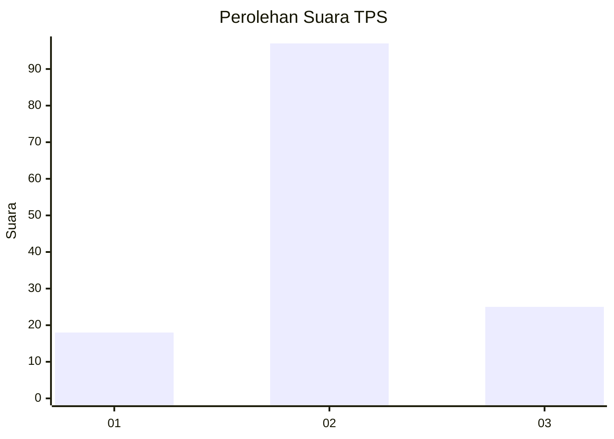
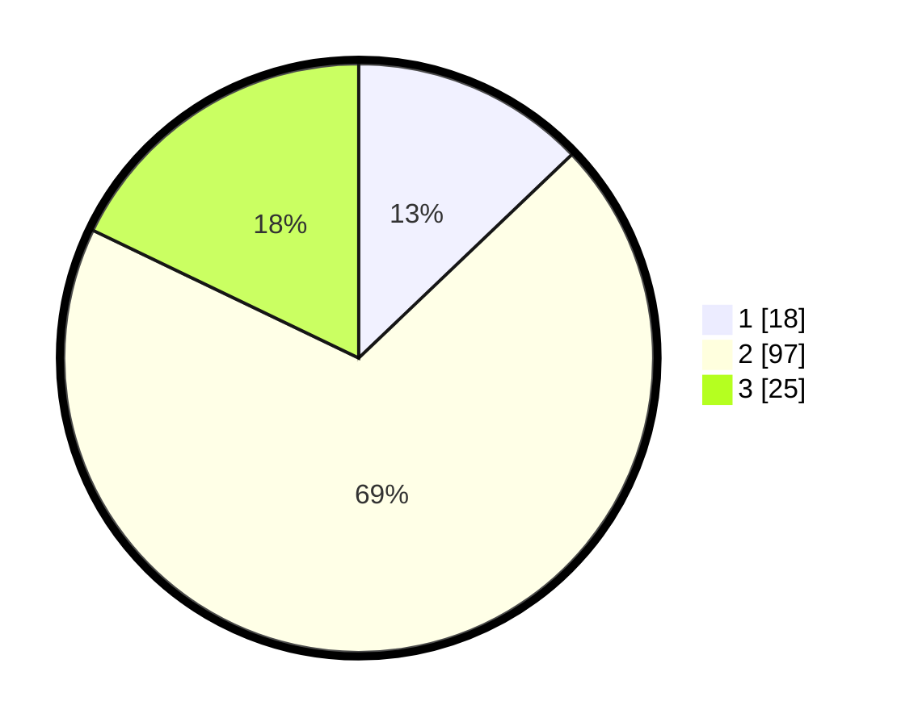

# Hasil

## Grafik

## Tabel

| No. | Nama Paslon    | Suara | Suara (raw) | Persentase |
|:--- |:-------------- | -----:| -----------:| ----------:|
| 1   | ANIES MUHAIMIN | 18    | [18][p-1]   | 12,86      |
| 2   | PRABOWO GIBRAN | 97    | [97][p-2]   | 69,29      |
| 3   | GANJAR MAHFUD  | 25    | [25][p-3]   | 17,86      |

[p-1]: https://github.com/gigit-pemilu/pemilu-2024-35-jawa-timur/blob/main/pilpres/hitung-suara/sub/35-jawa-timur/sub/09-jember/sub/01-jombang/sub/2006-sarimulyo/sub/007-tps/sub/paslon-1.txt
[p-2]: https://github.com/gigit-pemilu/pemilu-2024-35-jawa-timur/blob/main/pilpres/hitung-suara/sub/35-jawa-timur/sub/09-jember/sub/01-jombang/sub/2006-sarimulyo/sub/007-tps/sub/paslon-2.txt
[p-3]: https://github.com/gigit-pemilu/pemilu-2024-35-jawa-timur/blob/main/pilpres/hitung-suara/sub/35-jawa-timur/sub/09-jember/sub/01-jombang/sub/2006-sarimulyo/sub/007-tps/sub/paslon-3.txt

## Foto C Plano

https://sirekap-obj-formc.kpu.go.id/86a1/pemilu/ppwp/35/09/01/20/06/3509012006007-20240215-004932--e5eb7a86-9737-41c1-b915-ca572b1ecdc9.jpg

https://sirekap-obj-formc.kpu.go.id/86a1/pemilu/ppwp/35/09/01/20/06/3509012006007-20240215-005555--c88fd9f5-cd41-4b25-8886-cf83990eddbf.jpg

https://sirekap-obj-formc.kpu.go.id/86a1/pemilu/ppwp/35/09/01/20/06/3509012006007-20240215-005739--97dd63cf-ba65-47d4-8432-aa7b5c32b196.jpg

## Metadata

| Key        | Value               |
| ---------- | ------------------- |
| Time Stamp | 2024-02-15 12:00:28 |

