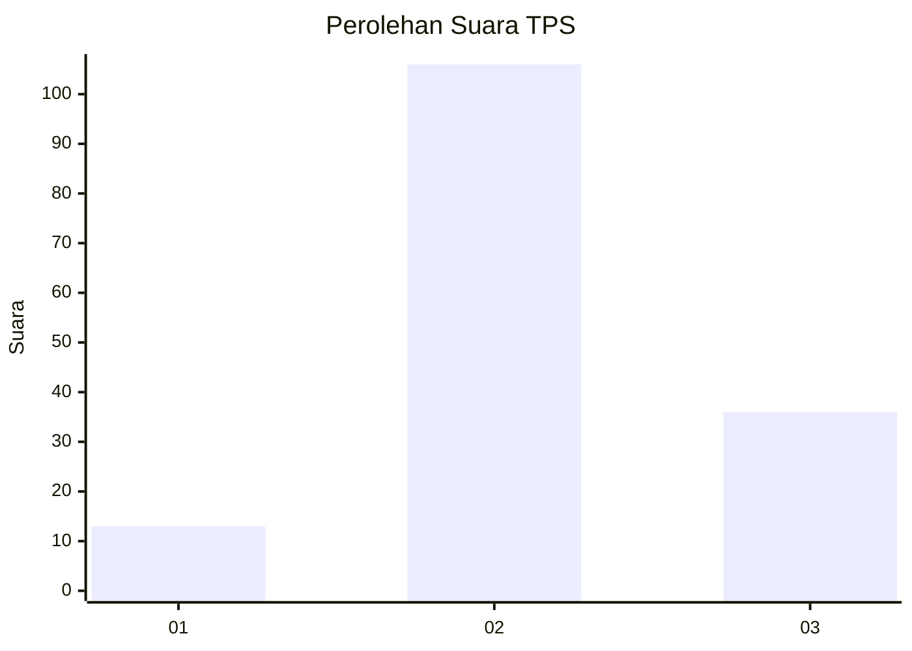
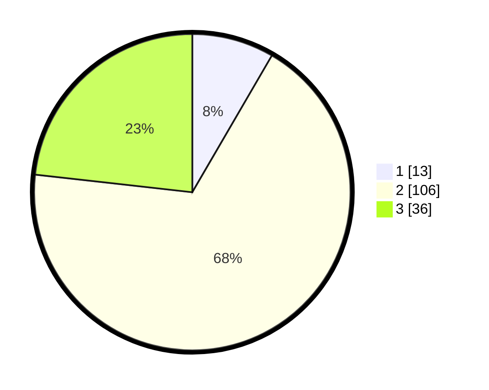

# Hasil

## Grafik

## Tabel

| No. | Nama Paslon    | Suara | Suara (raw) | Persentase |
|:--- |:-------------- | -----:| -----------:| ----------:|
| 1   | ANIES MUHAIMIN | 13    | [13][p-1]   | 8,39       |
| 2   | PRABOWO GIBRAN | 106   | [106][p-2]  | 68,39      |
| 3   | GANJAR MAHFUD  | 36    | [36][p-3]   | 23,23      |

[p-1]: https://github.com/gigit-pemilu/pemilu-2024-35-jawa-timur/blob/main/pilpres/hitung-suara/sub/35-jawa-timur/sub/09-jember/sub/01-jombang/sub/2006-sarimulyo/sub/008-tps/sub/paslon-1.txt
[p-2]: https://github.com/gigit-pemilu/pemilu-2024-35-jawa-timur/blob/main/pilpres/hitung-suara/sub/35-jawa-timur/sub/09-jember/sub/01-jombang/sub/2006-sarimulyo/sub/008-tps/sub/paslon-2.txt
[p-3]: https://github.com/gigit-pemilu/pemilu-2024-35-jawa-timur/blob/main/pilpres/hitung-suara/sub/35-jawa-timur/sub/09-jember/sub/01-jombang/sub/2006-sarimulyo/sub/008-tps/sub/paslon-3.txt

## Foto C Plano

https://sirekap-obj-formc.kpu.go.id/3658/pemilu/ppwp/35/09/01/20/06/3509012006008-20240215-012348--9fdd10c9-f35f-4f88-9c02-ec99529c46d9.jpg

https://sirekap-obj-formc.kpu.go.id/3658/pemilu/ppwp/35/09/01/20/06/3509012006008-20240215-012440--a24c19be-328f-4788-b0d8-88bbfa08b87f.jpg

https://sirekap-obj-formc.kpu.go.id/3658/pemilu/ppwp/35/09/01/20/06/3509012006008-20240215-012528--4d4f62c5-e0f1-4522-b523-c1c1451c5a25.jpg

## Metadata

| Key        | Value               |
| ---------- | ------------------- |
| Time Stamp | 2024-02-15 15:00:29 |

