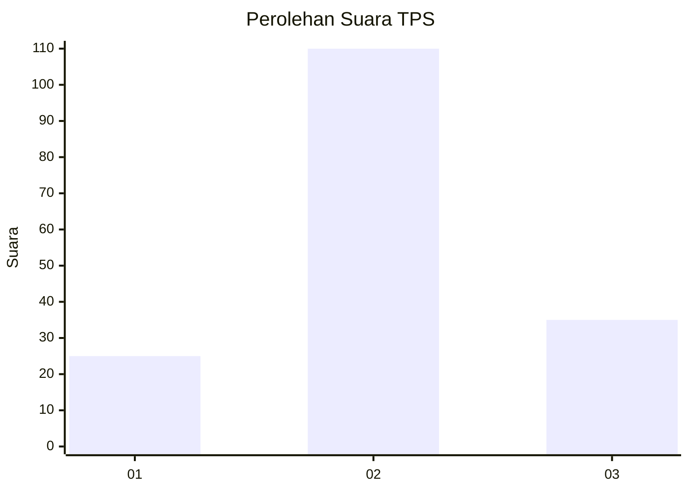
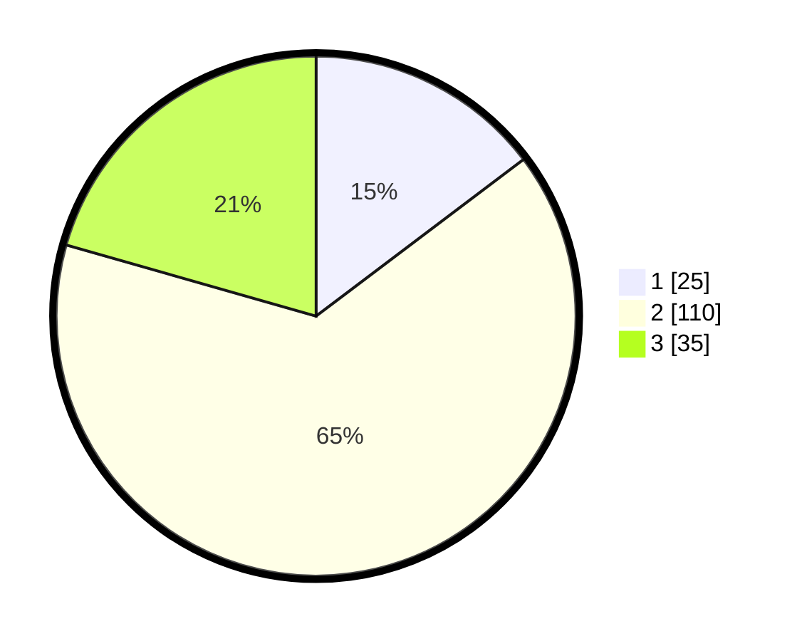

# Hasil

## Grafik

## Tabel

| No. | Nama Paslon    | Suara | Suara (raw) | Persentase |
|:--- |:-------------- | -----:| -----------:| ----------:|
| 1   | ANIES MUHAIMIN | 25    | [25][p-1]   | 14,71      |
| 2   | PRABOWO GIBRAN | 110   | [110][p-2]  | 64,71      |
| 3   | GANJAR MAHFUD  | 35    | [35][p-3]   | 20,59      |

[p-1]: https://github.com/gigit-pemilu/pemilu-2024/blob/main/pilpres/hitung-suara/sub/35-jawa-timur/sub/09-jember/sub/01-jombang/sub/2006-sarimulyo/sub/009-tps/sub/paslon-1.txt
[p-2]: https://github.com/gigit-pemilu/pemilu-2024/blob/main/pilpres/hitung-suara/sub/35-jawa-timur/sub/09-jember/sub/01-jombang/sub/2006-sarimulyo/sub/009-tps/sub/paslon-2.txt
[p-3]: https://github.com/gigit-pemilu/pemilu-2024/blob/main/pilpres/hitung-suara/sub/35-jawa-timur/sub/09-jember/sub/01-jombang/sub/2006-sarimulyo/sub/009-tps/sub/paslon-3.txt

## Foto C Plano

https://sirekap-obj-formc.kpu.go.id/8bc7/pemilu/ppwp/35/09/01/20/06/3509012006009-20240215-025931--df33869f-7da4-4911-8027-56c3978e9f42.jpg

https://sirekap-obj-formc.kpu.go.id/8bc7/pemilu/ppwp/35/09/01/20/06/3509012006009-20240215-030052--6924a6b7-ceb0-409e-bd65-9f0d6c3ae7c0.jpg

https://sirekap-obj-formc.kpu.go.id/8bc7/pemilu/ppwp/35/09/01/20/06/3509012006009-20240215-030154--7de41441-023f-4727-918c-dea3be83c18a.jpg

## Metadata

| Key        | Value               |
| ---------- | ------------------- |
| Time Stamp | 2024-02-16 11:00:29 |

