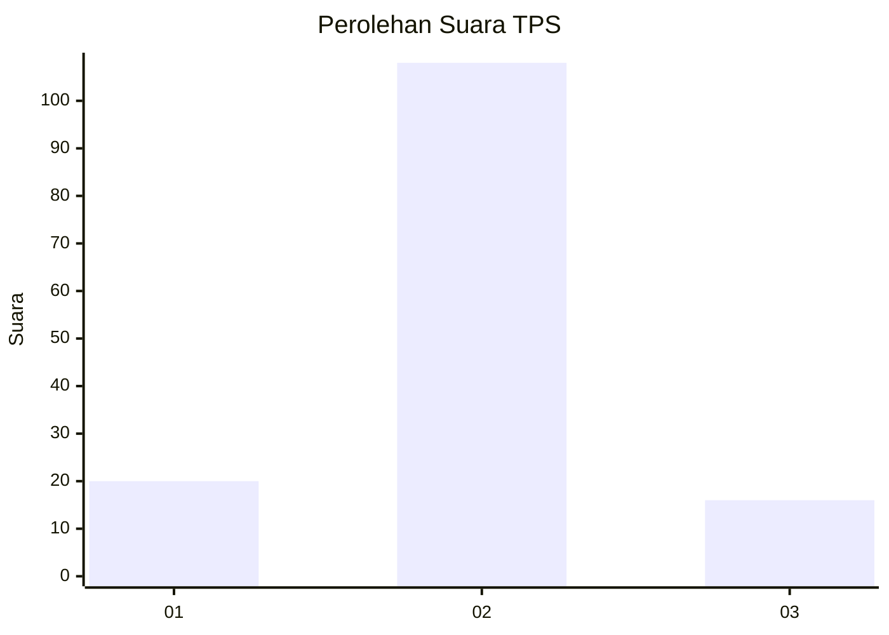
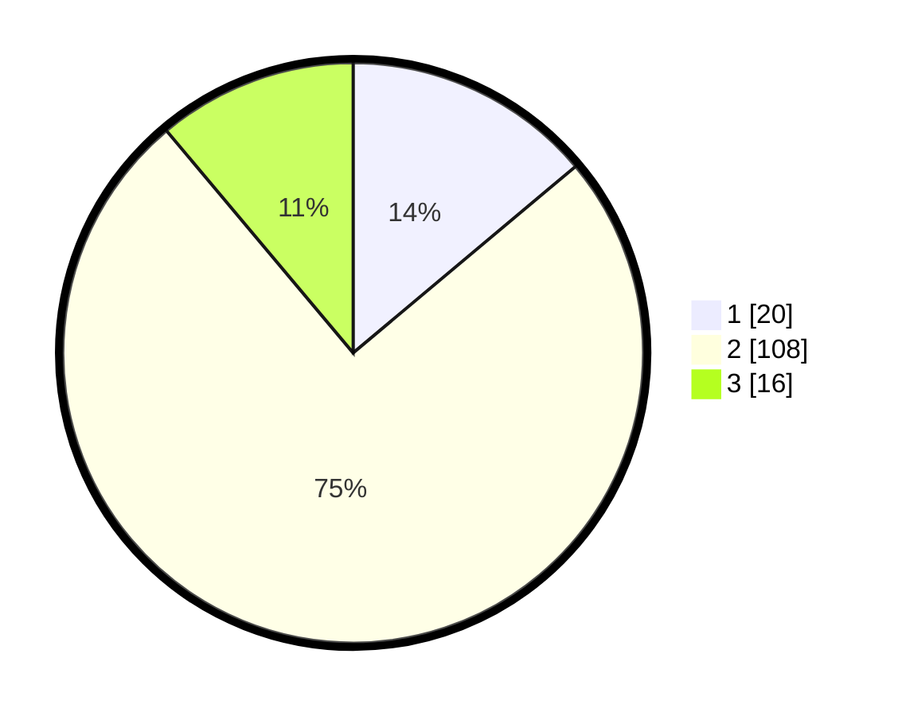

# Hasil

## Grafik

## Tabel

| No. | Nama Paslon    | Suara | Suara (raw) | Persentase |
|:--- |:-------------- | -----:| -----------:| ----------:|
| 1   | ANIES MUHAIMIN | 20    | [20][p-1]   | 13,89      |
| 2   | PRABOWO GIBRAN | 108   | [108][p-2]  | 75,00      |
| 3   | GANJAR MAHFUD  | 16    | [16][p-3]   | 11,11      |

[p-1]: https://github.com/gigit-pemilu/pemilu-2024-35-jawa-timur/blob/main/pilpres/hitung-suara/sub/35-jawa-timur/sub/09-jember/sub/01-jombang/sub/2006-sarimulyo/sub/011-tps/sub/paslon-1.txt
[p-2]: https://github.com/gigit-pemilu/pemilu-2024-35-jawa-timur/blob/main/pilpres/hitung-suara/sub/35-jawa-timur/sub/09-jember/sub/01-jombang/sub/2006-sarimulyo/sub/011-tps/sub/paslon-2.txt
[p-3]: https://github.com/gigit-pemilu/pemilu-2024-35-jawa-timur/blob/main/pilpres/hitung-suara/sub/35-jawa-timur/sub/09-jember/sub/01-jombang/sub/2006-sarimulyo/sub/011-tps/sub/paslon-3.txt

## Foto C Plano

https://sirekap-obj-formc.kpu.go.id/b70f/pemilu/ppwp/35/09/01/20/06/3509012006011-20240215-002054--6230894b-2066-4f52-b412-e9638a351049.jpg

https://sirekap-obj-formc.kpu.go.id/b70f/pemilu/ppwp/35/09/01/20/06/3509012006011-20240215-002520--e62f440f-1e6c-4a60-b96b-ebd82f7cc101.jpg

https://sirekap-obj-formc.kpu.go.id/b70f/pemilu/ppwp/35/09/01/20/06/3509012006011-20240215-002613--445aaa9a-f3d6-4ee6-8812-ca7aabe4a980.jpg

## Metadata

| Key        | Value               |
| ---------- | ------------------- |
| Time Stamp | 2024-02-15 15:30:25 |

