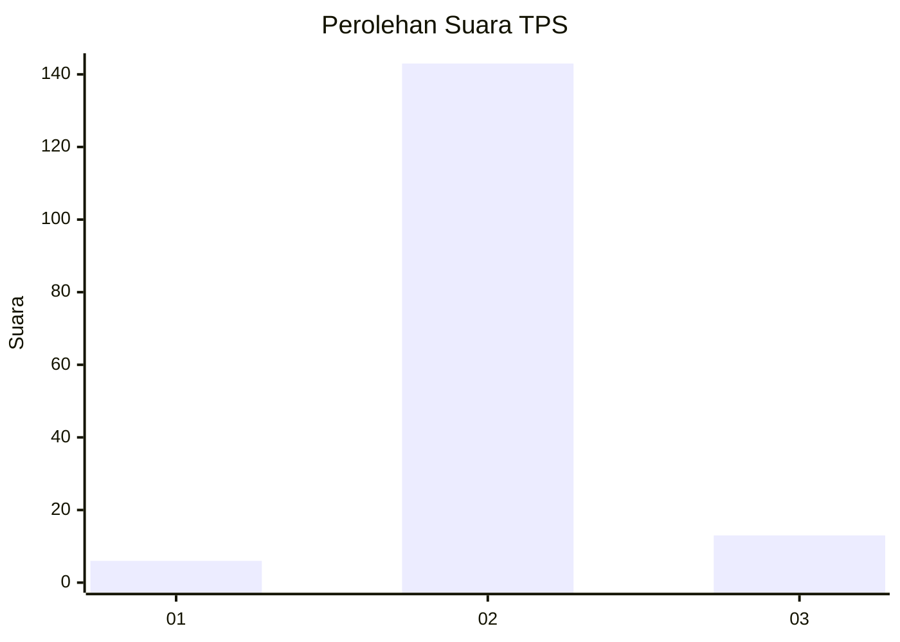
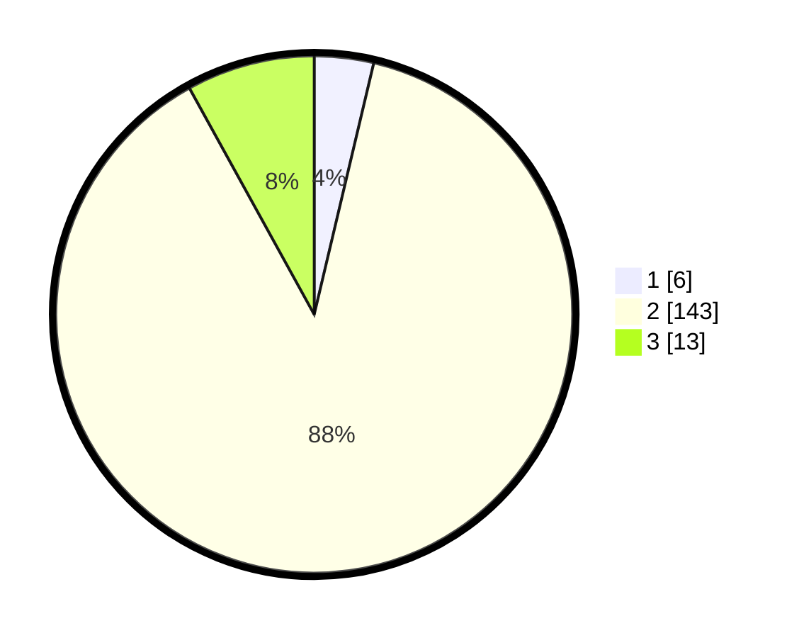

# Hasil

## Grafik

## Tabel

| No. | Nama Paslon    | Suara | Suara (raw) | Persentase |
|:--- |:-------------- | -----:| -----------:| ----------:|
| 1   | ANIES MUHAIMIN | 6     | [6][p-1]    | 3,70       |
| 2   | PRABOWO GIBRAN | 143   | [143][p-2]  | 88,27      |
| 3   | GANJAR MAHFUD  | 13    | [13][p-3]   | 8,02       |

[p-1]: https://github.com/gigit-pemilu/pemilu-2024-35-jawa-timur/blob/main/pilpres/hitung-suara/sub/35-jawa-timur/sub/09-jember/sub/01-jombang/sub/2006-sarimulyo/sub/012-tps/sub/paslon-1.txt
[p-2]: https://github.com/gigit-pemilu/pemilu-2024-35-jawa-timur/blob/main/pilpres/hitung-suara/sub/35-jawa-timur/sub/09-jember/sub/01-jombang/sub/2006-sarimulyo/sub/012-tps/sub/paslon-2.txt
[p-3]: https://github.com/gigit-pemilu/pemilu-2024-35-jawa-timur/blob/main/pilpres/hitung-suara/sub/35-jawa-timur/sub/09-jember/sub/01-jombang/sub/2006-sarimulyo/sub/012-tps/sub/paslon-3.txt

## Foto C Plano

https://sirekap-obj-formc.kpu.go.id/08c2/pemilu/ppwp/35/09/01/20/06/3509012006012-20240215-012954--1193ea32-2b2c-4798-8ed3-d1c451d5ee8f.jpg

https://sirekap-obj-formc.kpu.go.id/08c2/pemilu/ppwp/35/09/01/20/06/3509012006012-20240215-013040--5f6aa65b-7cc9-4f66-a0ed-e62109b8e576.jpg

https://sirekap-obj-formc.kpu.go.id/08c2/pemilu/ppwp/35/09/01/20/06/3509012006012-20240215-013136--67180a5e-1638-4816-b3fe-3262f77d7f83.jpg

## Metadata

| Key        | Value               |
| ---------- | ------------------- |
| Time Stamp | 2024-02-15 15:30:25 |

