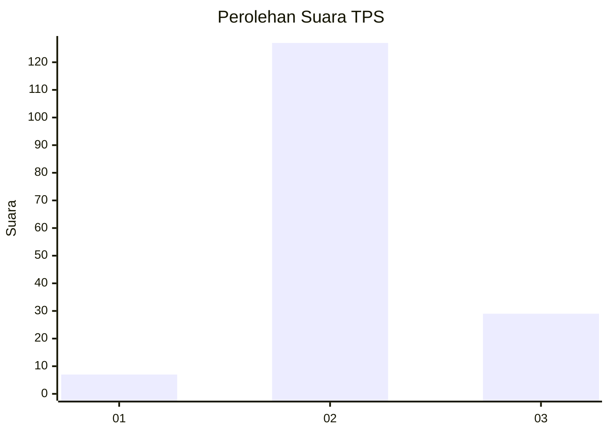

# Hasil

## Grafik

## Tabel

| No. | Nama Paslon    | Suara | Suara (raw) | Persentase |
|:--- |:-------------- | -----:| -----------:| ----------:|
| 1   | ANIES MUHAIMIN | 7     | [7][p-1]    | 4,29       |
| 2   | PRABOWO GIBRAN | 127   | [127][p-2]  | 77,91      |
| 3   | GANJAR MAHFUD  | 29    | [29][p-3]   | 17,79      |

[p-1]: https://github.com/gigit-pemilu/pemilu-2024-35-jawa-timur/blob/main/pilpres/hitung-suara/sub/35-jawa-timur/sub/09-jember/sub/01-jombang/sub/2006-sarimulyo/sub/013-tps/sub/paslon-1.txt
[p-2]: https://github.com/gigit-pemilu/pemilu-2024-35-jawa-timur/blob/main/pilpres/hitung-suara/sub/35-jawa-timur/sub/09-jember/sub/01-jombang/sub/2006-sarimulyo/sub/013-tps/sub/paslon-2.txt
[p-3]: https://github.com/gigit-pemilu/pemilu-2024-35-jawa-timur/blob/main/pilpres/hitung-suara/sub/35-jawa-timur/sub/09-jember/sub/01-jombang/sub/2006-sarimulyo/sub/013-tps/sub/paslon-3.txt

## Foto C Plano

https://sirekap-obj-formc.kpu.go.id/6383/pemilu/ppwp/35/09/01/20/06/3509012006013-20240214-234202--d8875e29-8b97-4025-856f-176145f74cf0.jpg

https://sirekap-obj-formc.kpu.go.id/6383/pemilu/ppwp/35/09/01/20/06/3509012006013-20240215-000246--6d92f831-8ebe-4781-bdf8-8fcbe36aa46e.jpg

https://sirekap-obj-formc.kpu.go.id/6383/pemilu/ppwp/35/09/01/20/06/3509012006013-20240214-234445--4b492db5-74b6-4d81-ac66-29278d9ce14d.jpg

## Metadata

| Key        | Value               |
| ---------- | ------------------- |
| Time Stamp | 2024-02-15 15:30:25 |

