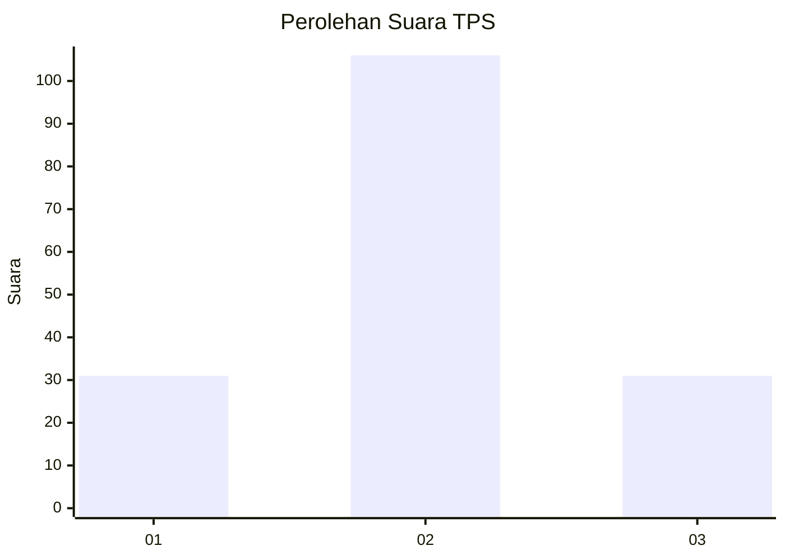
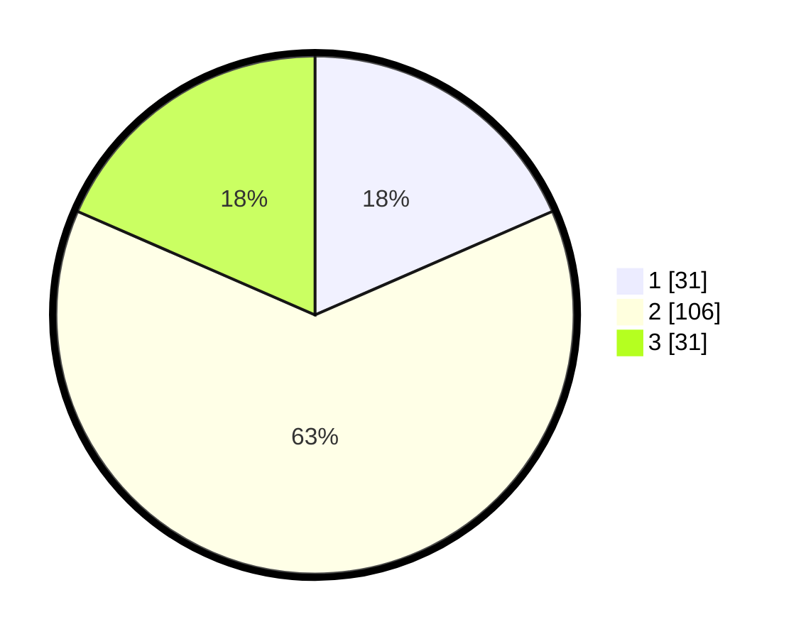

# Hasil

## Grafik

## Tabel

| No. | Nama Paslon    | Suara | Suara (raw) | Persentase |
|:--- |:-------------- | -----:| -----------:| ----------:|
| 1   | ANIES MUHAIMIN | 31    | [31][p-1]   | 18,45      |
| 2   | PRABOWO GIBRAN | 106   | [106][p-2]  | 63,10      |
| 3   | GANJAR MAHFUD  | 31    | [31][p-3]   | 18,45      |

[p-1]: https://github.com/gigit-pemilu/pemilu-2024-35-jawa-timur/blob/main/pilpres/hitung-suara/sub/35-jawa-timur/sub/09-jember/sub/02-kencong/sub/2003-kraton/sub/024-tps/sub/paslon-1.txt
[p-2]: https://github.com/gigit-pemilu/pemilu-2024-35-jawa-timur/blob/main/pilpres/hitung-suara/sub/35-jawa-timur/sub/09-jember/sub/02-kencong/sub/2003-kraton/sub/024-tps/sub/paslon-2.txt
[p-3]: https://github.com/gigit-pemilu/pemilu-2024-35-jawa-timur/blob/main/pilpres/hitung-suara/sub/35-jawa-timur/sub/09-jember/sub/02-kencong/sub/2003-kraton/sub/024-tps/sub/paslon-3.txt

## Foto C Plano

https://sirekap-obj-formc.kpu.go.id/057a/pemilu/ppwp/35/09/02/20/03/3509022003024-20240214-221354--9bfa79dd-056f-42ee-85c9-8eef613ec1e9.jpg

https://sirekap-obj-formc.kpu.go.id/057a/pemilu/ppwp/35/09/02/20/03/3509022003024-20240214-221238--205b46de-e4f5-4e4c-a520-dcd813600fe4.jpg

https://sirekap-obj-formc.kpu.go.id/057a/pemilu/ppwp/35/09/02/20/03/3509022003024-20240214-221437--60d469c3-49af-4a76-9a2f-e5bf8861e931.jpg

## Metadata

| Key        | Value               |
| ---------- | ------------------- |
| Time Stamp | 2024-02-15 12:00:28 |

