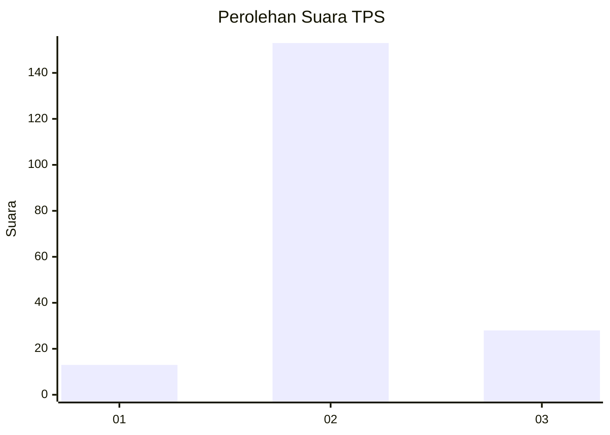

# Hasil

## Grafik

## Tabel

| No. | Nama Paslon    | Suara | Suara (raw) | Persentase |
|:--- |:-------------- | -----:| -----------:| ----------:|
| 1   | ANIES MUHAIMIN | 13    | [13][p-1]   | 6,70       |
| 2   | PRABOWO GIBRAN | 153   | [153][p-2]  | 78,87      |
| 3   | GANJAR MAHFUD  | 28    | [28][p-3]   | 14,43      |

[p-1]: https://github.com/gigit-pemilu/pemilu-2024/blob/main/pilpres/hitung-suara/sub/35-jawa-timur/sub/09-jember/sub/02-kencong/sub/2003-kraton/sub/025-tps/sub/paslon-1.txt
[p-2]: https://github.com/gigit-pemilu/pemilu-2024/blob/main/pilpres/hitung-suara/sub/35-jawa-timur/sub/09-jember/sub/02-kencong/sub/2003-kraton/sub/025-tps/sub/paslon-2.txt
[p-3]: https://github.com/gigit-pemilu/pemilu-2024/blob/main/pilpres/hitung-suara/sub/35-jawa-timur/sub/09-jember/sub/02-kencong/sub/2003-kraton/sub/025-tps/sub/paslon-3.txt

## Foto C Plano

https://sirekap-obj-formc.kpu.go.id/7b3b/pemilu/ppwp/35/09/02/20/03/3509022003025-20240216-205123--d7de9f41-1b1f-4578-bb3f-c229d1735bdb.jpg

https://sirekap-obj-formc.kpu.go.id/7b3b/pemilu/ppwp/35/09/02/20/03/3509022003025-20240216-231910--56674816-d636-45ca-a36a-ab371b04f426.jpg

https://sirekap-obj-formc.kpu.go.id/7b3b/pemilu/ppwp/35/09/02/20/03/3509022003025-20240216-205139--2d5ec892-5e5e-42f8-a429-b07297324947.jpg

## Metadata

| Key        | Value               |
| ---------- | ------------------- |
| Time Stamp | 2024-02-19 06:16:00 |

