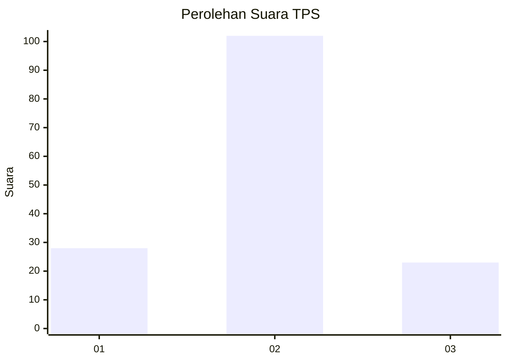
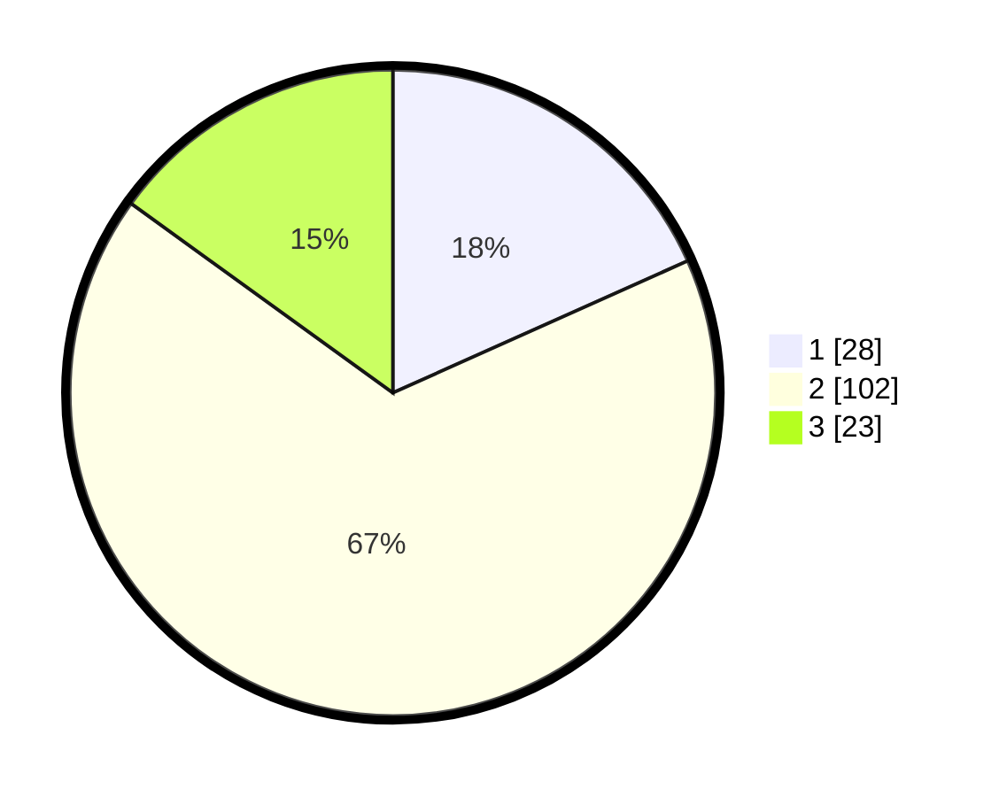

# Hasil

## Grafik

## Tabel

| No. | Nama Paslon    | Suara | Suara (raw) | Persentase |
|:--- |:-------------- | -----:| -----------:| ----------:|
| 1   | ANIES MUHAIMIN | 28    | [28][p-1]   | 18,30      |
| 2   | PRABOWO GIBRAN | 102   | [102][p-2]  | 66,67      |
| 3   | GANJAR MAHFUD  | 23    | [23][p-3]   | 15,03      |

[p-1]: https://github.com/gigit-pemilu/pemilu-2024-35-jawa-timur/blob/main/pilpres/hitung-suara/sub/35-jawa-timur/sub/09-jember/sub/02-kencong/sub/2004-kencong/sub/049-tps/sub/paslon-1.txt
[p-2]: https://github.com/gigit-pemilu/pemilu-2024-35-jawa-timur/blob/main/pilpres/hitung-suara/sub/35-jawa-timur/sub/09-jember/sub/02-kencong/sub/2004-kencong/sub/049-tps/sub/paslon-2.txt
[p-3]: https://github.com/gigit-pemilu/pemilu-2024-35-jawa-timur/blob/main/pilpres/hitung-suara/sub/35-jawa-timur/sub/09-jember/sub/02-kencong/sub/2004-kencong/sub/049-tps/sub/paslon-3.txt

## Foto C Plano

https://sirekap-obj-formc.kpu.go.id/9097/pemilu/ppwp/35/09/02/20/04/3509022004049-20240214-215139--bb3bd38e-be51-4d8a-b6a4-9d782d5f3a86.jpg

https://sirekap-obj-formc.kpu.go.id/9097/pemilu/ppwp/35/09/02/20/04/3509022004049-20240214-221926--7006f55f-f8fa-4d5b-be36-8965419a24ab.jpg

https://sirekap-obj-formc.kpu.go.id/9097/pemilu/ppwp/35/09/02/20/04/3509022004049-20240214-220442--71323462-4c43-4938-b95b-cf818d0c0351.jpg

## Metadata

| Key        | Value               |
| ---------- | ------------------- |
| Time Stamp | 2024-02-15 12:00:28 |

