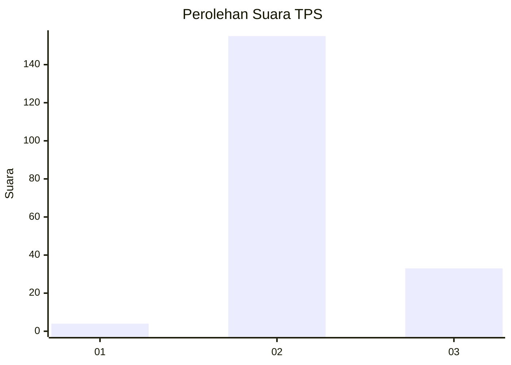

# Hasil

## Grafik

## Tabel

| No. | Nama Paslon    | Suara | Suara (raw) | Persentase |
|:--- |:-------------- | -----:| -----------:| ----------:|
| 1   | ANIES MUHAIMIN | 4     | [4][p-1]    | 2,08       |
| 2   | PRABOWO GIBRAN | 155   | [155][p-2]  | 80,73      |
| 3   | GANJAR MAHFUD  | 33    | [33][p-3]   | 17,19      |

[p-1]: https://github.com/gigit-pemilu/pemilu-2024/blob/main/pilpres/hitung-suara/sub/35-jawa-timur/sub/09-jember/sub/02-kencong/sub/2004-kencong/sub/079-tps/sub/paslon-1.txt
[p-2]: https://github.com/gigit-pemilu/pemilu-2024/blob/main/pilpres/hitung-suara/sub/35-jawa-timur/sub/09-jember/sub/02-kencong/sub/2004-kencong/sub/079-tps/sub/paslon-2.txt
[p-3]: https://github.com/gigit-pemilu/pemilu-2024/blob/main/pilpres/hitung-suara/sub/35-jawa-timur/sub/09-jember/sub/02-kencong/sub/2004-kencong/sub/079-tps/sub/paslon-3.txt

## Foto C Plano

https://sirekap-obj-formc.kpu.go.id/8f04/pemilu/ppwp/35/09/02/20/04/3509022004079-20240214-211123--b68aad22-2fde-4868-ae7b-b89abbd791fa.jpg

https://sirekap-obj-formc.kpu.go.id/8f04/pemilu/ppwp/35/09/02/20/04/3509022004079-20240214-155713--b8b01513-aa3c-46e3-86e6-62ff577c015f.jpg

https://sirekap-obj-formc.kpu.go.id/8f04/pemilu/ppwp/35/09/02/20/04/3509022004079-20240214-211351--eaa86b6d-ae7e-473e-8c4c-d66f42f497e7.jpg

## Metadata

| Key        | Value               |
| ---------- | ------------------- |
| Time Stamp | 2024-02-15 12:00:28 |

