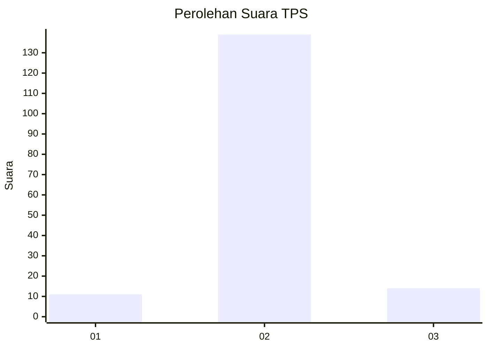
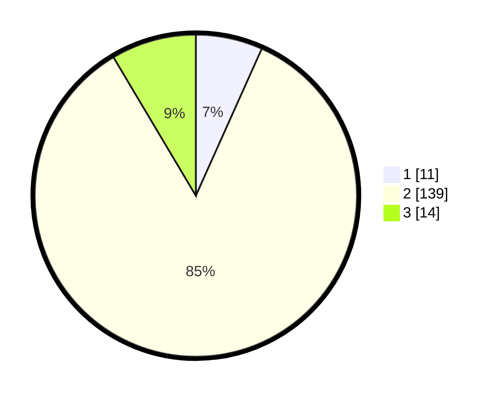

# Hasil

## Grafik

## Tabel

| No. | Nama Paslon    | Suara | Suara (raw) | Persentase |
|:--- |:-------------- | -----:| -----------:| ----------:|
| 1   | ANIES MUHAIMIN | 11    | [11][p-1]   | 6,71       |
| 2   | PRABOWO GIBRAN | 139   | [139][p-2]  | 84,76      |
| 3   | GANJAR MAHFUD  | 14    | [14][p-3]   | 8,54       |

[p-1]: https://github.com/gigit-pemilu/pemilu-2024-35-jawa-timur/blob/main/pilpres/hitung-suara/sub/35-jawa-timur/sub/09-jember/sub/02-kencong/sub/2004-kencong/sub/082-tps/sub/paslon-1.txt
[p-2]: https://github.com/gigit-pemilu/pemilu-2024-35-jawa-timur/blob/main/pilpres/hitung-suara/sub/35-jawa-timur/sub/09-jember/sub/02-kencong/sub/2004-kencong/sub/082-tps/sub/paslon-2.txt
[p-3]: https://github.com/gigit-pemilu/pemilu-2024-35-jawa-timur/blob/main/pilpres/hitung-suara/sub/35-jawa-timur/sub/09-jember/sub/02-kencong/sub/2004-kencong/sub/082-tps/sub/paslon-3.txt

## Foto C Plano

https://sirekap-obj-formc.kpu.go.id/b57e/pemilu/ppwp/35/09/02/20/04/3509022004082-20240214-141009--4b624161-0a2a-4585-af9c-cf82c700f19b.jpg

https://sirekap-obj-formc.kpu.go.id/b57e/pemilu/ppwp/35/09/02/20/04/3509022004082-20240214-141043--4a6458f4-05cf-4963-a0a1-7ea53d795a2f.jpg

https://sirekap-obj-formc.kpu.go.id/b57e/pemilu/ppwp/35/09/02/20/04/3509022004082-20240214-141127--940c8dbe-2357-4872-963f-9aed7f00baa8.jpg

## Metadata

| Key        | Value               |
| ---------- | ------------------- |
| Time Stamp | 2024-02-15 12:00:28 |

