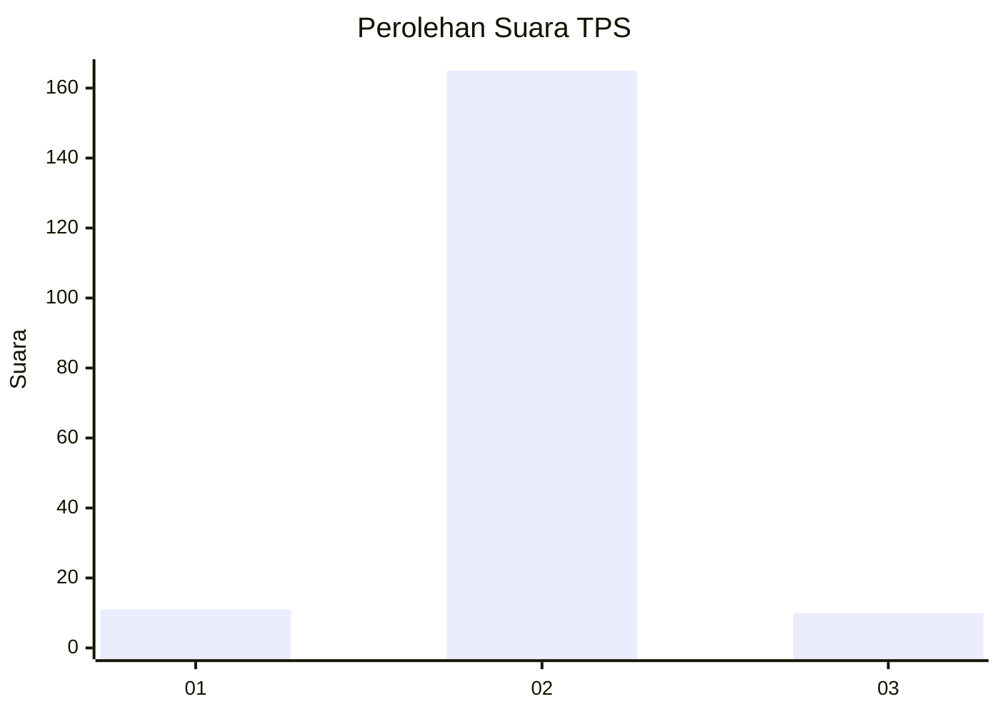
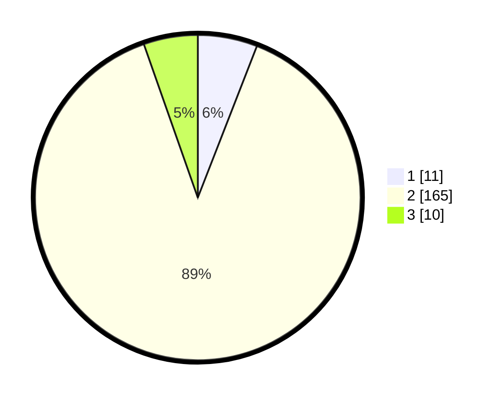

# Hasil

## Grafik

## Tabel

| No. | Nama Paslon    | Suara | Suara (raw) | Persentase |
|:--- |:-------------- | -----:| -----------:| ----------:|
| 1   | ANIES MUHAIMIN | 11    | [11][p-1]   | 5,91       |
| 2   | PRABOWO GIBRAN | 165   | [165][p-2]  | 88,71      |
| 3   | GANJAR MAHFUD  | 10    | [10][p-3]   | 5,38       |

[p-1]: https://github.com/gigit-pemilu/pemilu-2024-35-jawa-timur/blob/main/pilpres/hitung-suara/sub/35-jawa-timur/sub/09-jember/sub/02-kencong/sub/2005-wonorejo/sub/045-tps/sub/paslon-1.txt
[p-2]: https://github.com/gigit-pemilu/pemilu-2024-35-jawa-timur/blob/main/pilpres/hitung-suara/sub/35-jawa-timur/sub/09-jember/sub/02-kencong/sub/2005-wonorejo/sub/045-tps/sub/paslon-2.txt
[p-3]: https://github.com/gigit-pemilu/pemilu-2024-35-jawa-timur/blob/main/pilpres/hitung-suara/sub/35-jawa-timur/sub/09-jember/sub/02-kencong/sub/2005-wonorejo/sub/045-tps/sub/paslon-3.txt

## Foto C Plano

https://sirekap-obj-formc.kpu.go.id/1ed7/pemilu/ppwp/35/09/02/20/05/3509022005045-20240214-233857--c7c1090e-0dc5-4c62-b757-0bafd5fd465b.jpg

https://sirekap-obj-formc.kpu.go.id/1ed7/pemilu/ppwp/35/09/02/20/05/3509022005045-20240216-023509--ffea603f-9aaa-4da7-be60-da07445abf9f.jpg

https://sirekap-obj-formc.kpu.go.id/1ed7/pemilu/ppwp/35/09/02/20/05/3509022005045-20240216-023501--c2682f0d-c2eb-460e-a120-80cd433053cb.jpg

## Metadata

| Key        | Value               |
| ---------- | ------------------- |
| Time Stamp | 2024-02-20 18:00:00 |

