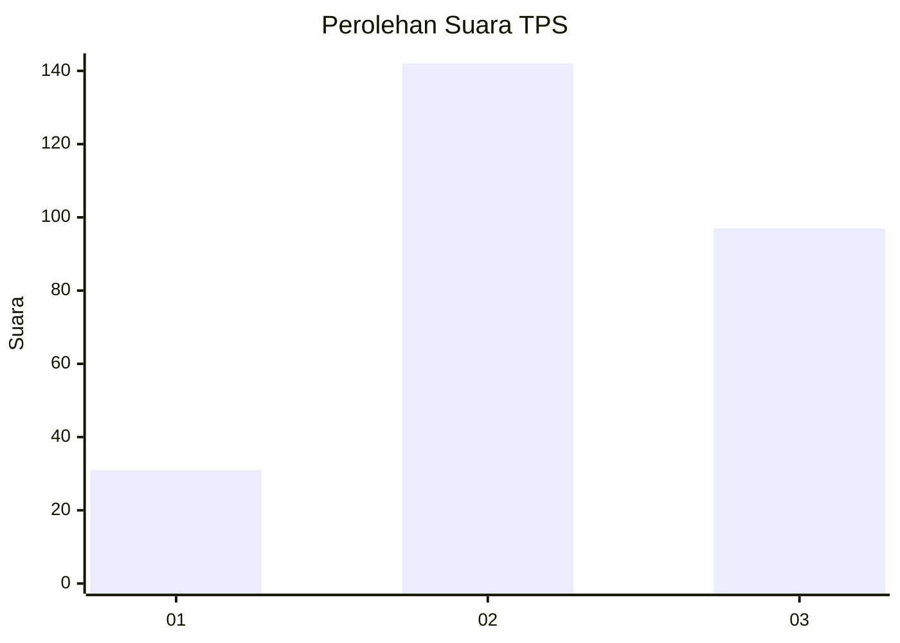
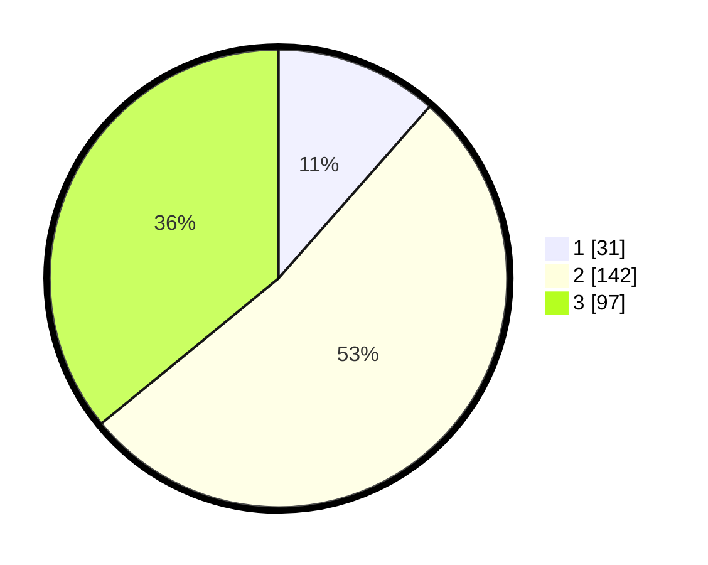

# Hasil

## Grafik

## Tabel

| No. | Nama Paslon    | Suara | Suara (raw) | Persentase |
|:--- |:-------------- | -----:| -----------:| ----------:|
| 1   | ANIES MUHAIMIN | 31    | [31][p-1]   | 11,48      |
| 2   | PRABOWO GIBRAN | 142   | [142][p-2]  | 52,59      |
| 3   | GANJAR MAHFUD  | 97    | [97][p-3]   | 35,93      |

[p-1]: https://github.com/gigit-pemilu/pemilu-2024/blob/main/pilpres/hitung-suara/sub/35-jawa-timur/sub/09-jember/sub/03-sumberbaru/sub/2001-jamintoro/sub/001-tps/sub/paslon-1.txt
[p-2]: https://github.com/gigit-pemilu/pemilu-2024/blob/main/pilpres/hitung-suara/sub/35-jawa-timur/sub/09-jember/sub/03-sumberbaru/sub/2001-jamintoro/sub/001-tps/sub/paslon-2.txt
[p-3]: https://github.com/gigit-pemilu/pemilu-2024/blob/main/pilpres/hitung-suara/sub/35-jawa-timur/sub/09-jember/sub/03-sumberbaru/sub/2001-jamintoro/sub/001-tps/sub/paslon-3.txt

## Foto C Plano

https://sirekap-obj-formc.kpu.go.id/4161/pemilu/ppwp/35/09/03/20/01/3509032001001-20240215-110129--897252e9-ffe4-42c0-a795-7633366e30c6.jpg

https://sirekap-obj-formc.kpu.go.id/4161/pemilu/ppwp/35/09/03/20/01/3509032001001-20240215-110220--a55ded86-b6fb-416b-a8f3-cdf0611a8616.jpg

https://sirekap-obj-formc.kpu.go.id/4161/pemilu/ppwp/35/09/03/20/01/3509032001001-20240215-110253--6b596baf-5623-465d-a597-f57f965d9176.jpg

## Metadata

| Key        | Value               |
| ---------- | ------------------- |
| Time Stamp | 2024-02-15 17:30:25 |

## DATA PEMILIH TETAP

Jumlah pemilih dalam DPT: **293**.
 * L: **151**.
 * P: **142**.

## DATA PENGGUNA HAK PILIH

Jumlah pengguna hak pilih dalam DPT: **271**.
 * L: **130**.
 * P: **141**.

Jumlah pengguna hak pilih dalam DPTb: **0**.
 * L: **0**.
 * P: **0**.

Jumlah pengguna hak pilih dalam DPK: **0**.
 * L: **0**.
 * P: **0**.

Jumlah pengguna hak pilih: **271**.
 * L: **130**.
 * P: **141**.

## JUMLAH SUARA SAH DAN TIDAK SAH

JUMLAH SELURUH SUARA SAH: **270**.

JUMLAH SUARA TIDAK SAH: **1**.

JUMLAH SELURUH SUARA SAH DAN SUARA TIDAK SAH: **271**.

