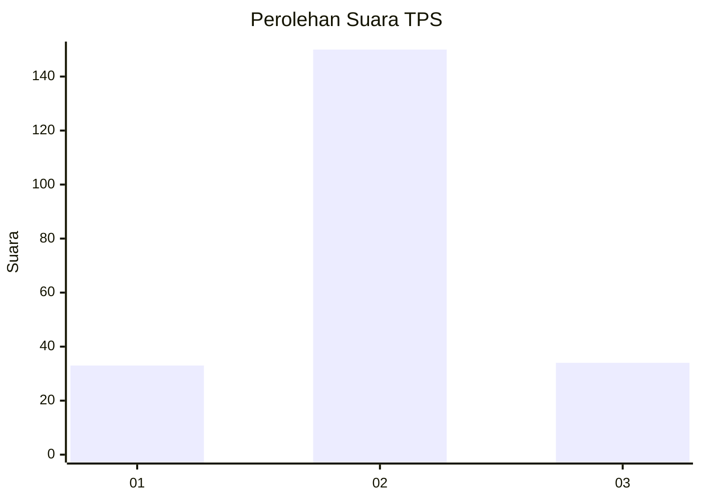

# Hasil

## Grafik

## Tabel

| No. | Nama Paslon    | Suara | Suara (raw) | Persentase |
|:--- |:-------------- | -----:| -----------:| ----------:|
| 1   | ANIES MUHAIMIN | 33    | [33][p-1]   | 15,21      |
| 2   | PRABOWO GIBRAN | 150   | [150][p-2]  | 69,12      |
| 3   | GANJAR MAHFUD  | 34    | [34][p-3]   | 15,67      |

[p-1]: https://github.com/gigit-pemilu/pemilu-2024-35-jawa-timur/blob/main/pilpres/hitung-suara/sub/35-jawa-timur/sub/09-jember/sub/03-sumberbaru/sub/2001-jamintoro/sub/006-tps/sub/paslon-1.txt
[p-2]: https://github.com/gigit-pemilu/pemilu-2024-35-jawa-timur/blob/main/pilpres/hitung-suara/sub/35-jawa-timur/sub/09-jember/sub/03-sumberbaru/sub/2001-jamintoro/sub/006-tps/sub/paslon-2.txt
[p-3]: https://github.com/gigit-pemilu/pemilu-2024-35-jawa-timur/blob/main/pilpres/hitung-suara/sub/35-jawa-timur/sub/09-jember/sub/03-sumberbaru/sub/2001-jamintoro/sub/006-tps/sub/paslon-3.txt

## Foto C Plano

https://sirekap-obj-formc.kpu.go.id/90f0/pemilu/ppwp/35/09/03/20/01/3509032001006-20240215-120720--4bfea465-4aeb-4d44-a88e-635d6f32752c.jpg

https://sirekap-obj-formc.kpu.go.id/90f0/pemilu/ppwp/35/09/03/20/01/3509032001006-20240215-120921--c9dbb574-3b21-4a53-a975-a9e358bc3363.jpg

https://sirekap-obj-formc.kpu.go.id/90f0/pemilu/ppwp/35/09/03/20/01/3509032001006-20240215-121108--2e491331-be17-4df3-99a5-55e9e9747882.jpg

## Metadata

| Key        | Value               |
| ---------- | ------------------- |
| Time Stamp | 2024-02-15 16:00:26 |

