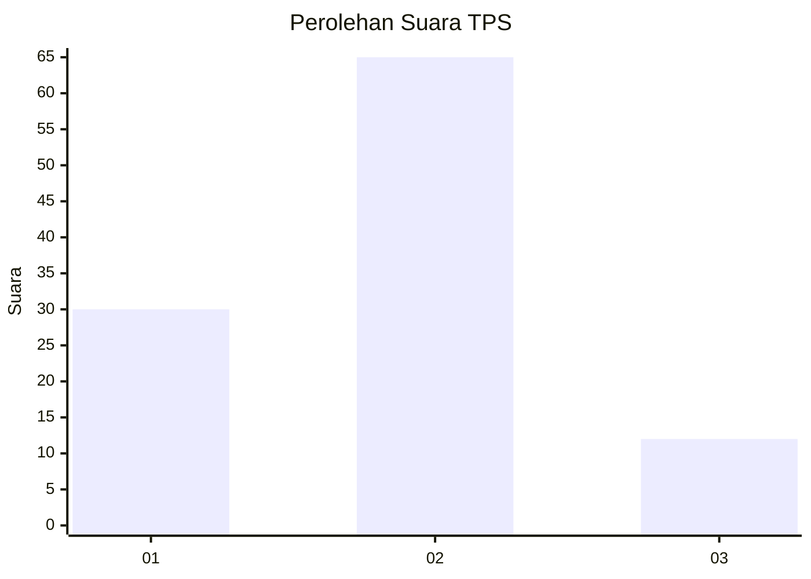
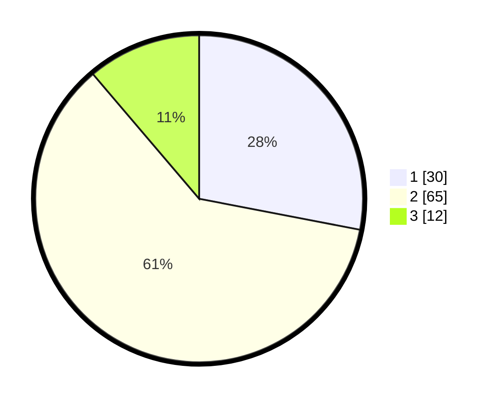

# Hasil

## Grafik

## Tabel

| No. | Nama Paslon    | Suara | Suara (raw) | Persentase |
|:--- |:-------------- | -----:| -----------:| ----------:|
| 1   | ANIES MUHAIMIN | 30    | [30][p-1]   | 28,04      |
| 2   | PRABOWO GIBRAN | 65    | [65][p-2]   | 60,75      |
| 3   | GANJAR MAHFUD  | 12    | [12][p-3]   | 11,21      |

[p-1]: https://github.com/gigit-pemilu/pemilu-2024/blob/main/pilpres/hitung-suara/sub/35-jawa-timur/sub/09-jember/sub/03-sumberbaru/sub/2001-jamintoro/sub/008-tps/sub/paslon-1.txt
[p-2]: https://github.com/gigit-pemilu/pemilu-2024/blob/main/pilpres/hitung-suara/sub/35-jawa-timur/sub/09-jember/sub/03-sumberbaru/sub/2001-jamintoro/sub/008-tps/sub/paslon-2.txt
[p-3]: https://github.com/gigit-pemilu/pemilu-2024/blob/main/pilpres/hitung-suara/sub/35-jawa-timur/sub/09-jember/sub/03-sumberbaru/sub/2001-jamintoro/sub/008-tps/sub/paslon-3.txt

## Foto C Plano

https://sirekap-obj-formc.kpu.go.id/714b/pemilu/ppwp/35/09/03/20/01/3509032001008-20240214-225948--5448bce4-763d-47ac-b145-a60a8e04d167.jpg

https://sirekap-obj-formc.kpu.go.id/714b/pemilu/ppwp/35/09/03/20/01/3509032001008-20240214-231929--006c2725-8080-4bdc-b9fc-53a8669ef8e6.jpg

https://sirekap-obj-formc.kpu.go.id/714b/pemilu/ppwp/35/09/03/20/01/3509032001008-20240215-112416--755b881f-3e6b-4ada-b36e-1926d713855d.jpg

## Metadata

| Key        | Value               |
| ---------- | ------------------- |
| Time Stamp | 2024-02-15 20:00:44 |

