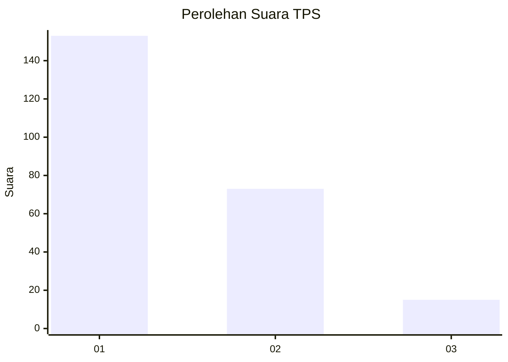
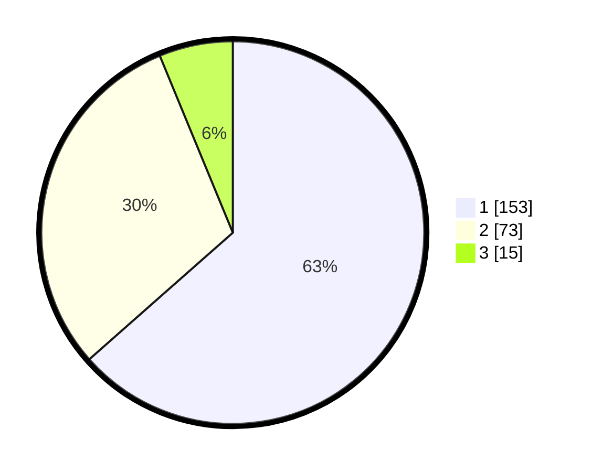

# Hasil

## Grafik

## Tabel

| No. | Nama Paslon    | Suara | Suara (raw) | Persentase |
|:--- |:-------------- | -----:| -----------:| ----------:|
| 1   | ANIES MUHAIMIN | 153   | [153][p-1]  | 63,49      |
| 2   | PRABOWO GIBRAN | 73    | [73][p-2]   | 30,29      |
| 3   | GANJAR MAHFUD  | 15    | [15][p-3]   | 6,22       |

[p-1]: https://github.com/gigit-pemilu/pemilu-2024-35-jawa-timur/blob/main/pilpres/hitung-suara/sub/35-jawa-timur/sub/09-jember/sub/03-sumberbaru/sub/2001-jamintoro/sub/012-tps/sub/paslon-1.txt
[p-2]: https://github.com/gigit-pemilu/pemilu-2024-35-jawa-timur/blob/main/pilpres/hitung-suara/sub/35-jawa-timur/sub/09-jember/sub/03-sumberbaru/sub/2001-jamintoro/sub/012-tps/sub/paslon-2.txt
[p-3]: https://github.com/gigit-pemilu/pemilu-2024-35-jawa-timur/blob/main/pilpres/hitung-suara/sub/35-jawa-timur/sub/09-jember/sub/03-sumberbaru/sub/2001-jamintoro/sub/012-tps/sub/paslon-3.txt

## Foto C Plano

https://sirekap-obj-formc.kpu.go.id/fc53/pemilu/ppwp/35/09/03/20/01/3509032001012-20240220-053525--db650b56-3da7-4889-b394-4a9cf39ce917.jpg

https://sirekap-obj-formc.kpu.go.id/fc53/pemilu/ppwp/35/09/03/20/01/3509032001012-20240220-053539--45072f79-4a46-4a73-9f08-4bf04ce58cd6.jpg

https://sirekap-obj-formc.kpu.go.id/fc53/pemilu/ppwp/35/09/03/20/01/3509032001012-20240215-060431--51b53342-124a-4588-8912-775de4897c8f.jpg

## Metadata

| Key        | Value               |
| ---------- | ------------------- |
| Time Stamp | 2024-02-24 22:31:28 |

