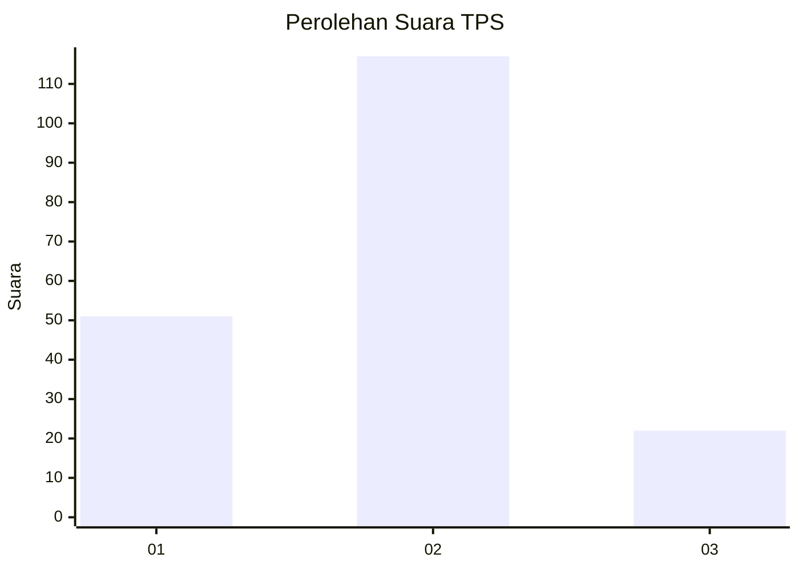
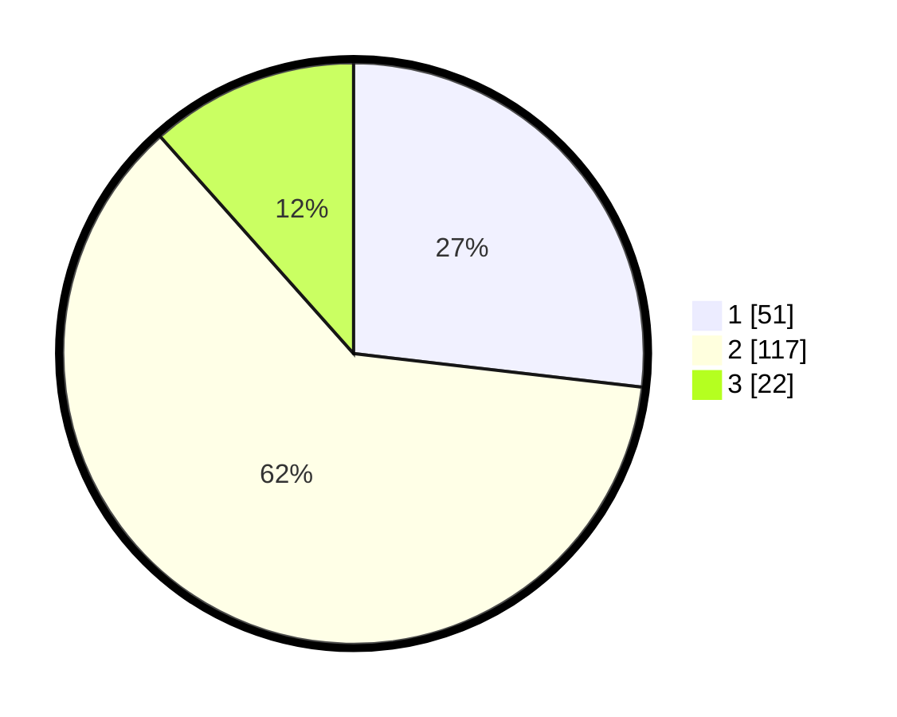

# Hasil

## Grafik

## Tabel

| No. | Nama Paslon    | Suara | Suara (raw) | Persentase |
|:--- |:-------------- | -----:| -----------:| ----------:|
| 1   | ANIES MUHAIMIN | 51    | [51][p-1]   | 26,84      |
| 2   | PRABOWO GIBRAN | 117   | [117][p-2]  | 61,58      |
| 3   | GANJAR MAHFUD  | 22    | [22][p-3]   | 11,58      |

[p-1]: https://github.com/gigit-pemilu/pemilu-2024/blob/main/pilpres/hitung-suara/sub/35-jawa-timur/sub/09-jember/sub/03-sumberbaru/sub/2002-jatiroto/sub/002-tps/sub/paslon-1.txt
[p-2]: https://github.com/gigit-pemilu/pemilu-2024/blob/main/pilpres/hitung-suara/sub/35-jawa-timur/sub/09-jember/sub/03-sumberbaru/sub/2002-jatiroto/sub/002-tps/sub/paslon-2.txt
[p-3]: https://github.com/gigit-pemilu/pemilu-2024/blob/main/pilpres/hitung-suara/sub/35-jawa-timur/sub/09-jember/sub/03-sumberbaru/sub/2002-jatiroto/sub/002-tps/sub/paslon-3.txt

## Foto C Plano

https://sirekap-obj-formc.kpu.go.id/74f4/pemilu/ppwp/35/09/03/20/02/3509032002002-20240215-002349--c5c2d007-bb1a-40b0-bb28-d98c37433097.jpg

https://sirekap-obj-formc.kpu.go.id/74f4/pemilu/ppwp/35/09/03/20/02/3509032002002-20240215-002629--d8d68fb9-5a99-4c34-968d-81bc9d751be7.jpg

https://sirekap-obj-formc.kpu.go.id/74f4/pemilu/ppwp/35/09/03/20/02/3509032002002-20240215-002859--6a6a96d2-3f7f-456c-8f71-d9da31fb4e77.jpg

## Metadata

| Key        | Value               |
| ---------- | ------------------- |
| Time Stamp | 2024-02-16 06:30:27 |

