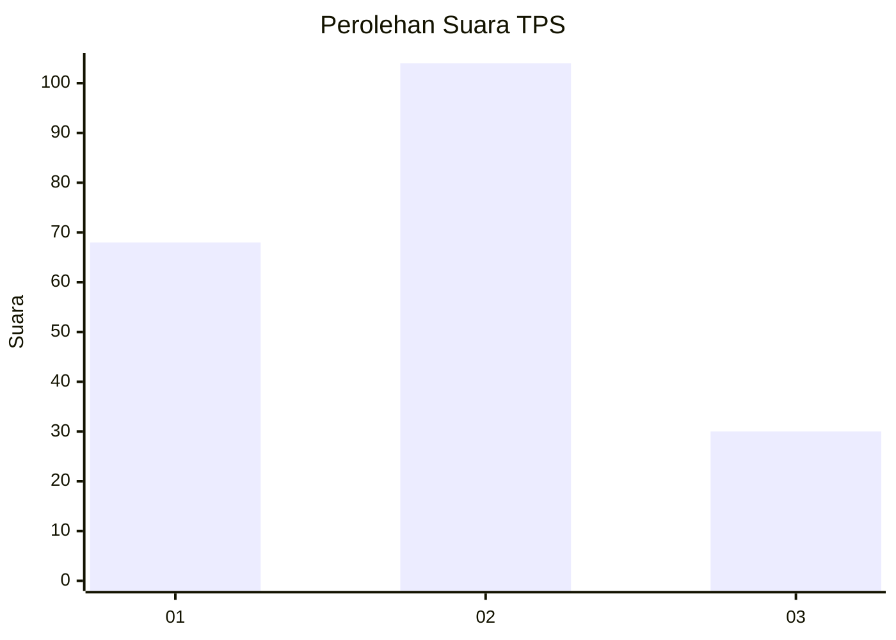
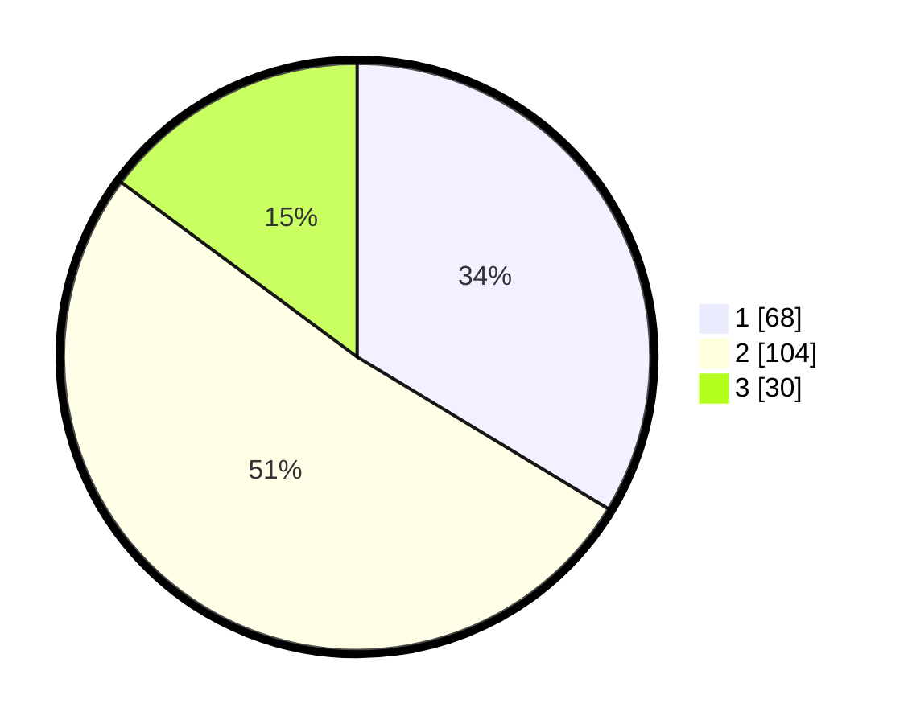

# Hasil

## Grafik

## Tabel

| No. | Nama Paslon    | Suara | Suara (raw) | Persentase |
|:--- |:-------------- | -----:| -----------:| ----------:|
| 1   | ANIES MUHAIMIN | 68    | [68][p-1]   | 33,66      |
| 2   | PRABOWO GIBRAN | 104   | [104][p-2]  | 51,49      |
| 3   | GANJAR MAHFUD  | 30    | [30][p-3]   | 14,85      |

[p-1]: https://github.com/gigit-pemilu/pemilu-2024-35-jawa-timur/blob/main/pilpres/hitung-suara/sub/35-jawa-timur/sub/09-jember/sub/03-sumberbaru/sub/2002-jatiroto/sub/004-tps/sub/paslon-1.txt
[p-2]: https://github.com/gigit-pemilu/pemilu-2024-35-jawa-timur/blob/main/pilpres/hitung-suara/sub/35-jawa-timur/sub/09-jember/sub/03-sumberbaru/sub/2002-jatiroto/sub/004-tps/sub/paslon-2.txt
[p-3]: https://github.com/gigit-pemilu/pemilu-2024-35-jawa-timur/blob/main/pilpres/hitung-suara/sub/35-jawa-timur/sub/09-jember/sub/03-sumberbaru/sub/2002-jatiroto/sub/004-tps/sub/paslon-3.txt

## Foto C Plano

https://sirekap-obj-formc.kpu.go.id/a2c4/pemilu/ppwp/35/09/03/20/02/3509032002004-20240215-063830--377c464c-843d-4f1a-a40c-bc5938fecd0b.jpg

https://sirekap-obj-formc.kpu.go.id/a2c4/pemilu/ppwp/35/09/03/20/02/3509032002004-20240215-001613--6242cbe3-abec-45a0-9243-bde2ee710f57.jpg

https://sirekap-obj-formc.kpu.go.id/a2c4/pemilu/ppwp/35/09/03/20/02/3509032002004-20240215-064120--881eede2-84bf-4e00-a8c6-596db92f2a5c.jpg

## Metadata

| Key        | Value               |
| ---------- | ------------------- |
| Time Stamp | 2024-02-15 21:30:27 |

