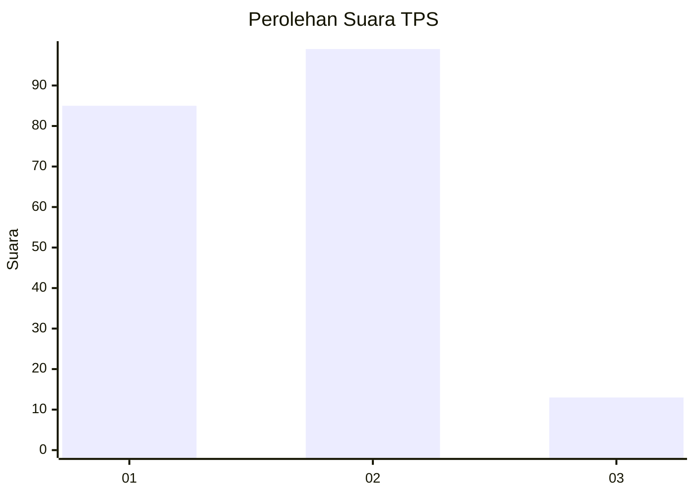
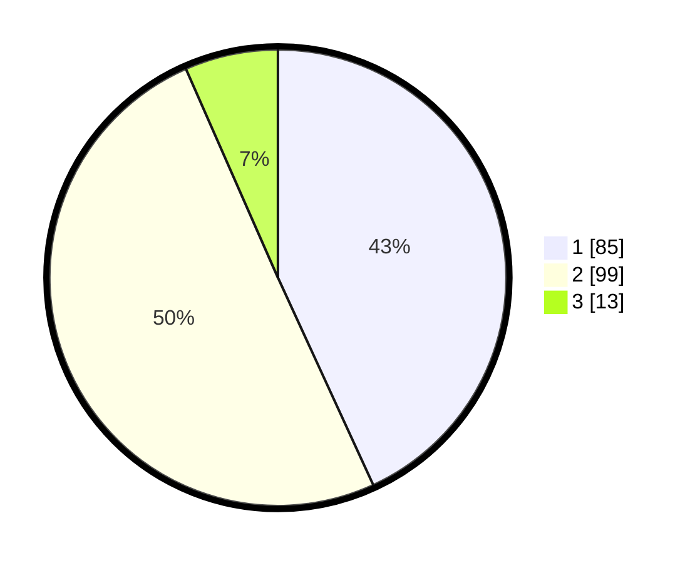

# Hasil

## Grafik

## Tabel

| No. | Nama Paslon    | Suara | Suara (raw) | Persentase |
|:--- |:-------------- | -----:| -----------:| ----------:|
| 1   | ANIES MUHAIMIN | 85    | [85][p-1]   | 43,15      |
| 2   | PRABOWO GIBRAN | 99    | [99][p-2]   | 50,25      |
| 3   | GANJAR MAHFUD  | 13    | [13][p-3]   | 6,60       |

[p-1]: https://github.com/gigit-pemilu/pemilu-2024-35-jawa-timur/blob/main/pilpres/hitung-suara/sub/35-jawa-timur/sub/09-jember/sub/03-sumberbaru/sub/2002-jatiroto/sub/005-tps/sub/paslon-1.txt
[p-2]: https://github.com/gigit-pemilu/pemilu-2024-35-jawa-timur/blob/main/pilpres/hitung-suara/sub/35-jawa-timur/sub/09-jember/sub/03-sumberbaru/sub/2002-jatiroto/sub/005-tps/sub/paslon-2.txt
[p-3]: https://github.com/gigit-pemilu/pemilu-2024-35-jawa-timur/blob/main/pilpres/hitung-suara/sub/35-jawa-timur/sub/09-jember/sub/03-sumberbaru/sub/2002-jatiroto/sub/005-tps/sub/paslon-3.txt

## Foto C Plano

https://sirekap-obj-formc.kpu.go.id/0aff/pemilu/ppwp/35/09/03/20/02/3509032002005-20240214-220613--403d5b1b-6e52-417f-baa5-0058ef2ff30a.jpg

https://sirekap-obj-formc.kpu.go.id/0aff/pemilu/ppwp/35/09/03/20/02/3509032002005-20240214-220716--ecf5405a-665b-42f1-a512-38c3e94cba69.jpg

https://sirekap-obj-formc.kpu.go.id/0aff/pemilu/ppwp/35/09/03/20/02/3509032002005-20240214-220802--e1f166a1-b3f5-47b4-a09a-96c6519079d8.jpg

## Metadata

| Key        | Value               |
| ---------- | ------------------- |
| Time Stamp | 2024-02-15 16:00:26 |

