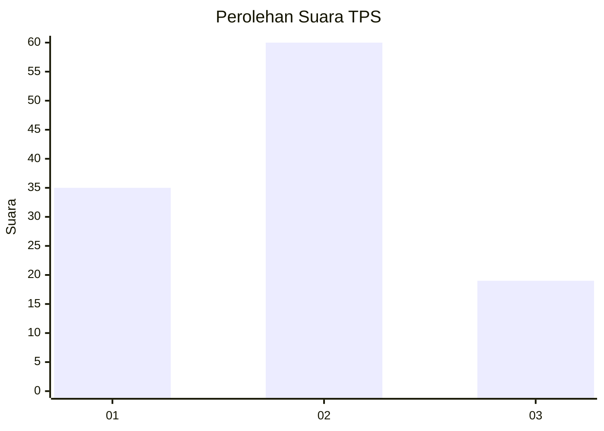
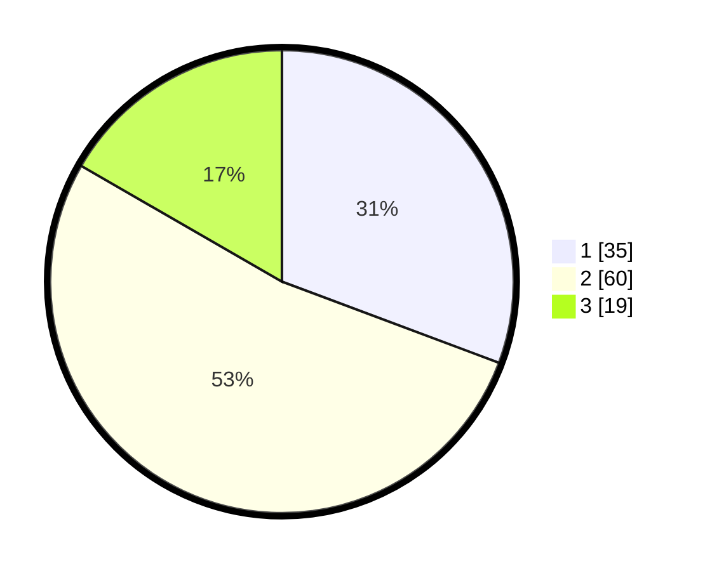

# Hasil

## Grafik

## Tabel

| No. | Nama Paslon    | Suara | Suara (raw) | Persentase |
|:--- |:-------------- | -----:| -----------:| ----------:|
| 1   | ANIES MUHAIMIN | 35    | [35][p-1]   | 30,70      |
| 2   | PRABOWO GIBRAN | 60    | [60][p-2]   | 52,63      |
| 3   | GANJAR MAHFUD  | 19    | [19][p-3]   | 16,67      |

[p-1]: https://github.com/gigit-pemilu/pemilu-2024/blob/main/pilpres/hitung-suara/sub/35-jawa-timur/sub/09-jember/sub/03-sumberbaru/sub/2002-jatiroto/sub/006-tps/sub/paslon-1.txt
[p-2]: https://github.com/gigit-pemilu/pemilu-2024/blob/main/pilpres/hitung-suara/sub/35-jawa-timur/sub/09-jember/sub/03-sumberbaru/sub/2002-jatiroto/sub/006-tps/sub/paslon-2.txt
[p-3]: https://github.com/gigit-pemilu/pemilu-2024/blob/main/pilpres/hitung-suara/sub/35-jawa-timur/sub/09-jember/sub/03-sumberbaru/sub/2002-jatiroto/sub/006-tps/sub/paslon-3.txt

## Foto C Plano

https://sirekap-obj-formc.kpu.go.id/a3dc/pemilu/ppwp/35/09/03/20/02/3509032002006-20240214-232840--9f1e9c57-3dd6-4cca-98e0-2c08c29a23d0.jpg

https://sirekap-obj-formc.kpu.go.id/a3dc/pemilu/ppwp/35/09/03/20/02/3509032002006-20240214-222927--40720d26-89d0-47d1-b7d2-8d293fa377ce.jpg

https://sirekap-obj-formc.kpu.go.id/a3dc/pemilu/ppwp/35/09/03/20/02/3509032002006-20240214-233456--31e97fa0-145e-4a0f-bde4-ffd33dd65c4e.jpg

## Metadata

| Key        | Value               |
| ---------- | ------------------- |
| Time Stamp | 2024-02-24 22:31:28 |

