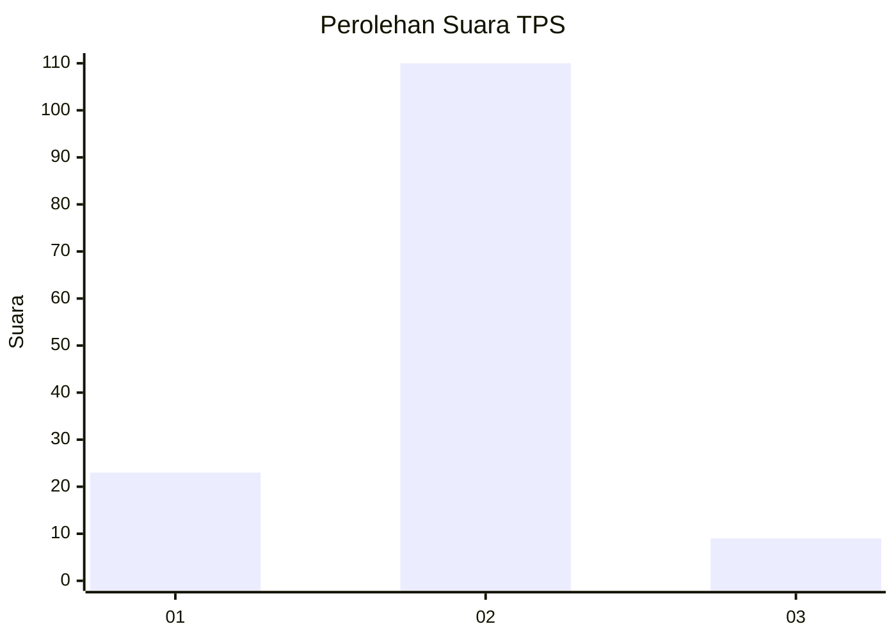
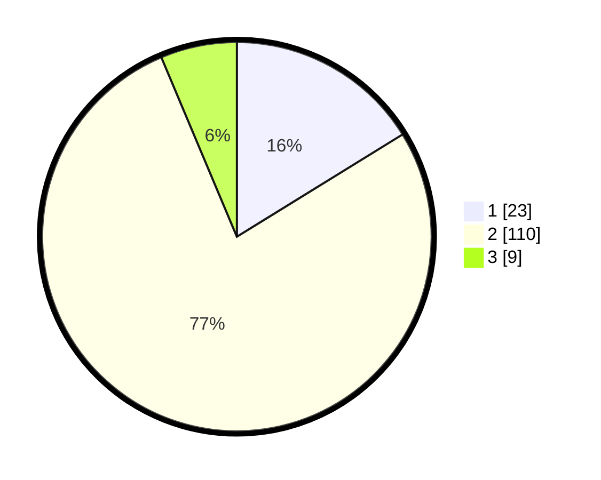

# Hasil

## Grafik

## Tabel

| No. | Nama Paslon    | Suara | Suara (raw) | Persentase |
|:--- |:-------------- | -----:| -----------:| ----------:|
| 1   | ANIES MUHAIMIN | 23    | [23][p-1]   | 16,20      |
| 2   | PRABOWO GIBRAN | 110   | [110][p-2]  | 77,46      |
| 3   | GANJAR MAHFUD  | 9     | [9][p-3]    | 6,34       |

[p-1]: https://github.com/gigit-pemilu/pemilu-2024/blob/main/pilpres/hitung-suara/sub/35-jawa-timur/sub/09-jember/sub/03-sumberbaru/sub/2002-jatiroto/sub/016-tps/sub/paslon-1.txt
[p-2]: https://github.com/gigit-pemilu/pemilu-2024/blob/main/pilpres/hitung-suara/sub/35-jawa-timur/sub/09-jember/sub/03-sumberbaru/sub/2002-jatiroto/sub/016-tps/sub/paslon-2.txt
[p-3]: https://github.com/gigit-pemilu/pemilu-2024/blob/main/pilpres/hitung-suara/sub/35-jawa-timur/sub/09-jember/sub/03-sumberbaru/sub/2002-jatiroto/sub/016-tps/sub/paslon-3.txt

## Foto C Plano

https://sirekap-obj-formc.kpu.go.id/1599/pemilu/ppwp/35/09/03/20/02/3509032002016-20240215-022949--c9d868ed-6f5f-434f-b538-e121fe3387ba.jpg

https://sirekap-obj-formc.kpu.go.id/1599/pemilu/ppwp/35/09/03/20/02/3509032002016-20240215-023227--53efa55c-91e6-40a1-8c85-bf4fcd572bcd.jpg

https://sirekap-obj-formc.kpu.go.id/1599/pemilu/ppwp/35/09/03/20/02/3509032002016-20240215-023344--f957299e-3004-4a7e-952d-8e2de25aa622.jpg

## Metadata

| Key        | Value               |
| ---------- | ------------------- |
| Time Stamp | 2024-02-15 15:00:29 |

