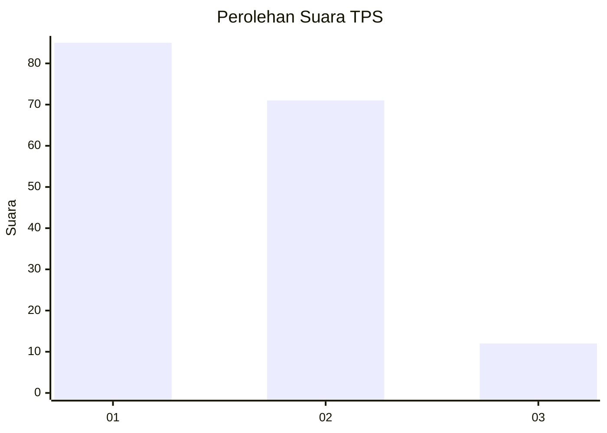
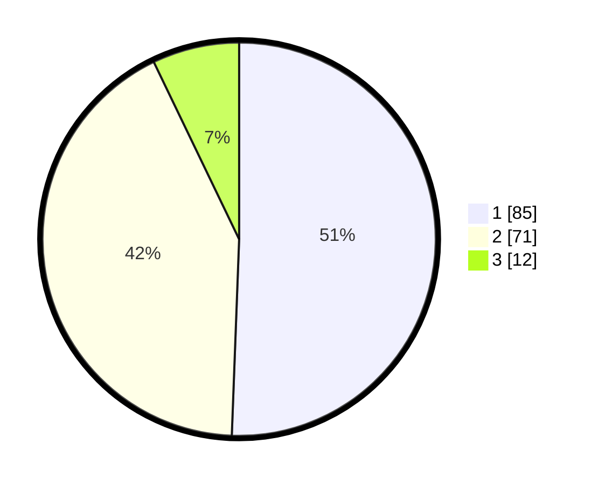

# Hasil

## Grafik

## Tabel

| No. | Nama Paslon    | Suara | Suara (raw) | Persentase |
|:--- |:-------------- | -----:| -----------:| ----------:|
| 1   | ANIES MUHAIMIN | 85    | [85][p-1]   | 50,60      |
| 2   | PRABOWO GIBRAN | 71    | [71][p-2]   | 42,26      |
| 3   | GANJAR MAHFUD  | 12    | [12][p-3]   | 7,14       |

[p-1]: https://github.com/gigit-pemilu/pemilu-2024/blob/main/pilpres/hitung-suara/sub/35-jawa-timur/sub/09-jember/sub/03-sumberbaru/sub/2002-jatiroto/sub/020-tps/sub/paslon-1.txt
[p-2]: https://github.com/gigit-pemilu/pemilu-2024/blob/main/pilpres/hitung-suara/sub/35-jawa-timur/sub/09-jember/sub/03-sumberbaru/sub/2002-jatiroto/sub/020-tps/sub/paslon-2.txt
[p-3]: https://github.com/gigit-pemilu/pemilu-2024/blob/main/pilpres/hitung-suara/sub/35-jawa-timur/sub/09-jember/sub/03-sumberbaru/sub/2002-jatiroto/sub/020-tps/sub/paslon-3.txt

## Foto C Plano

https://sirekap-obj-formc.kpu.go.id/2cf9/pemilu/ppwp/35/09/03/20/02/3509032002020-20240214-202928--5b726023-30f0-4829-8a29-f7962ae0a5ab.jpg

https://sirekap-obj-formc.kpu.go.id/2cf9/pemilu/ppwp/35/09/03/20/02/3509032002020-20240214-203148--d96462b9-9df7-4c97-85cf-680818866b44.jpg

https://sirekap-obj-formc.kpu.go.id/2cf9/pemilu/ppwp/35/09/03/20/02/3509032002020-20240214-203255--d8f3a3bf-c8ef-4aed-9c73-f88e67e30aba.jpg

## Metadata

| Key        | Value               |
| ---------- | ------------------- |
| Time Stamp | 2024-02-15 03:06:03 |

