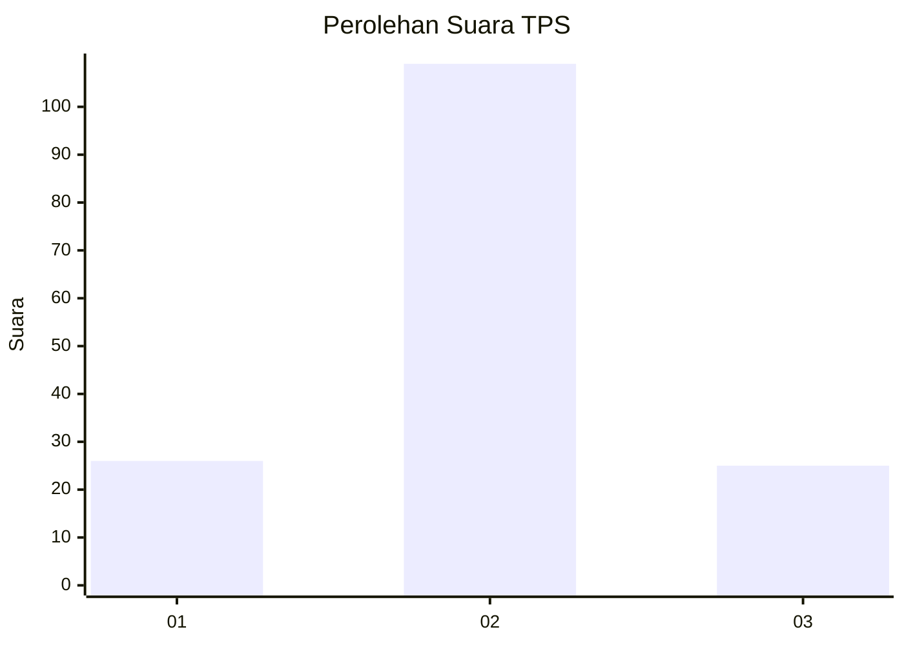
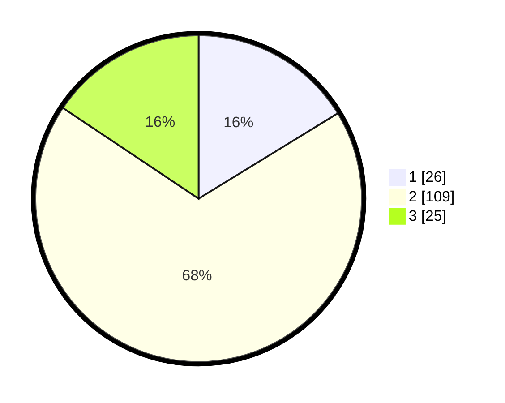

# Hasil

## Grafik

## Tabel

| No. | Nama Paslon    | Suara | Suara (raw) | Persentase |
|:--- |:-------------- | -----:| -----------:| ----------:|
| 1   | ANIES MUHAIMIN | 26    | [26][p-1]   | 16,25      |
| 2   | PRABOWO GIBRAN | 109   | [109][p-2]  | 68,13      |
| 3   | GANJAR MAHFUD  | 25    | [25][p-3]   | 15,63      |

[p-1]: https://github.com/gigit-pemilu/pemilu-2024/blob/main/pilpres/hitung-suara/sub/35-jawa-timur/sub/09-jember/sub/03-sumberbaru/sub/2002-jatiroto/sub/024-tps/sub/paslon-1.txt
[p-2]: https://github.com/gigit-pemilu/pemilu-2024/blob/main/pilpres/hitung-suara/sub/35-jawa-timur/sub/09-jember/sub/03-sumberbaru/sub/2002-jatiroto/sub/024-tps/sub/paslon-2.txt
[p-3]: https://github.com/gigit-pemilu/pemilu-2024/blob/main/pilpres/hitung-suara/sub/35-jawa-timur/sub/09-jember/sub/03-sumberbaru/sub/2002-jatiroto/sub/024-tps/sub/paslon-3.txt

## Foto C Plano

https://sirekap-obj-formc.kpu.go.id/4084/pemilu/ppwp/35/09/03/20/02/3509032002024-20240215-035236--e42bcda6-c951-4408-868b-04337795d4ec.jpg

https://sirekap-obj-formc.kpu.go.id/4084/pemilu/ppwp/35/09/03/20/02/3509032002024-20240215-035331--f6226ece-eae8-4845-9bb9-bedbe5df5044.jpg

https://sirekap-obj-formc.kpu.go.id/4084/pemilu/ppwp/35/09/03/20/02/3509032002024-20240215-035429--a8cf6a8e-d9c9-4897-a975-8bfafa2a9456.jpg

## Metadata

| Key        | Value               |
| ---------- | ------------------- |
| Time Stamp | 2024-02-15 15:00:29 |

