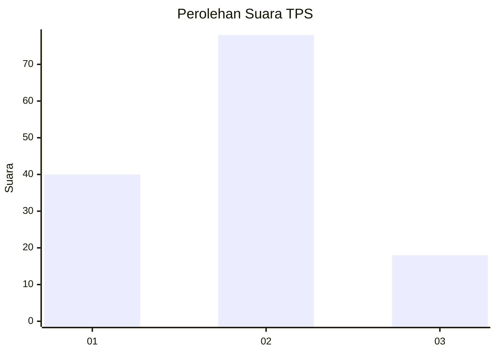
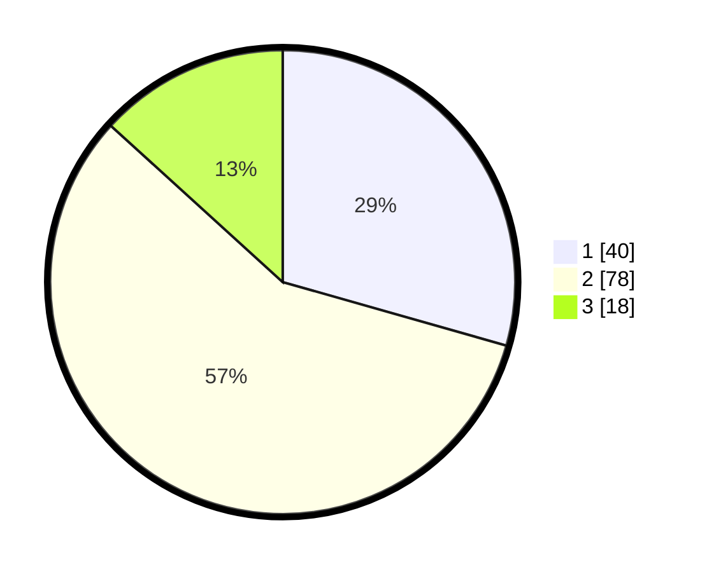

# Hasil

## Grafik

## Tabel

| No. | Nama Paslon    | Suara | Suara (raw) | Persentase |
|:--- |:-------------- | -----:| -----------:| ----------:|
| 1   | ANIES MUHAIMIN | 40    | [40][p-1]   | 29,41      |
| 2   | PRABOWO GIBRAN | 78    | [78][p-2]   | 57,35      |
| 3   | GANJAR MAHFUD  | 18    | [18][p-3]   | 13,24      |

[p-1]: https://github.com/gigit-pemilu/pemilu-2024-35-jawa-timur/blob/main/pilpres/hitung-suara/sub/35-jawa-timur/sub/09-jember/sub/03-sumberbaru/sub/2002-jatiroto/sub/025-tps/sub/paslon-1.txt
[p-2]: https://github.com/gigit-pemilu/pemilu-2024-35-jawa-timur/blob/main/pilpres/hitung-suara/sub/35-jawa-timur/sub/09-jember/sub/03-sumberbaru/sub/2002-jatiroto/sub/025-tps/sub/paslon-2.txt
[p-3]: https://github.com/gigit-pemilu/pemilu-2024-35-jawa-timur/blob/main/pilpres/hitung-suara/sub/35-jawa-timur/sub/09-jember/sub/03-sumberbaru/sub/2002-jatiroto/sub/025-tps/sub/paslon-3.txt

## Foto C Plano

https://sirekap-obj-formc.kpu.go.id/2fd9/pemilu/ppwp/35/09/03/20/02/3509032002025-20240214-203929--7d718056-f016-413a-998a-1138fd910088.jpg

https://sirekap-obj-formc.kpu.go.id/2fd9/pemilu/ppwp/35/09/03/20/02/3509032002025-20240214-203728--b7734fc2-49a8-4992-ac03-65b8bb19e5d8.jpg

https://sirekap-obj-formc.kpu.go.id/2fd9/pemilu/ppwp/35/09/03/20/02/3509032002025-20240214-203830--19782b34-2374-45c2-8f24-81189dade331.jpg

## Metadata

| Key        | Value               |
| ---------- | ------------------- |
| Time Stamp | 2024-02-15 12:00:28 |

