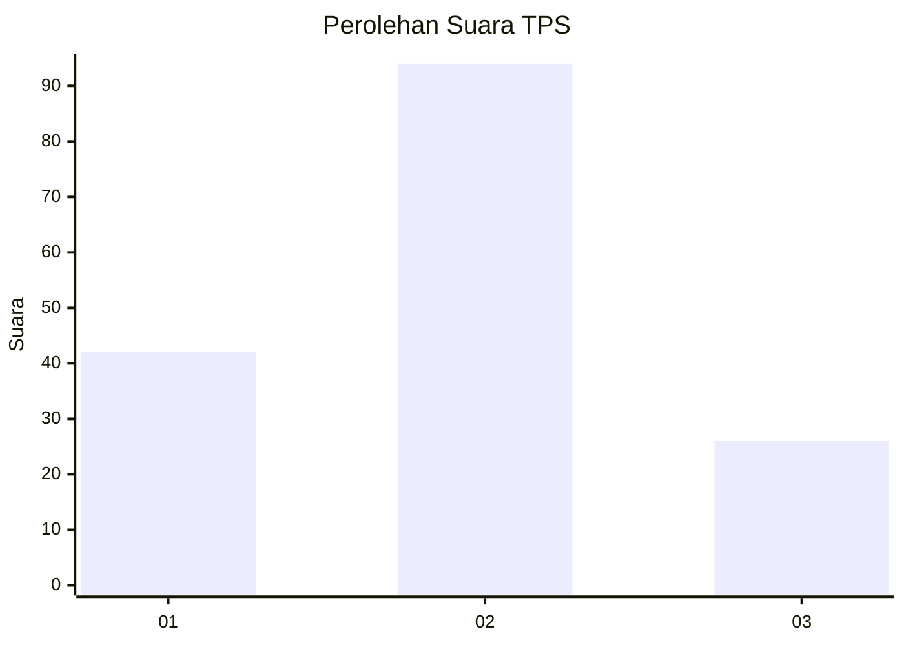
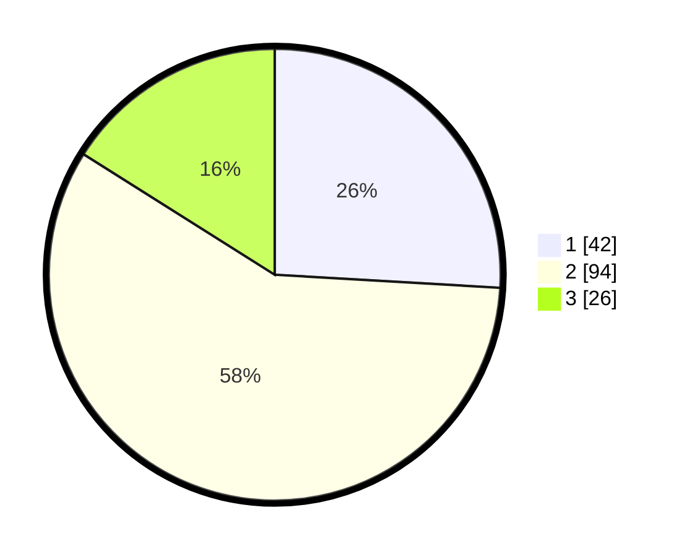

# Hasil

## Grafik

## Tabel

| No. | Nama Paslon    | Suara | Suara (raw) | Persentase |
|:--- |:-------------- | -----:| -----------:| ----------:|
| 1   | ANIES MUHAIMIN | 42    | [42][p-1]   | 25,93      |
| 2   | PRABOWO GIBRAN | 94    | [94][p-2]   | 58,02      |
| 3   | GANJAR MAHFUD  | 26    | [26][p-3]   | 16,05      |

[p-1]: https://github.com/gigit-pemilu/pemilu-2024/blob/main/pilpres/hitung-suara/sub/35-jawa-timur/sub/09-jember/sub/03-sumberbaru/sub/2002-jatiroto/sub/029-tps/sub/paslon-1.txt
[p-2]: https://github.com/gigit-pemilu/pemilu-2024/blob/main/pilpres/hitung-suara/sub/35-jawa-timur/sub/09-jember/sub/03-sumberbaru/sub/2002-jatiroto/sub/029-tps/sub/paslon-2.txt
[p-3]: https://github.com/gigit-pemilu/pemilu-2024/blob/main/pilpres/hitung-suara/sub/35-jawa-timur/sub/09-jember/sub/03-sumberbaru/sub/2002-jatiroto/sub/029-tps/sub/paslon-3.txt

## Foto C Plano

https://sirekap-obj-formc.kpu.go.id/180c/pemilu/ppwp/35/09/03/20/02/3509032002029-20240214-140928--8d262902-0aaa-457c-8a47-b74736e3f80b.jpg

https://sirekap-obj-formc.kpu.go.id/180c/pemilu/ppwp/35/09/03/20/02/3509032002029-20240214-141102--fc6eee99-0dd7-4e19-bfdf-ccf8f51477ad.jpg

https://sirekap-obj-formc.kpu.go.id/180c/pemilu/ppwp/35/09/03/20/02/3509032002029-20240214-141235--bdf4c0f9-ef37-4117-a900-a8a7429ce7df.jpg

## Metadata

| Key        | Value               |
| ---------- | ------------------- |
| Time Stamp | 2024-02-14 21:46:01 |

