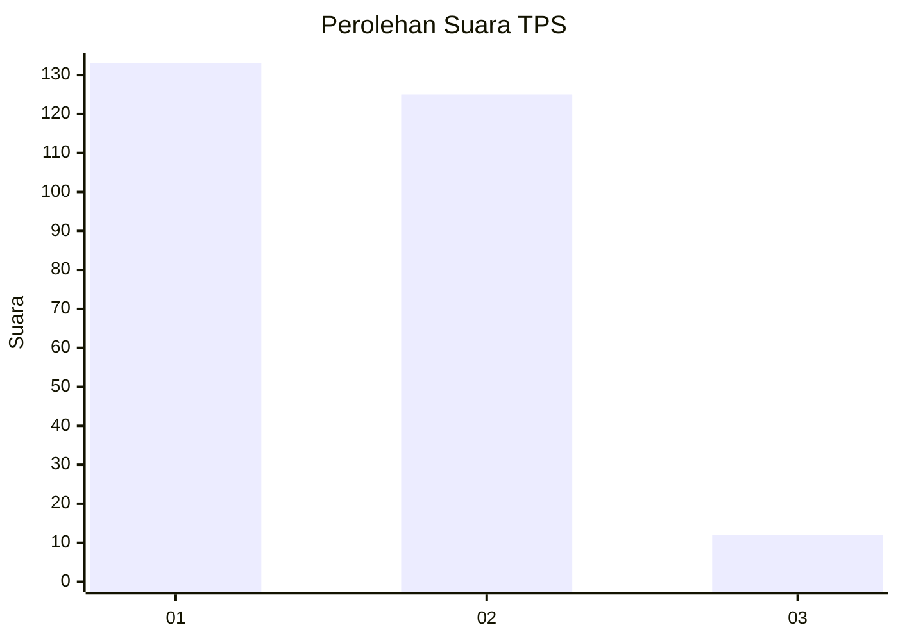
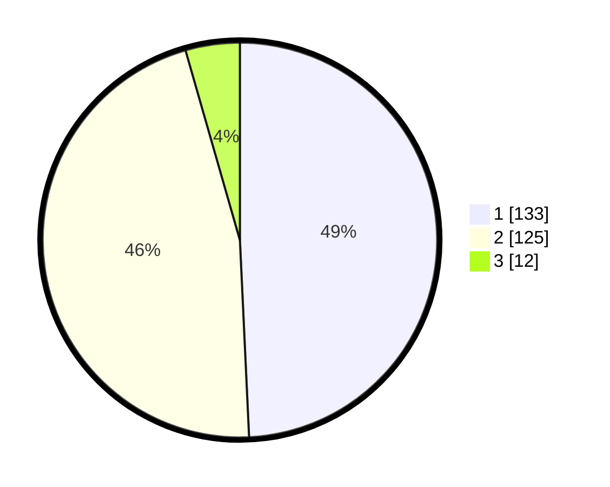

# Hasil

## Grafik

## Tabel

| No. | Nama Paslon    | Suara | Suara (raw) | Persentase |
|:--- |:-------------- | -----:| -----------:| ----------:|
| 1   | ANIES MUHAIMIN | 133   | [133][p-1]  | 49,26      |
| 2   | PRABOWO GIBRAN | 125   | [125][p-2]  | 46,30      |
| 3   | GANJAR MAHFUD  | 12    | [12][p-3]   | 4,44       |

[p-1]: https://github.com/gigit-pemilu/pemilu-2024-35-jawa-timur/blob/main/pilpres/hitung-suara/sub/35-jawa-timur/sub/09-jember/sub/03-sumberbaru/sub/2003-kaliglagah/sub/002-tps/sub/paslon-1.txt
[p-2]: https://github.com/gigit-pemilu/pemilu-2024-35-jawa-timur/blob/main/pilpres/hitung-suara/sub/35-jawa-timur/sub/09-jember/sub/03-sumberbaru/sub/2003-kaliglagah/sub/002-tps/sub/paslon-2.txt
[p-3]: https://github.com/gigit-pemilu/pemilu-2024-35-jawa-timur/blob/main/pilpres/hitung-suara/sub/35-jawa-timur/sub/09-jember/sub/03-sumberbaru/sub/2003-kaliglagah/sub/002-tps/sub/paslon-3.txt

## Foto C Plano

https://sirekap-obj-formc.kpu.go.id/7e5e/pemilu/ppwp/35/09/03/20/03/3509032003002-20240214-213102--daf1f9af-d9d1-48db-9cc9-90c862e7d59f.jpg

https://sirekap-obj-formc.kpu.go.id/7e5e/pemilu/ppwp/35/09/03/20/03/3509032003002-20240214-213559--26160e06-eea0-43c0-8508-aed386c1f9d4.jpg

https://sirekap-obj-formc.kpu.go.id/7e5e/pemilu/ppwp/35/09/03/20/03/3509032003002-20240214-213757--507aaf5a-28ec-4ec5-9ea6-feed67289b5a.jpg

## Metadata

| Key        | Value               |
| ---------- | ------------------- |
| Time Stamp | 2024-02-25 21:00:00 |

