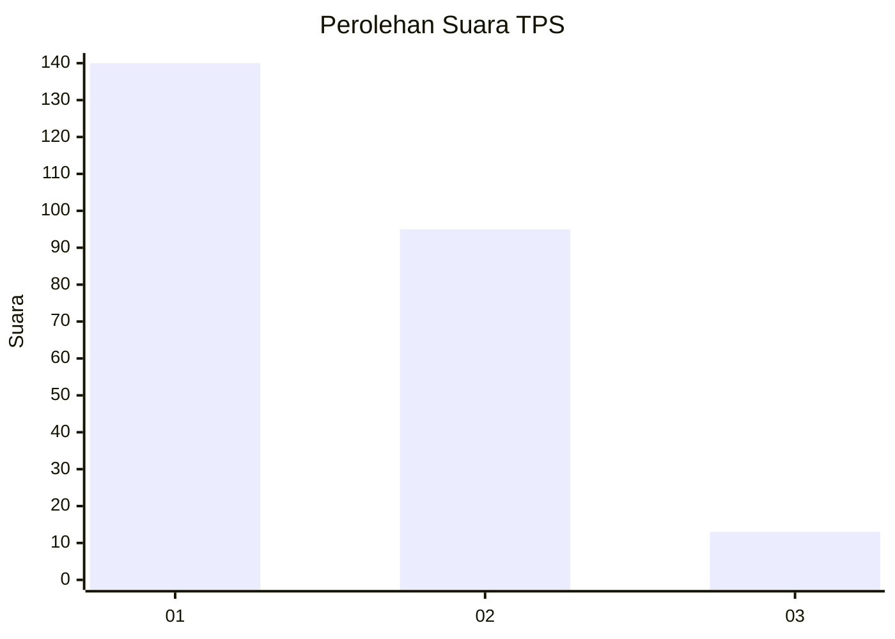
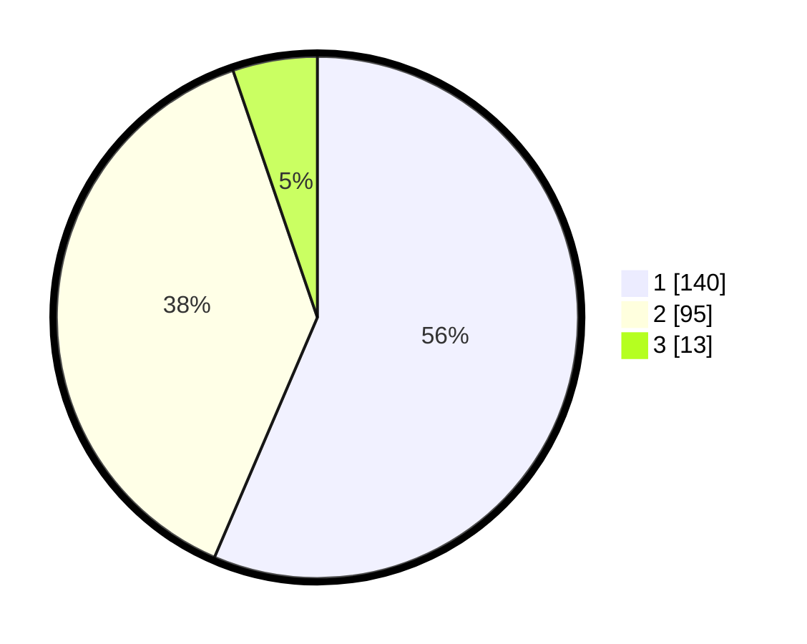

# Hasil

## Grafik

## Tabel

| No. | Nama Paslon    | Suara | Suara (raw) | Persentase |
|:--- |:-------------- | -----:| -----------:| ----------:|
| 1   | ANIES MUHAIMIN | 140   | [140][p-1]  | 56,45      |
| 2   | PRABOWO GIBRAN | 95    | [95][p-2]   | 38,31      |
| 3   | GANJAR MAHFUD  | 13    | [13][p-3]   | 5,24       |

[p-1]: https://github.com/gigit-pemilu/pemilu-2024-35-jawa-timur/blob/main/pilpres/hitung-suara/sub/35-jawa-timur/sub/09-jember/sub/03-sumberbaru/sub/2003-kaliglagah/sub/010-tps/sub/paslon-1.txt
[p-2]: https://github.com/gigit-pemilu/pemilu-2024-35-jawa-timur/blob/main/pilpres/hitung-suara/sub/35-jawa-timur/sub/09-jember/sub/03-sumberbaru/sub/2003-kaliglagah/sub/010-tps/sub/paslon-2.txt
[p-3]: https://github.com/gigit-pemilu/pemilu-2024-35-jawa-timur/blob/main/pilpres/hitung-suara/sub/35-jawa-timur/sub/09-jember/sub/03-sumberbaru/sub/2003-kaliglagah/sub/010-tps/sub/paslon-3.txt

## Foto C Plano

https://sirekap-obj-formc.kpu.go.id/c457/pemilu/ppwp/35/09/03/20/03/3509032003010-20240214-221327--f0f2e7e0-d3a6-4635-b829-d0473a1c2cc8.jpg

https://sirekap-obj-formc.kpu.go.id/c457/pemilu/ppwp/35/09/03/20/03/3509032003010-20240214-221540--ff08970d-3034-41a3-b722-d8f7a8097e66.jpg

https://sirekap-obj-formc.kpu.go.id/c457/pemilu/ppwp/35/09/03/20/03/3509032003010-20240215-011607--f38e419e-145e-42a0-b397-f294d3054dbd.jpg

## Metadata

| Key        | Value               |
| ---------- | ------------------- |
| Time Stamp | 2024-02-15 15:00:29 |

