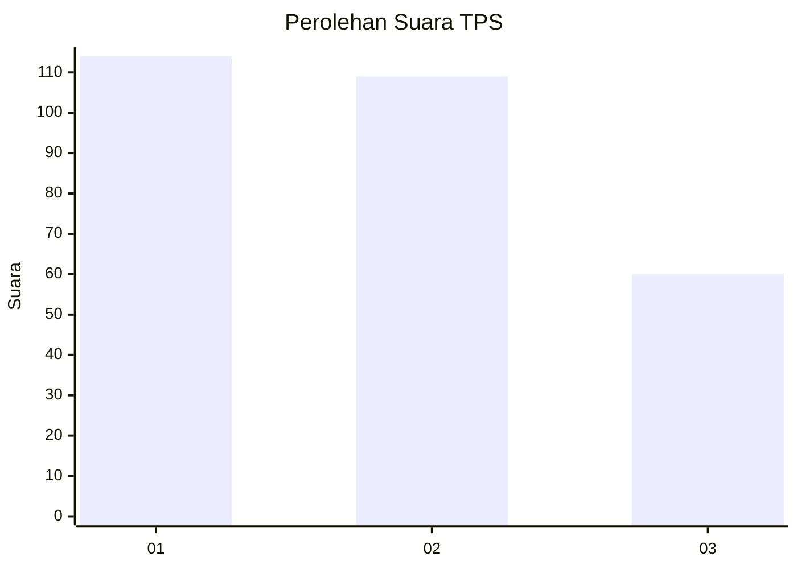
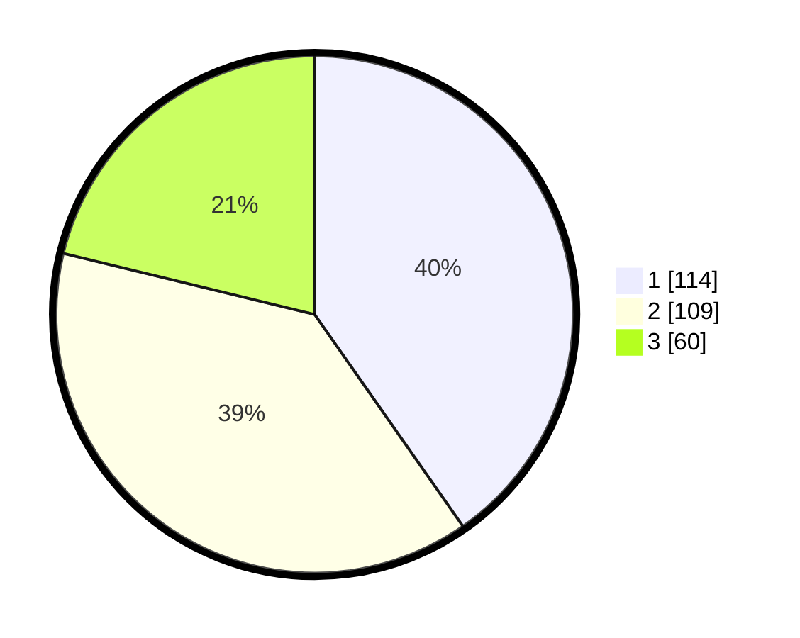

# Hasil

## Grafik

## Tabel

| No. | Nama Paslon    | Suara | Suara (raw) | Persentase |
|:--- |:-------------- | -----:| -----------:| ----------:|
| 1   | ANIES MUHAIMIN | 114   | [114][p-1]  | 40,28      |
| 2   | PRABOWO GIBRAN | 109   | [109][p-2]  | 38,52      |
| 3   | GANJAR MAHFUD  | 60    | [60][p-3]   | 21,20      |

[p-1]: https://github.com/gigit-pemilu/pemilu-2024-35-jawa-timur/blob/main/pilpres/hitung-suara/sub/35-jawa-timur/sub/09-jember/sub/03-sumberbaru/sub/2003-kaliglagah/sub/015-tps/sub/paslon-1.txt
[p-2]: https://github.com/gigit-pemilu/pemilu-2024-35-jawa-timur/blob/main/pilpres/hitung-suara/sub/35-jawa-timur/sub/09-jember/sub/03-sumberbaru/sub/2003-kaliglagah/sub/015-tps/sub/paslon-2.txt
[p-3]: https://github.com/gigit-pemilu/pemilu-2024-35-jawa-timur/blob/main/pilpres/hitung-suara/sub/35-jawa-timur/sub/09-jember/sub/03-sumberbaru/sub/2003-kaliglagah/sub/015-tps/sub/paslon-3.txt

## Foto C Plano

https://sirekap-obj-formc.kpu.go.id/2692/pemilu/ppwp/35/09/03/20/03/3509032003015-20240215-011417--4eda7b57-ead1-42fb-8b75-4856b98bdb31.jpg

https://sirekap-obj-formc.kpu.go.id/2692/pemilu/ppwp/35/09/03/20/03/3509032003015-20240215-011543--1a441bd5-0bba-4ce1-b6f2-5d9836e7a7c2.jpg

https://sirekap-obj-formc.kpu.go.id/2692/pemilu/ppwp/35/09/03/20/03/3509032003015-20240215-011726--d8ae0dcb-78f2-4f11-a77c-e9be5116598d.jpg

## Metadata

| Key        | Value               |
| ---------- | ------------------- |
| Time Stamp | 2024-02-16 12:51:22 |

