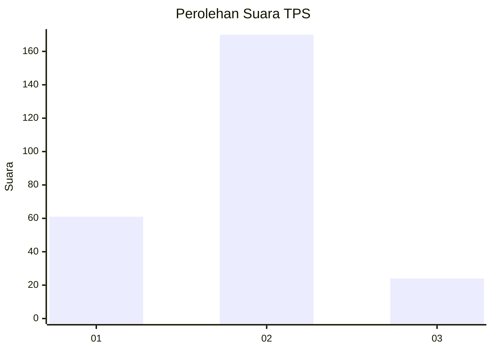
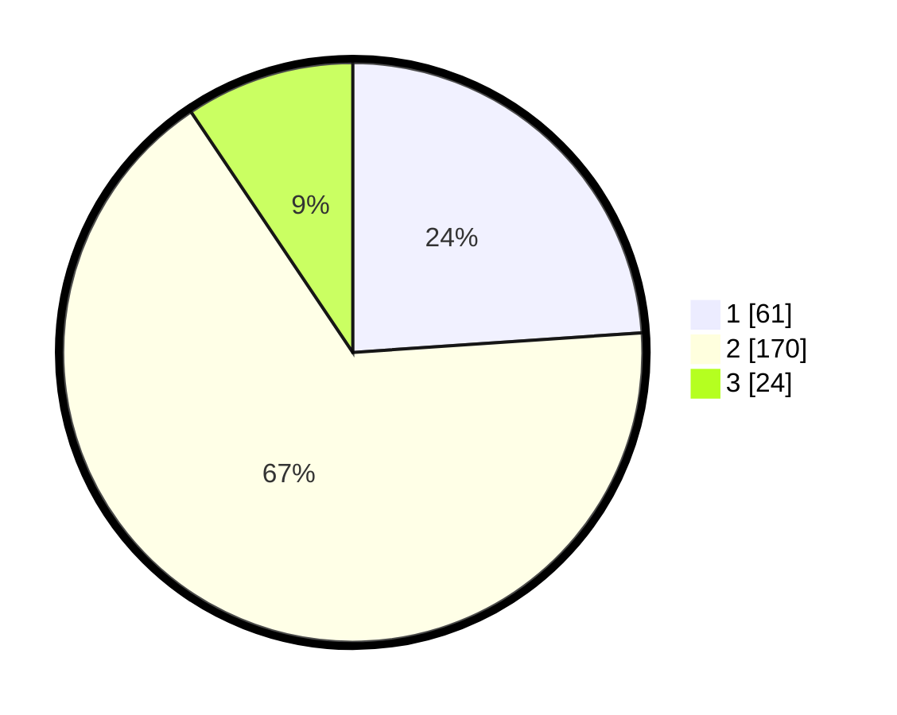

# Hasil

## Grafik

## Tabel

| No. | Nama Paslon    | Suara | Suara (raw) | Persentase |
|:--- |:-------------- | -----:| -----------:| ----------:|
| 1   | ANIES MUHAIMIN | 61    | [61][p-1]   | 23,92      |
| 2   | PRABOWO GIBRAN | 170   | [170][p-2]  | 66,67      |
| 3   | GANJAR MAHFUD  | 24    | [24][p-3]   | 9,41       |

[p-1]: https://github.com/gigit-pemilu/pemilu-2024-35-jawa-timur/blob/main/pilpres/hitung-suara/sub/35-jawa-timur/sub/09-jember/sub/03-sumberbaru/sub/2003-kaliglagah/sub/017-tps/sub/paslon-1.txt
[p-2]: https://github.com/gigit-pemilu/pemilu-2024-35-jawa-timur/blob/main/pilpres/hitung-suara/sub/35-jawa-timur/sub/09-jember/sub/03-sumberbaru/sub/2003-kaliglagah/sub/017-tps/sub/paslon-2.txt
[p-3]: https://github.com/gigit-pemilu/pemilu-2024-35-jawa-timur/blob/main/pilpres/hitung-suara/sub/35-jawa-timur/sub/09-jember/sub/03-sumberbaru/sub/2003-kaliglagah/sub/017-tps/sub/paslon-3.txt

## Foto C Plano

https://sirekap-obj-formc.kpu.go.id/7709/pemilu/ppwp/35/09/03/20/03/3509032003017-20240214-235954--d69bb5fd-80b1-4a1e-ab52-3a0e38d77c37.jpg

https://sirekap-obj-formc.kpu.go.id/7709/pemilu/ppwp/35/09/03/20/03/3509032003017-20240214-235846--e45274c6-d61f-4876-9908-dda90e452400.jpg

https://sirekap-obj-formc.kpu.go.id/7709/pemilu/ppwp/35/09/03/20/03/3509032003017-20240214-235834--c8909276-30f5-4276-bf82-31f171e7309d.jpg

## Metadata

| Key        | Value               |
| ---------- | ------------------- |
| Time Stamp | 2024-02-15 15:00:29 |

