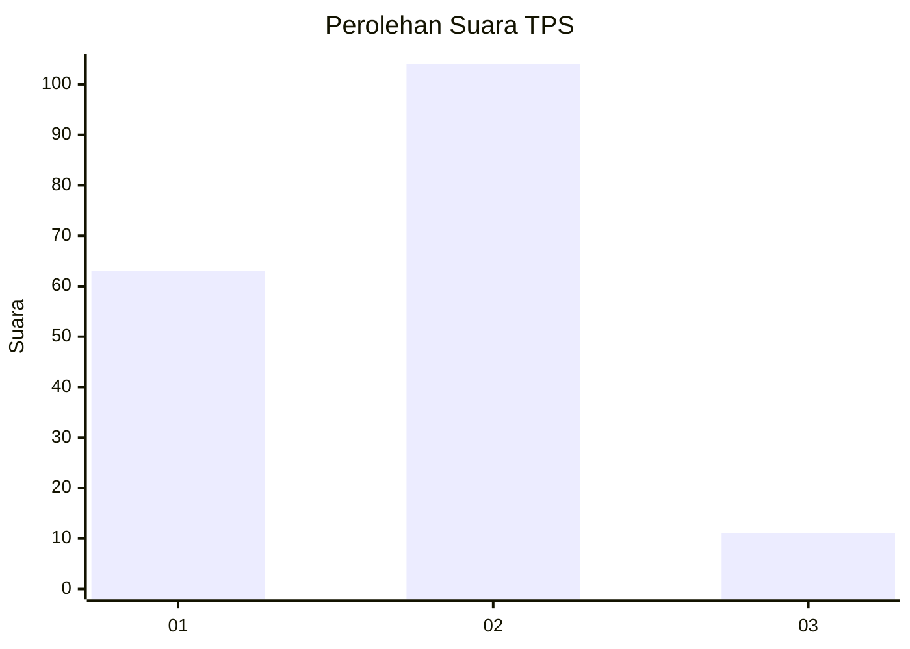
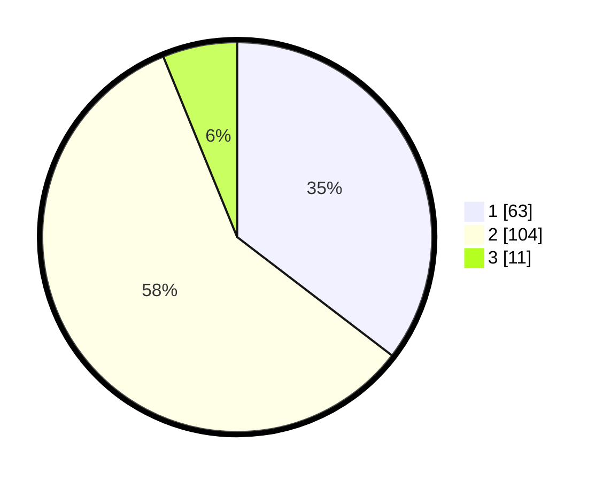

# Hasil

## Grafik

## Tabel

| No. | Nama Paslon    | Suara | Suara (raw) | Persentase |
|:--- |:-------------- | -----:| -----------:| ----------:|
| 1   | ANIES MUHAIMIN | 63    | [63][p-1]   | 35,39      |
| 2   | PRABOWO GIBRAN | 104   | [104][p-2]  | 58,43      |
| 3   | GANJAR MAHFUD  | 11    | [11][p-3]   | 6,18       |

[p-1]: https://github.com/gigit-pemilu/pemilu-2024-35-jawa-timur/blob/main/pilpres/hitung-suara/sub/35-jawa-timur/sub/09-jember/sub/03-sumberbaru/sub/2003-kaliglagah/sub/020-tps/sub/paslon-1.txt
[p-2]: https://github.com/gigit-pemilu/pemilu-2024-35-jawa-timur/blob/main/pilpres/hitung-suara/sub/35-jawa-timur/sub/09-jember/sub/03-sumberbaru/sub/2003-kaliglagah/sub/020-tps/sub/paslon-2.txt
[p-3]: https://github.com/gigit-pemilu/pemilu-2024-35-jawa-timur/blob/main/pilpres/hitung-suara/sub/35-jawa-timur/sub/09-jember/sub/03-sumberbaru/sub/2003-kaliglagah/sub/020-tps/sub/paslon-3.txt

## Foto C Plano

https://sirekap-obj-formc.kpu.go.id/1f8a/pemilu/ppwp/35/09/03/20/03/3509032003020-20240214-221345--ea321b97-d913-4997-b3cb-9e3e4c82faf8.jpg

https://sirekap-obj-formc.kpu.go.id/1f8a/pemilu/ppwp/35/09/03/20/03/3509032003020-20240214-191218--06706669-ea5a-4788-ae9d-897bb9c009c7.jpg

https://sirekap-obj-formc.kpu.go.id/1f8a/pemilu/ppwp/35/09/03/20/03/3509032003020-20240214-221544--7d333f13-4481-4df1-be54-2d8ab5c1b192.jpg

## Metadata

| Key        | Value               |
| ---------- | ------------------- |
| Time Stamp | 2024-02-15 15:00:29 |

