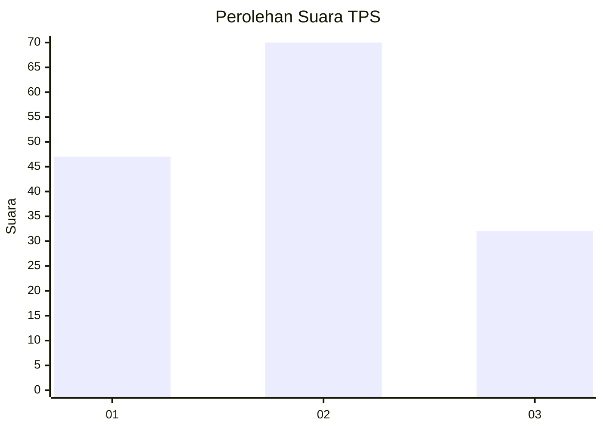
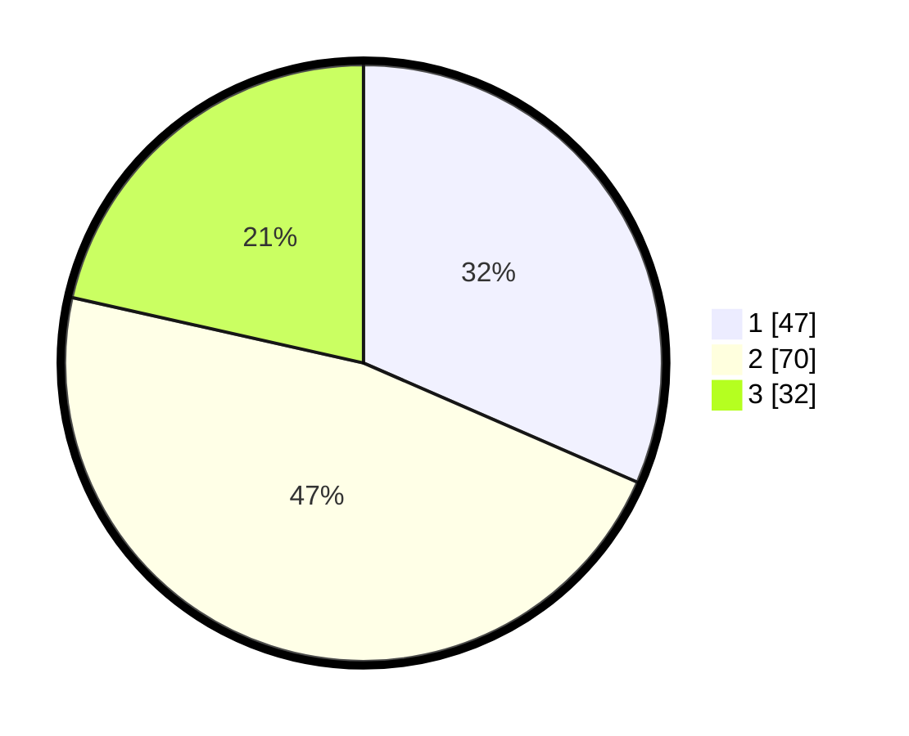

# Hasil

## Grafik

## Tabel

| No. | Nama Paslon    | Suara | Suara (raw) | Persentase |
|:--- |:-------------- | -----:| -----------:| ----------:|
| 1   | ANIES MUHAIMIN | 47    | [47][p-1]   | 31,54      |
| 2   | PRABOWO GIBRAN | 70    | [70][p-2]   | 46,98      |
| 3   | GANJAR MAHFUD  | 32    | [32][p-3]   | 21,48      |

[p-1]: https://github.com/gigit-pemilu/pemilu-2024/blob/main/pilpres/hitung-suara/sub/35-jawa-timur/sub/09-jember/sub/03-sumberbaru/sub/2003-kaliglagah/sub/023-tps/sub/paslon-1.txt
[p-2]: https://github.com/gigit-pemilu/pemilu-2024/blob/main/pilpres/hitung-suara/sub/35-jawa-timur/sub/09-jember/sub/03-sumberbaru/sub/2003-kaliglagah/sub/023-tps/sub/paslon-2.txt
[p-3]: https://github.com/gigit-pemilu/pemilu-2024/blob/main/pilpres/hitung-suara/sub/35-jawa-timur/sub/09-jember/sub/03-sumberbaru/sub/2003-kaliglagah/sub/023-tps/sub/paslon-3.txt

## Foto C Plano

https://sirekap-obj-formc.kpu.go.id/8159/pemilu/ppwp/35/09/03/20/03/3509032003023-20240214-141136--7b7a9147-4a36-4c30-8bac-0b78cf52d21c.jpg

https://sirekap-obj-formc.kpu.go.id/8159/pemilu/ppwp/35/09/03/20/03/3509032003023-20240214-141257--f486bb31-ec7c-4b92-ae11-0d904f8b87a3.jpg

https://sirekap-obj-formc.kpu.go.id/8159/pemilu/ppwp/35/09/03/20/03/3509032003023-20240214-141412--922b027c-f7c3-493b-b79a-0a3fdcdd0089.jpg

## Metadata

| Key        | Value               |
| ---------- | ------------------- |
| Time Stamp | 2024-02-14 21:46:01 |

