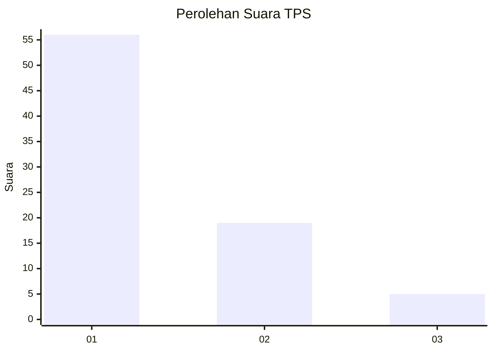
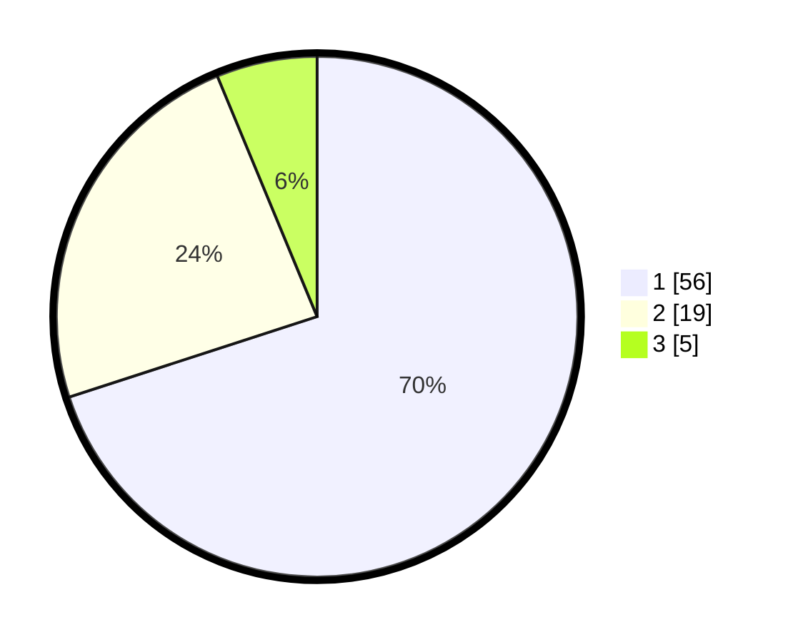

# Hasil

## Grafik

## Tabel

| No. | Nama Paslon    | Suara | Suara (raw) | Persentase |
|:--- |:-------------- | -----:| -----------:| ----------:|
| 1   | ANIES MUHAIMIN | 56    | [56][p-1]   | 70,00      |
| 2   | PRABOWO GIBRAN | 19    | [19][p-2]   | 23,75      |
| 3   | GANJAR MAHFUD  | 5     | [5][p-3]    | 6,25       |

[p-1]: https://github.com/gigit-pemilu/pemilu-2024/blob/main/pilpres/hitung-suara/sub/35-jawa-timur/sub/09-jember/sub/03-sumberbaru/sub/2003-kaliglagah/sub/026-tps/sub/paslon-1.txt
[p-2]: https://github.com/gigit-pemilu/pemilu-2024/blob/main/pilpres/hitung-suara/sub/35-jawa-timur/sub/09-jember/sub/03-sumberbaru/sub/2003-kaliglagah/sub/026-tps/sub/paslon-2.txt
[p-3]: https://github.com/gigit-pemilu/pemilu-2024/blob/main/pilpres/hitung-suara/sub/35-jawa-timur/sub/09-jember/sub/03-sumberbaru/sub/2003-kaliglagah/sub/026-tps/sub/paslon-3.txt

## Foto C Plano

https://sirekap-obj-formc.kpu.go.id/072b/pemilu/ppwp/35/09/03/20/03/3509032003026-20240214-192036--54de6374-aba6-40d4-ad12-0131d9c105f5.jpg

https://sirekap-obj-formc.kpu.go.id/072b/pemilu/ppwp/35/09/03/20/03/3509032003026-20240214-192151--01b3e989-1361-4b71-ac13-33b6a2d478e7.jpg

https://sirekap-obj-formc.kpu.go.id/072b/pemilu/ppwp/35/09/03/20/03/3509032003026-20240214-191003--3fb0530a-8e6b-4d3a-bd21-d80e0acb0155.jpg

## Metadata

| Key        | Value               |
| ---------- | ------------------- |
| Time Stamp | 2024-02-14 21:46:01 |

## DATA PEMILIH TETAP

Jumlah pemilih dalam DPT: **83**.
 * L: **49**.
 * P: **34**.

## DATA PENGGUNA HAK PILIH

Jumlah pengguna hak pilih dalam DPT: **80**.
 * L: **48**.
 * P: **32**.

Jumlah pengguna hak pilih dalam DPTb: **0**.
 * L: **0**.
 * P: **0**.

Jumlah pengguna hak pilih dalam DPK: **0**.
 * L: **0**.
 * P: **0**.

Jumlah pengguna hak pilih: **80**.
 * L: **48**.
 * P: **32**.

## JUMLAH SUARA SAH DAN TIDAK SAH

JUMLAH SELURUH SUARA SAH: **80**.

JUMLAH SUARA TIDAK SAH: **0**.

JUMLAH SELURUH SUARA SAH DAN SUARA TIDAK SAH: **80**.

