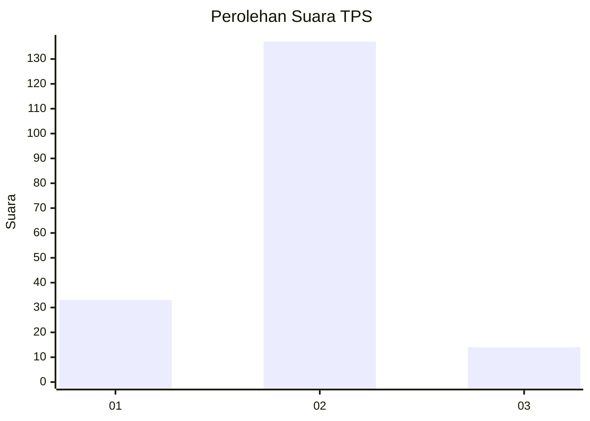
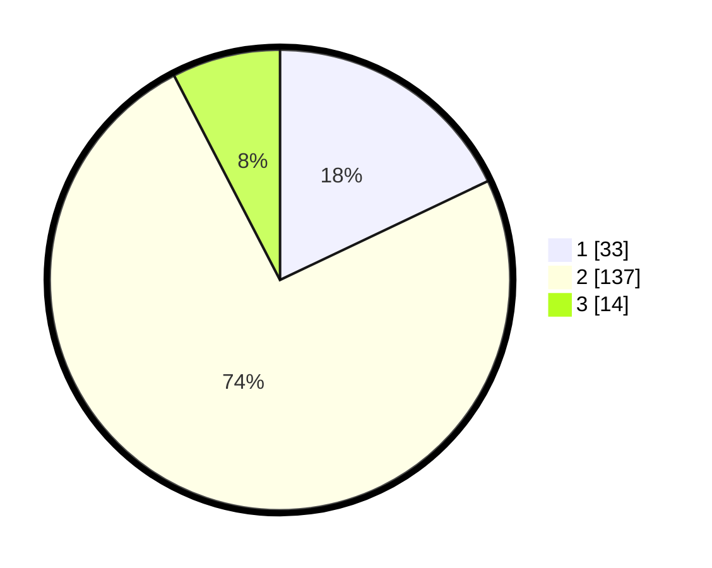

# Hasil

## Grafik

## Tabel

| No. | Nama Paslon    | Suara | Suara (raw) | Persentase |
|:--- |:-------------- | -----:| -----------:| ----------:|
| 1   | ANIES MUHAIMIN | 33    | [33][p-1]   | 17,93      |
| 2   | PRABOWO GIBRAN | 137   | [137][p-2]  | 74,46      |
| 3   | GANJAR MAHFUD  | 14    | [14][p-3]   | 7,61       |

[p-1]: https://github.com/gigit-pemilu/pemilu-2024/blob/main/pilpres/hitung-suara/sub/35-jawa-timur/sub/09-jember/sub/03-sumberbaru/sub/2004-jambesari/sub/001-tps/sub/paslon-1.txt
[p-2]: https://github.com/gigit-pemilu/pemilu-2024/blob/main/pilpres/hitung-suara/sub/35-jawa-timur/sub/09-jember/sub/03-sumberbaru/sub/2004-jambesari/sub/001-tps/sub/paslon-2.txt
[p-3]: https://github.com/gigit-pemilu/pemilu-2024/blob/main/pilpres/hitung-suara/sub/35-jawa-timur/sub/09-jember/sub/03-sumberbaru/sub/2004-jambesari/sub/001-tps/sub/paslon-3.txt

## Foto C Plano

https://sirekap-obj-formc.kpu.go.id/6a2b/pemilu/ppwp/35/09/03/20/04/3509032004001-20240214-141900--754144e9-995d-4df0-ab9e-048c7bb902c7.jpg

https://sirekap-obj-formc.kpu.go.id/6a2b/pemilu/ppwp/35/09/03/20/04/3509032004001-20240214-141741--4daf44a0-7982-448d-98bc-37147b795c5c.jpg

## Metadata

| Key        | Value               |
| ---------- | ------------------- |
| Time Stamp | 2024-02-25 15:00:00 |

