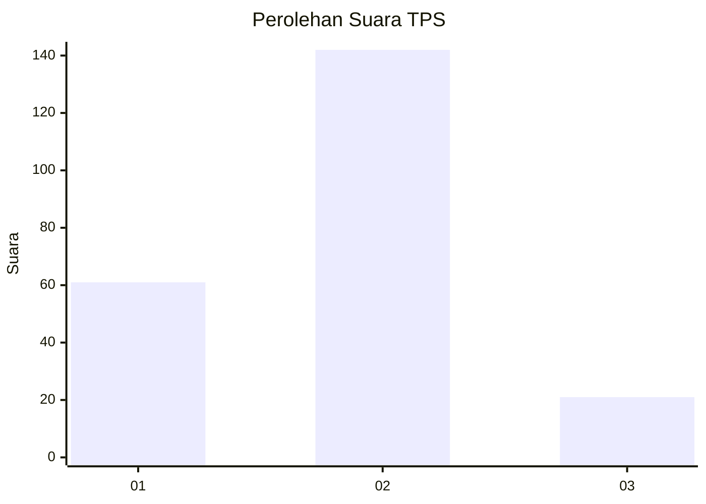
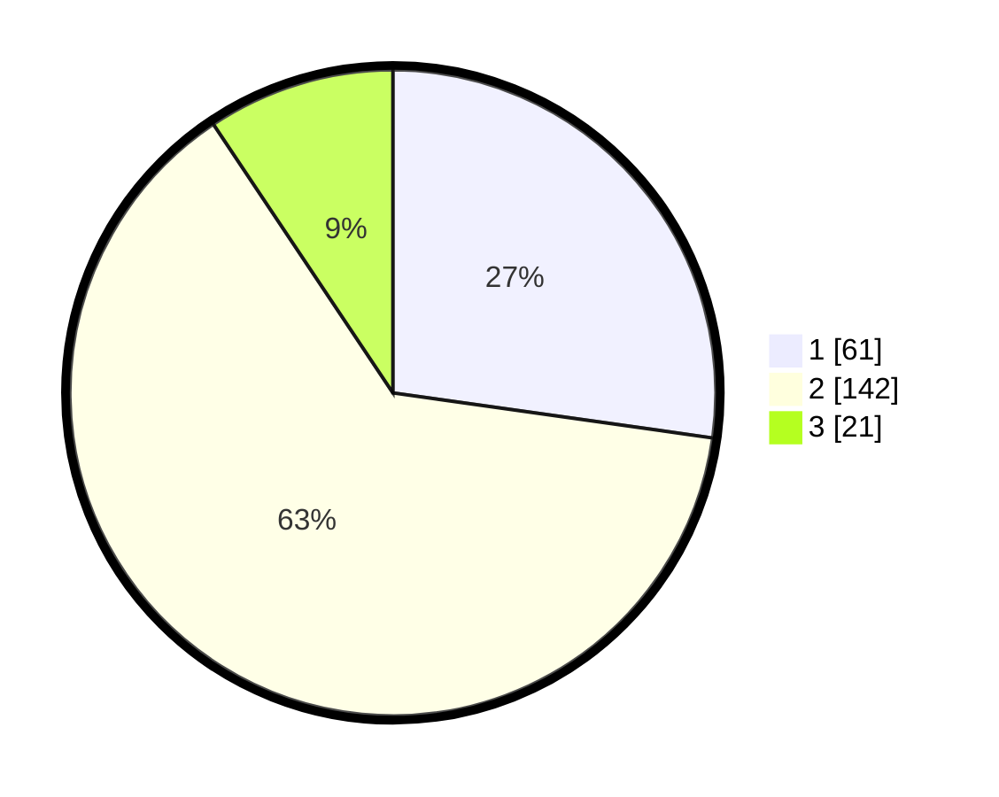

# Hasil

## Grafik

## Tabel

| No. | Nama Paslon    | Suara | Suara (raw) | Persentase |
|:--- |:-------------- | -----:| -----------:| ----------:|
| 1   | ANIES MUHAIMIN | 61    | [61][p-1]   | 27,23      |
| 2   | PRABOWO GIBRAN | 142   | [142][p-2]  | 63,39      |
| 3   | GANJAR MAHFUD  | 21    | [21][p-3]   | 9,38       |

[p-1]: https://github.com/gigit-pemilu/pemilu-2024/blob/main/pilpres/hitung-suara/sub/35-jawa-timur/sub/09-jember/sub/03-sumberbaru/sub/2004-jambesari/sub/004-tps/sub/paslon-1.txt
[p-2]: https://github.com/gigit-pemilu/pemilu-2024/blob/main/pilpres/hitung-suara/sub/35-jawa-timur/sub/09-jember/sub/03-sumberbaru/sub/2004-jambesari/sub/004-tps/sub/paslon-2.txt
[p-3]: https://github.com/gigit-pemilu/pemilu-2024/blob/main/pilpres/hitung-suara/sub/35-jawa-timur/sub/09-jember/sub/03-sumberbaru/sub/2004-jambesari/sub/004-tps/sub/paslon-3.txt

## Foto C Plano

https://sirekap-obj-formc.kpu.go.id/f841/pemilu/ppwp/35/09/03/20/04/3509032004004-20240214-222730--eb19c2f2-a4e9-464c-8521-058e04c61ef6.jpg

https://sirekap-obj-formc.kpu.go.id/f841/pemilu/ppwp/35/09/03/20/04/3509032004004-20240214-222855--e0bf17b6-d411-4239-9fda-3d6d0782dbaf.jpg

https://sirekap-obj-formc.kpu.go.id/f841/pemilu/ppwp/35/09/03/20/04/3509032004004-20240214-223029--2be723b1-73fa-4711-8d21-62ee49c4788f.jpg

## Metadata

| Key        | Value               |
| ---------- | ------------------- |
| Time Stamp | 2024-02-15 12:00:28 |

