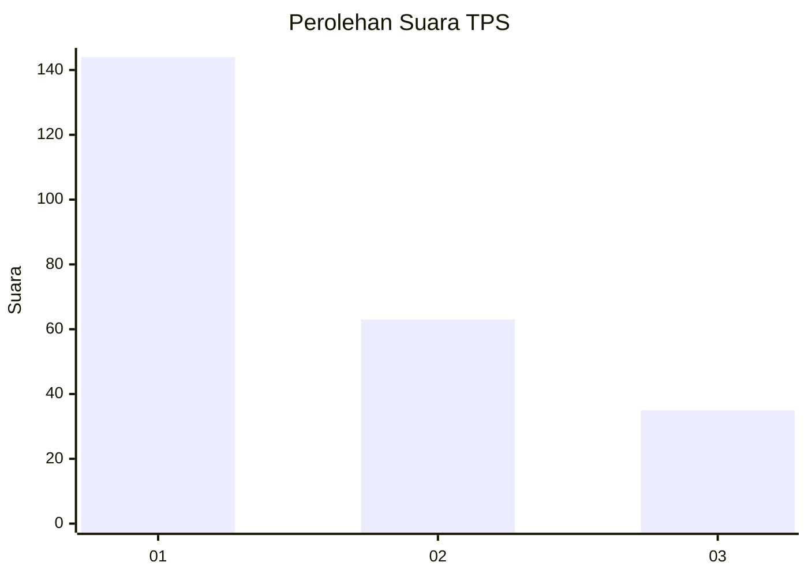
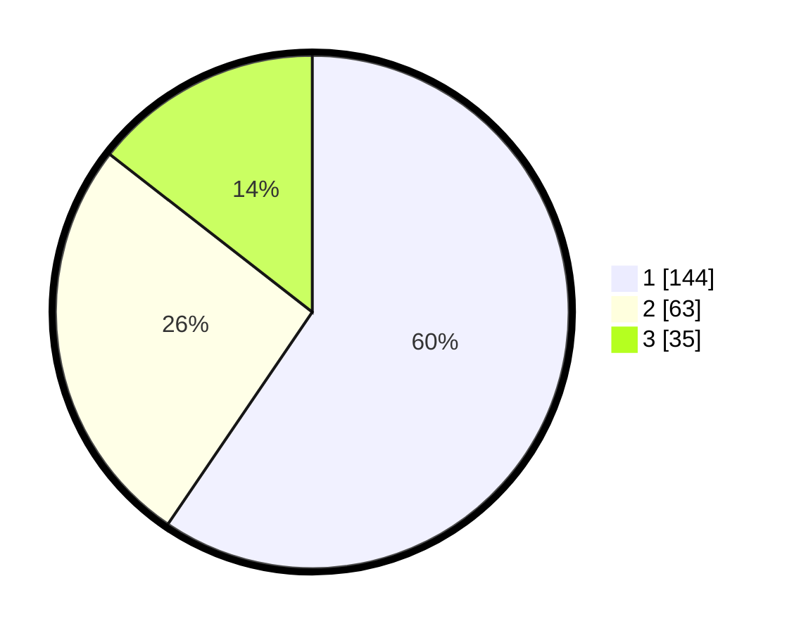

# Hasil

## Grafik

## Tabel

| No. | Nama Paslon    | Suara | Suara (raw) | Persentase |
|:--- |:-------------- | -----:| -----------:| ----------:|
| 1   | ANIES MUHAIMIN | 144   | [144][p-1]  | 59,50      |
| 2   | PRABOWO GIBRAN | 63    | [63][p-2]   | 26,03      |
| 3   | GANJAR MAHFUD  | 35    | [35][p-3]   | 14,46      |

[p-1]: https://github.com/gigit-pemilu/pemilu-2024-35-jawa-timur/blob/main/pilpres/hitung-suara/sub/35-jawa-timur/sub/09-jember/sub/03-sumberbaru/sub/2004-jambesari/sub/008-tps/sub/paslon-1.txt
[p-2]: https://github.com/gigit-pemilu/pemilu-2024-35-jawa-timur/blob/main/pilpres/hitung-suara/sub/35-jawa-timur/sub/09-jember/sub/03-sumberbaru/sub/2004-jambesari/sub/008-tps/sub/paslon-2.txt
[p-3]: https://github.com/gigit-pemilu/pemilu-2024-35-jawa-timur/blob/main/pilpres/hitung-suara/sub/35-jawa-timur/sub/09-jember/sub/03-sumberbaru/sub/2004-jambesari/sub/008-tps/sub/paslon-3.txt

## Foto C Plano

https://sirekap-obj-formc.kpu.go.id/149b/pemilu/ppwp/35/09/03/20/04/3509032004008-20240215-062934--aa326683-0421-460a-b1bd-9afebd534217.jpg

https://sirekap-obj-formc.kpu.go.id/149b/pemilu/ppwp/35/09/03/20/04/3509032004008-20240215-063120--b0ed3984-0df1-452c-9bd0-a0f29b8c31b1.jpg

https://sirekap-obj-formc.kpu.go.id/149b/pemilu/ppwp/35/09/03/20/04/3509032004008-20240215-063218--32d7c405-dd68-4fd0-bdf4-914e3bb56cf4.jpg

## Metadata

| Key        | Value               |
| ---------- | ------------------- |
| Time Stamp | 2024-02-16 09:30:28 |

