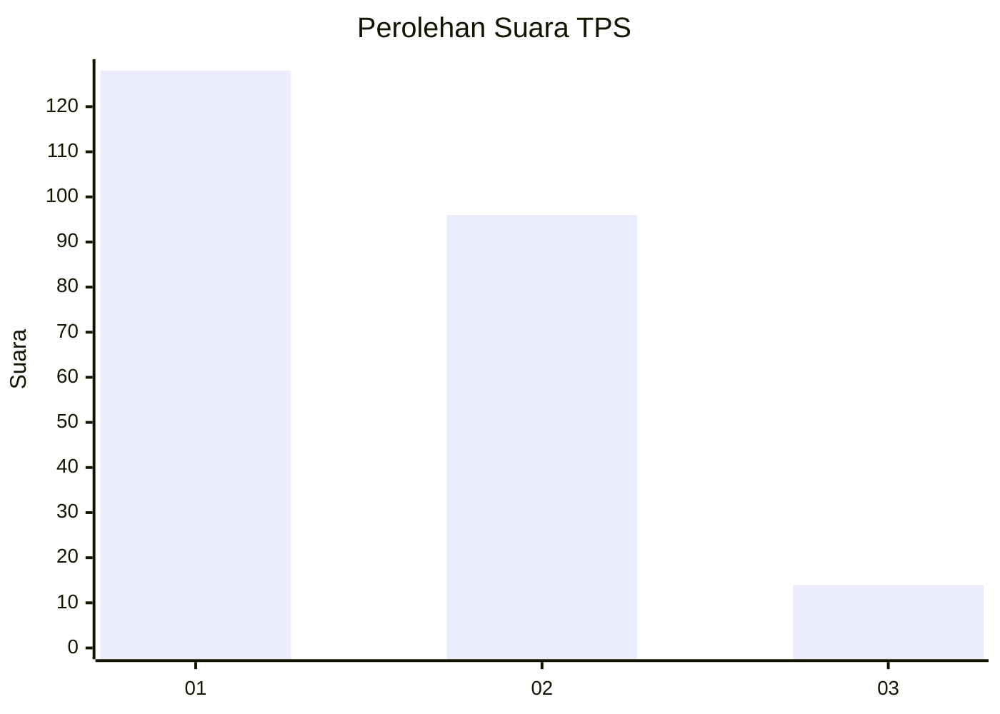
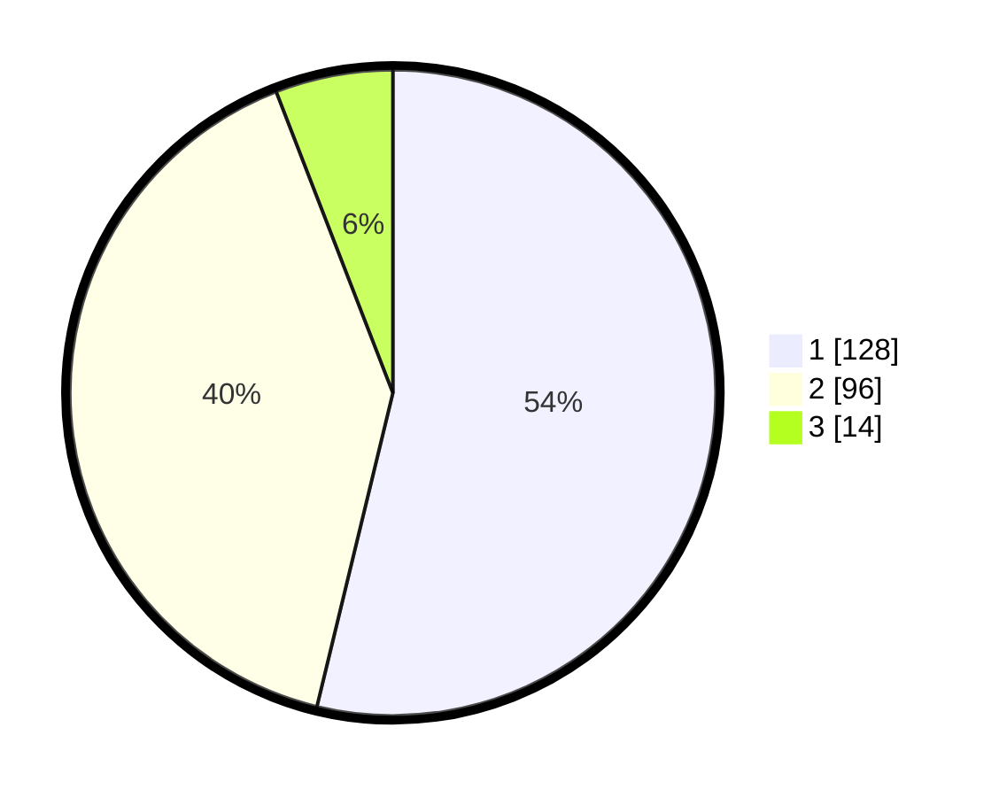

# Hasil

## Grafik

## Tabel

| No. | Nama Paslon    | Suara | Suara (raw) | Persentase |
|:--- |:-------------- | -----:| -----------:| ----------:|
| 1   | ANIES MUHAIMIN | 128   | [128][p-1]  | 53,78      |
| 2   | PRABOWO GIBRAN | 96    | [96][p-2]   | 40,34      |
| 3   | GANJAR MAHFUD  | 14    | [14][p-3]   | 5,88       |

[p-1]: https://github.com/gigit-pemilu/pemilu-2024-35-jawa-timur/blob/main/pilpres/hitung-suara/sub/35-jawa-timur/sub/09-jember/sub/03-sumberbaru/sub/2004-jambesari/sub/009-tps/sub/paslon-1.txt
[p-2]: https://github.com/gigit-pemilu/pemilu-2024-35-jawa-timur/blob/main/pilpres/hitung-suara/sub/35-jawa-timur/sub/09-jember/sub/03-sumberbaru/sub/2004-jambesari/sub/009-tps/sub/paslon-2.txt
[p-3]: https://github.com/gigit-pemilu/pemilu-2024-35-jawa-timur/blob/main/pilpres/hitung-suara/sub/35-jawa-timur/sub/09-jember/sub/03-sumberbaru/sub/2004-jambesari/sub/009-tps/sub/paslon-3.txt

## Foto C Plano

https://sirekap-obj-formc.kpu.go.id/b8dd/pemilu/ppwp/35/09/03/20/04/3509032004009-20240214-205635--4c361378-c3ce-461d-825b-a0cf311b51a0.jpg

https://sirekap-obj-formc.kpu.go.id/b8dd/pemilu/ppwp/35/09/03/20/04/3509032004009-20240215-081154--73f7a36b-f4a9-4ca1-bf8d-97c98d2a9eff.jpg

https://sirekap-obj-formc.kpu.go.id/b8dd/pemilu/ppwp/35/09/03/20/04/3509032004009-20240215-132631--2e305b5b-5e1f-46d4-b486-0b01fe52e690.jpg

## Metadata

| Key        | Value               |
| ---------- | ------------------- |
| Time Stamp | 2024-02-15 21:01:18 |

