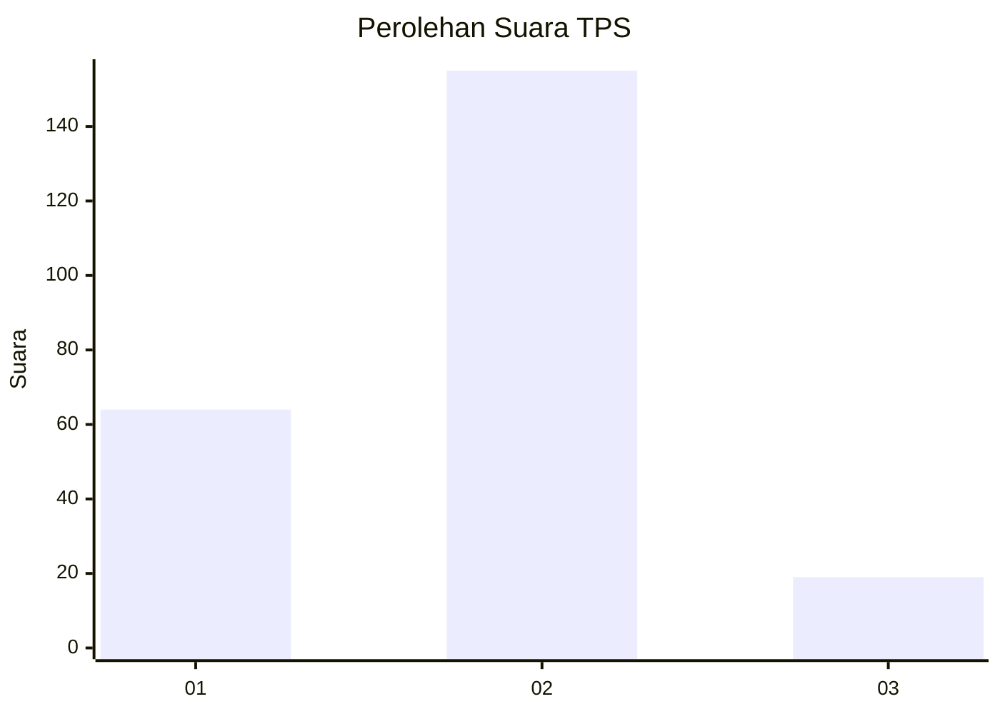
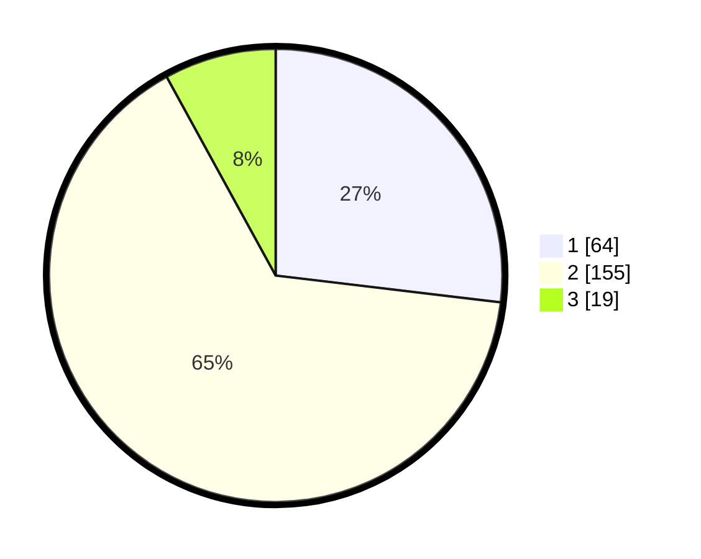

# Hasil

## Grafik

## Tabel

| No. | Nama Paslon    | Suara | Suara (raw) | Persentase |
|:--- |:-------------- | -----:| -----------:| ----------:|
| 1   | ANIES MUHAIMIN | 64    | [64][p-1]   | 26,89      |
| 2   | PRABOWO GIBRAN | 155   | [155][p-2]  | 65,13      |
| 3   | GANJAR MAHFUD  | 19    | [19][p-3]   | 7,98       |

[p-1]: https://github.com/gigit-pemilu/pemilu-2024-35-jawa-timur/blob/main/pilpres/hitung-suara/sub/35-jawa-timur/sub/09-jember/sub/03-sumberbaru/sub/2005-yosorati/sub/001-tps/sub/paslon-1.txt
[p-2]: https://github.com/gigit-pemilu/pemilu-2024-35-jawa-timur/blob/main/pilpres/hitung-suara/sub/35-jawa-timur/sub/09-jember/sub/03-sumberbaru/sub/2005-yosorati/sub/001-tps/sub/paslon-2.txt
[p-3]: https://github.com/gigit-pemilu/pemilu-2024-35-jawa-timur/blob/main/pilpres/hitung-suara/sub/35-jawa-timur/sub/09-jember/sub/03-sumberbaru/sub/2005-yosorati/sub/001-tps/sub/paslon-3.txt

## Foto C Plano

https://sirekap-obj-formc.kpu.go.id/4674/pemilu/ppwp/35/09/03/20/05/3509032005001-20240214-222753--76d2122d-0c67-46f9-aeb7-102d0bf5a81b.jpg

https://sirekap-obj-formc.kpu.go.id/4674/pemilu/ppwp/35/09/03/20/05/3509032005001-20240214-212558--89a55c54-5ae4-43aa-b98c-581d36f608f2.jpg

https://sirekap-obj-formc.kpu.go.id/4674/pemilu/ppwp/35/09/03/20/05/3509032005001-20240214-221423--dc1c24c2-92bb-4107-b717-84270c32158b.jpg

## Metadata

| Key        | Value               |
| ---------- | ------------------- |
| Time Stamp | 2024-02-15 15:00:29 |

