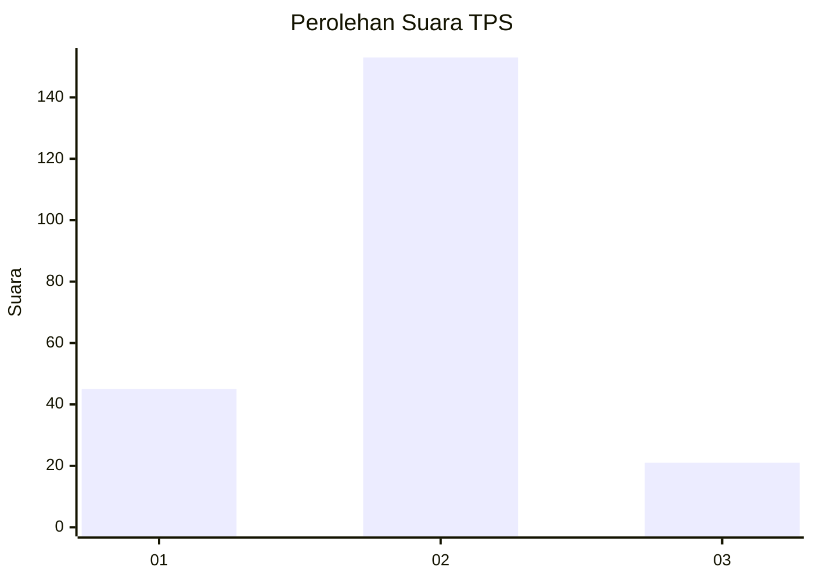

# Hasil

## Grafik

## Tabel

| No. | Nama Paslon    | Suara | Suara (raw) | Persentase |
|:--- |:-------------- | -----:| -----------:| ----------:|
| 1   | ANIES MUHAIMIN | 45    | [45][p-1]   | 20,55      |
| 2   | PRABOWO GIBRAN | 153   | [153][p-2]  | 69,86      |
| 3   | GANJAR MAHFUD  | 21    | [21][p-3]   | 9,59       |

[p-1]: https://github.com/gigit-pemilu/pemilu-2024/blob/main/pilpres/hitung-suara/sub/35-jawa-timur/sub/09-jember/sub/03-sumberbaru/sub/2005-yosorati/sub/002-tps/sub/paslon-1.txt
[p-2]: https://github.com/gigit-pemilu/pemilu-2024/blob/main/pilpres/hitung-suara/sub/35-jawa-timur/sub/09-jember/sub/03-sumberbaru/sub/2005-yosorati/sub/002-tps/sub/paslon-2.txt
[p-3]: https://github.com/gigit-pemilu/pemilu-2024/blob/main/pilpres/hitung-suara/sub/35-jawa-timur/sub/09-jember/sub/03-sumberbaru/sub/2005-yosorati/sub/002-tps/sub/paslon-3.txt

## Foto C Plano

https://sirekap-obj-formc.kpu.go.id/9807/pemilu/ppwp/35/09/03/20/05/3509032005002-20240214-232440--85b89cdc-5a8b-4eb7-bc0b-0a6d53b13060.jpg

https://sirekap-obj-formc.kpu.go.id/9807/pemilu/ppwp/35/09/03/20/05/3509032005002-20240214-232643--47b015f6-12eb-4a1b-bc11-2eed1a2d6a77.jpg

https://sirekap-obj-formc.kpu.go.id/9807/pemilu/ppwp/35/09/03/20/05/3509032005002-20240214-232736--31f1ae2e-56ff-49bf-82a5-263ffcec28b3.jpg

## Metadata

| Key        | Value               |
| ---------- | ------------------- |
| Time Stamp | 2024-02-15 12:00:28 |

