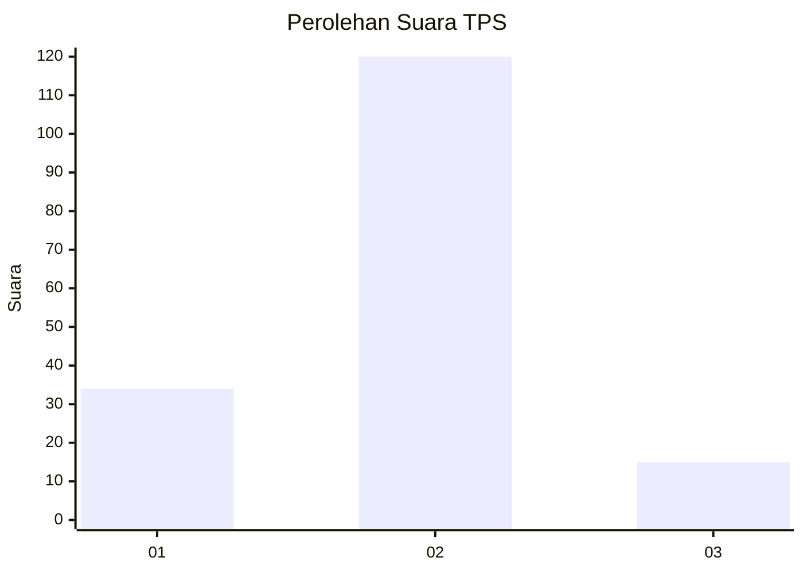

# Hasil

## Grafik

## Tabel

| No. | Nama Paslon    | Suara | Suara (raw) | Persentase |
|:--- |:-------------- | -----:| -----------:| ----------:|
| 1   | ANIES MUHAIMIN | 34    | [34][p-1]   | 20,12      |
| 2   | PRABOWO GIBRAN | 120   | [120][p-2]  | 71,01      |
| 3   | GANJAR MAHFUD  | 15    | [15][p-3]   | 8,88       |

[p-1]: https://github.com/gigit-pemilu/pemilu-2024/blob/main/pilpres/hitung-suara/sub/35-jawa-timur/sub/09-jember/sub/03-sumberbaru/sub/2005-yosorati/sub/005-tps/sub/paslon-1.txt
[p-2]: https://github.com/gigit-pemilu/pemilu-2024/blob/main/pilpres/hitung-suara/sub/35-jawa-timur/sub/09-jember/sub/03-sumberbaru/sub/2005-yosorati/sub/005-tps/sub/paslon-2.txt
[p-3]: https://github.com/gigit-pemilu/pemilu-2024/blob/main/pilpres/hitung-suara/sub/35-jawa-timur/sub/09-jember/sub/03-sumberbaru/sub/2005-yosorati/sub/005-tps/sub/paslon-3.txt

## Foto C Plano

https://sirekap-obj-formc.kpu.go.id/e304/pemilu/ppwp/35/09/03/20/05/3509032005005-20240214-212946--9023fe95-e584-4e5d-9795-c6f596ca07a9.jpg

https://sirekap-obj-formc.kpu.go.id/e304/pemilu/ppwp/35/09/03/20/05/3509032005005-20240214-213015--dba96c9a-08f4-4261-896f-ee0fd82a4bbf.jpg

https://sirekap-obj-formc.kpu.go.id/e304/pemilu/ppwp/35/09/03/20/05/3509032005005-20240214-213120--d0428a45-bb78-4e0a-9ddd-07fc62059484.jpg

## Metadata

| Key        | Value               |
| ---------- | ------------------- |
| Time Stamp | 2024-02-15 15:00:29 |

