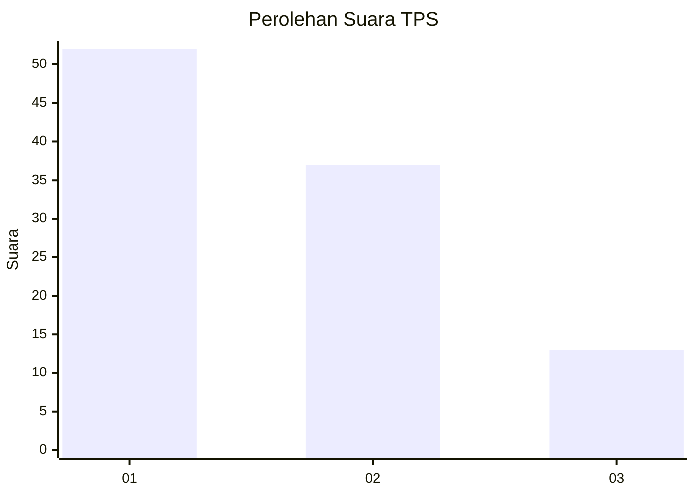
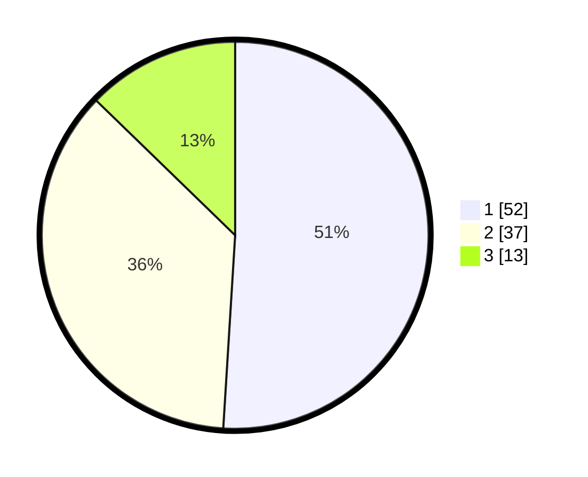

# Hasil

## Grafik

## Tabel

| No. | Nama Paslon    | Suara | Suara (raw) | Persentase |
|:--- |:-------------- | -----:| -----------:| ----------:|
| 1   | ANIES MUHAIMIN | 52    | [52][p-1]   | 50,98      |
| 2   | PRABOWO GIBRAN | 37    | [37][p-2]   | 36,27      |
| 3   | GANJAR MAHFUD  | 13    | [13][p-3]   | 12,75      |

[p-1]: https://github.com/gigit-pemilu/pemilu-2024/blob/main/pilpres/hitung-suara/sub/35-jawa-timur/sub/09-jember/sub/03-sumberbaru/sub/2005-yosorati/sub/010-tps/sub/paslon-1.txt
[p-2]: https://github.com/gigit-pemilu/pemilu-2024/blob/main/pilpres/hitung-suara/sub/35-jawa-timur/sub/09-jember/sub/03-sumberbaru/sub/2005-yosorati/sub/010-tps/sub/paslon-2.txt
[p-3]: https://github.com/gigit-pemilu/pemilu-2024/blob/main/pilpres/hitung-suara/sub/35-jawa-timur/sub/09-jember/sub/03-sumberbaru/sub/2005-yosorati/sub/010-tps/sub/paslon-3.txt

## Foto C Plano

https://sirekap-obj-formc.kpu.go.id/0bfd/pemilu/ppwp/35/09/03/20/05/3509032005010-20240215-021046--6ae00e1d-319d-4690-8b1c-8ea2237aeb87.jpg

https://sirekap-obj-formc.kpu.go.id/0bfd/pemilu/ppwp/35/09/03/20/05/3509032005010-20240215-021303--775252cb-1703-4435-93c0-d565776f78a0.jpg

https://sirekap-obj-formc.kpu.go.id/0bfd/pemilu/ppwp/35/09/03/20/05/3509032005010-20240215-021338--8442b417-4f3c-43e6-8af1-efb2f0912de5.jpg

## Metadata

| Key        | Value               |
| ---------- | ------------------- |
| Time Stamp | 2024-02-25 16:00:00 |

