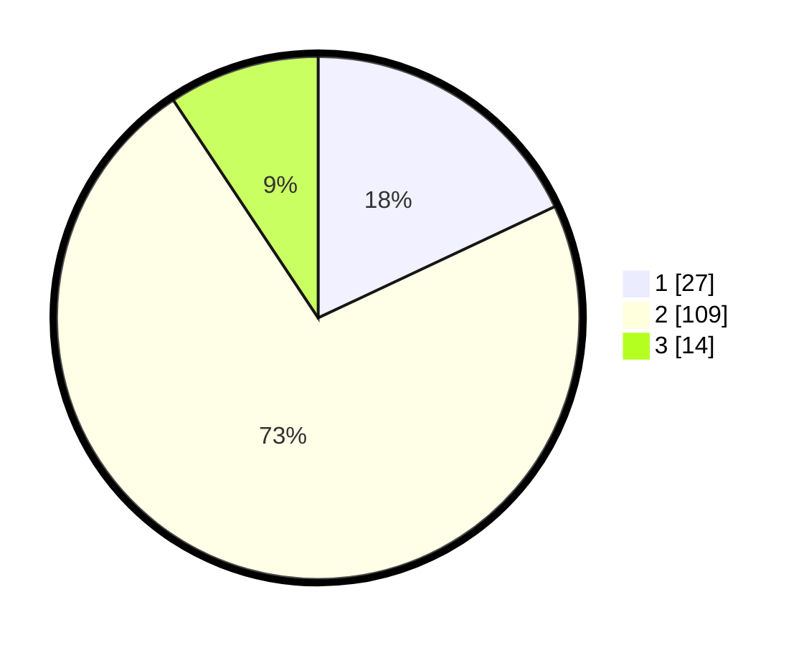

# Hasil

## Grafik

## Tabel

| No. | Nama Paslon    | Suara | Suara (raw) | Persentase |
|:--- |:-------------- | -----:| -----------:| ----------:|
| 1   | ANIES MUHAIMIN | 27    | [27][p-1]   | 18,00      |
| 2   | PRABOWO GIBRAN | 109   | [109][p-2]  | 72,67      |
| 3   | GANJAR MAHFUD  | 14    | [14][p-3]   | 9,33       |

[p-1]: https://github.com/gigit-pemilu/pemilu-2024-35-jawa-timur/blob/main/pilpres/hitung-suara/sub/35-jawa-timur/sub/09-jember/sub/03-sumberbaru/sub/2005-yosorati/sub/011-tps/sub/paslon-1.txt
[p-2]: https://github.com/gigit-pemilu/pemilu-2024-35-jawa-timur/blob/main/pilpres/hitung-suara/sub/35-jawa-timur/sub/09-jember/sub/03-sumberbaru/sub/2005-yosorati/sub/011-tps/sub/paslon-2.txt
[p-3]: https://github.com/gigit-pemilu/pemilu-2024-35-jawa-timur/blob/main/pilpres/hitung-suara/sub/35-jawa-timur/sub/09-jember/sub/03-sumberbaru/sub/2005-yosorati/sub/011-tps/sub/paslon-3.txt

## Foto C Plano

https://sirekap-obj-formc.kpu.go.id/a485/pemilu/ppwp/35/09/03/20/05/3509032005011-20240214-193538--3850eab4-a343-45e2-81bd-5e350e13d8ab.jpg

https://sirekap-obj-formc.kpu.go.id/a485/pemilu/ppwp/35/09/03/20/05/3509032005011-20240214-193558--6fa54262-ecba-4aa3-9fa7-85e8607bb709.jpg

https://sirekap-obj-formc.kpu.go.id/a485/pemilu/ppwp/35/09/03/20/05/3509032005011-20240214-193610--b4ccb600-a29b-45f9-b7b8-051940b048ad.jpg

## Metadata

| Key        | Value               |
| ---------- | ------------------- |
| Time Stamp | 2024-02-14 21:46:01 |

