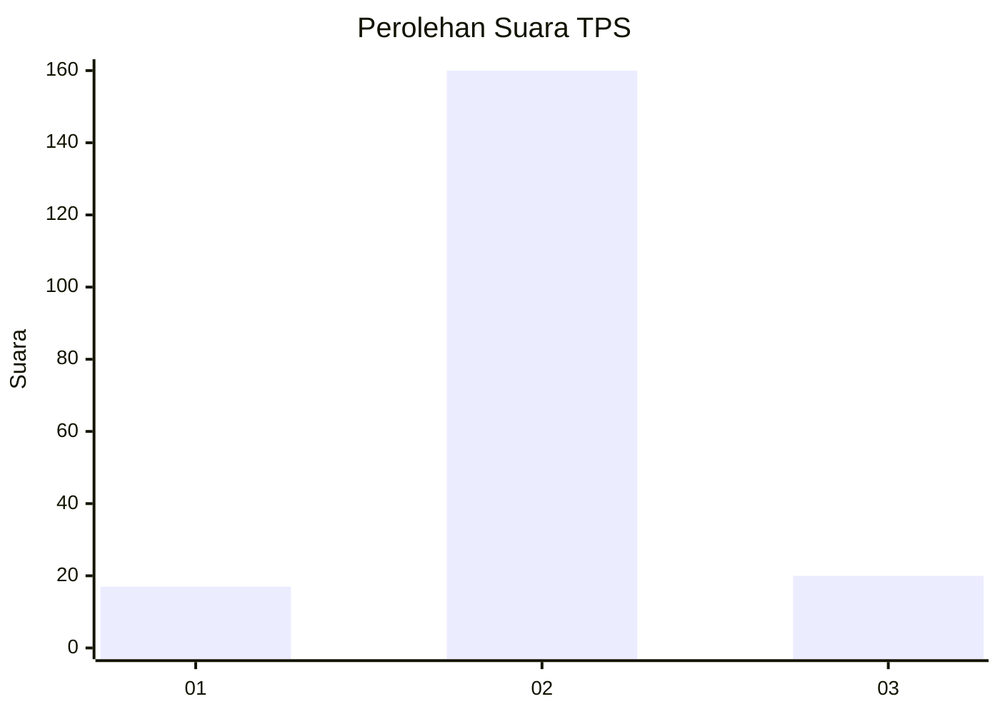
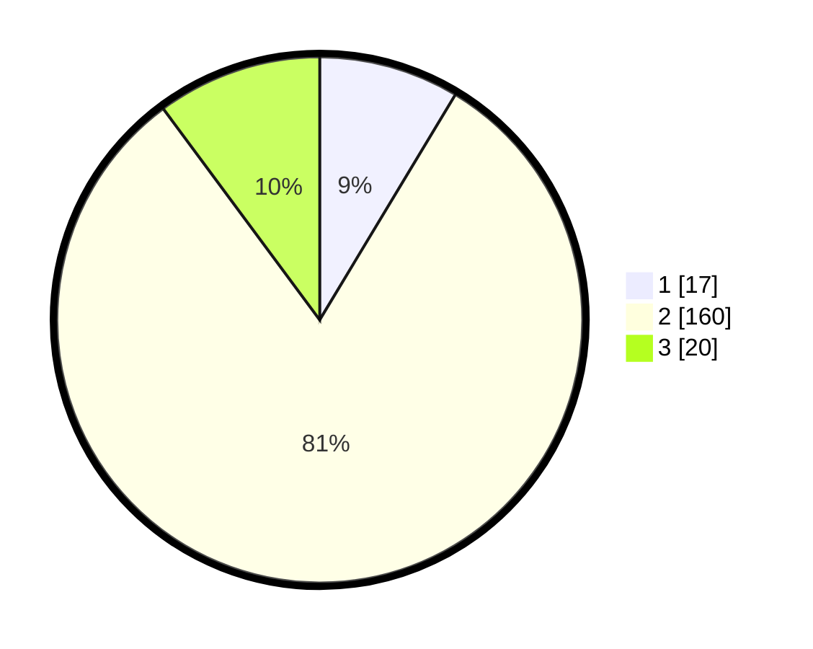

# Hasil

## Grafik

## Tabel

| No. | Nama Paslon    | Suara | Suara (raw) | Persentase |
|:--- |:-------------- | -----:| -----------:| ----------:|
| 1   | ANIES MUHAIMIN | 17    | [17][p-1]   | 8,63       |
| 2   | PRABOWO GIBRAN | 160   | [160][p-2]  | 81,22      |
| 3   | GANJAR MAHFUD  | 20    | [20][p-3]   | 10,15      |

[p-1]: https://github.com/gigit-pemilu/pemilu-2024/blob/main/pilpres/hitung-suara/sub/35-jawa-timur/sub/09-jember/sub/03-sumberbaru/sub/2005-yosorati/sub/013-tps/sub/paslon-1.txt
[p-2]: https://github.com/gigit-pemilu/pemilu-2024/blob/main/pilpres/hitung-suara/sub/35-jawa-timur/sub/09-jember/sub/03-sumberbaru/sub/2005-yosorati/sub/013-tps/sub/paslon-2.txt
[p-3]: https://github.com/gigit-pemilu/pemilu-2024/blob/main/pilpres/hitung-suara/sub/35-jawa-timur/sub/09-jember/sub/03-sumberbaru/sub/2005-yosorati/sub/013-tps/sub/paslon-3.txt

## Foto C Plano

https://sirekap-obj-formc.kpu.go.id/3f5a/pemilu/ppwp/35/09/03/20/05/3509032005013-20240214-214328--9dd73a97-5676-4df6-8176-d7125757301a.jpg

https://sirekap-obj-formc.kpu.go.id/3f5a/pemilu/ppwp/35/09/03/20/05/3509032005013-20240214-204945--dd050a8a-c5b6-4ced-b200-fb6b4096c528.jpg

https://sirekap-obj-formc.kpu.go.id/3f5a/pemilu/ppwp/35/09/03/20/05/3509032005013-20240214-205045--696e456c-686e-47cb-9bc3-97d8af508321.jpg

## Metadata

| Key        | Value               |
| ---------- | ------------------- |
| Time Stamp | 2024-02-15 15:00:29 |

