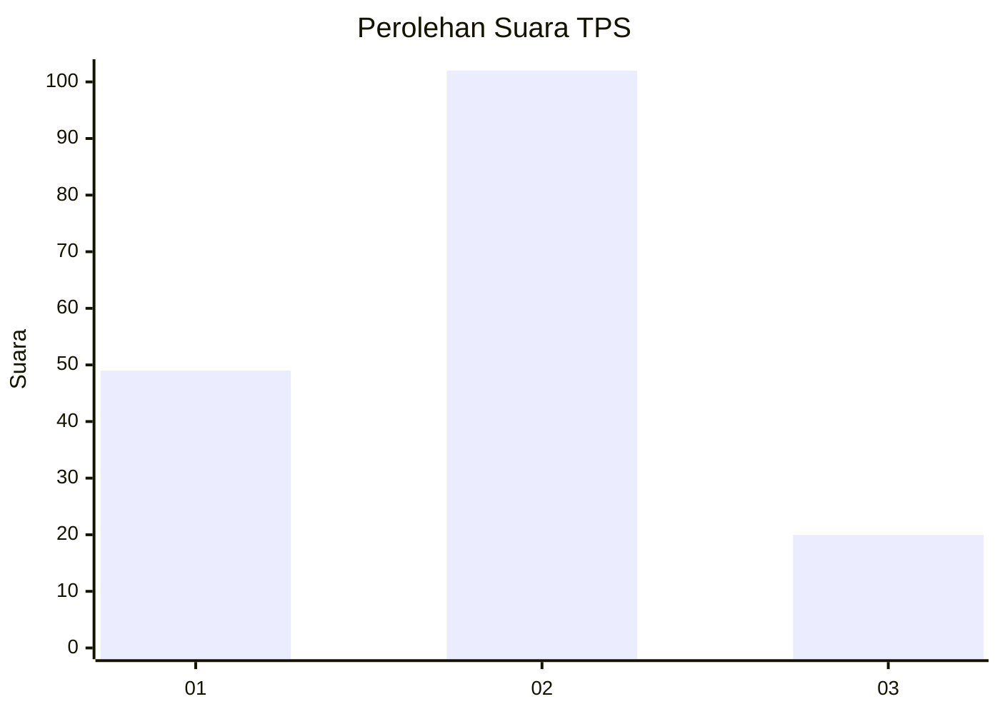
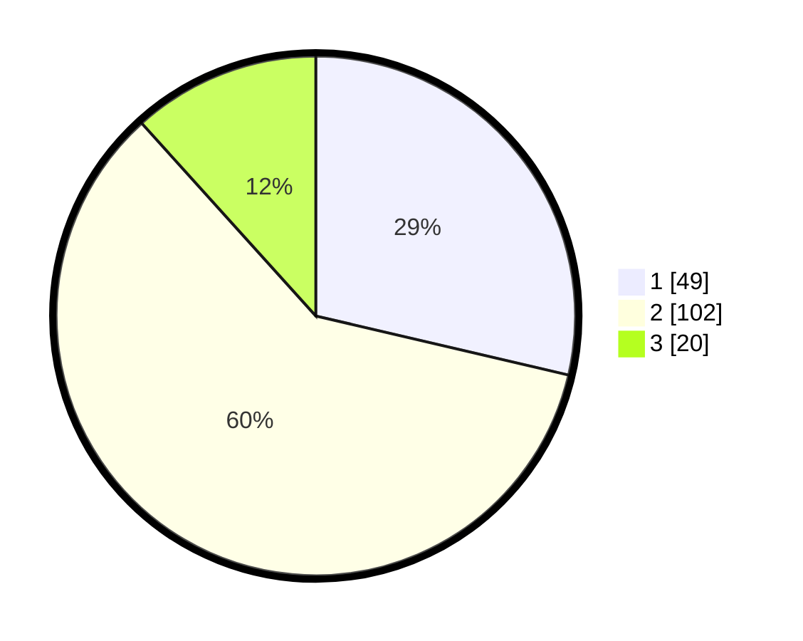

# Hasil

## Grafik

## Tabel

| No. | Nama Paslon    | Suara | Suara (raw) | Persentase |
|:--- |:-------------- | -----:| -----------:| ----------:|
| 1   | ANIES MUHAIMIN | 49    | [49][p-1]   | 28,65      |
| 2   | PRABOWO GIBRAN | 102   | [102][p-2]  | 59,65      |
| 3   | GANJAR MAHFUD  | 20    | [20][p-3]   | 11,70      |

[p-1]: https://github.com/gigit-pemilu/pemilu-2024/blob/main/pilpres/hitung-suara/sub/35-jawa-timur/sub/09-jember/sub/03-sumberbaru/sub/2005-yosorati/sub/023-tps/sub/paslon-1.txt
[p-2]: https://github.com/gigit-pemilu/pemilu-2024/blob/main/pilpres/hitung-suara/sub/35-jawa-timur/sub/09-jember/sub/03-sumberbaru/sub/2005-yosorati/sub/023-tps/sub/paslon-2.txt
[p-3]: https://github.com/gigit-pemilu/pemilu-2024/blob/main/pilpres/hitung-suara/sub/35-jawa-timur/sub/09-jember/sub/03-sumberbaru/sub/2005-yosorati/sub/023-tps/sub/paslon-3.txt

## Foto C Plano

https://sirekap-obj-formc.kpu.go.id/6326/pemilu/ppwp/35/09/03/20/05/3509032005023-20240214-203602--b90b47ec-af8e-4110-9bb5-608e3ccab1e7.jpg

https://sirekap-obj-formc.kpu.go.id/6326/pemilu/ppwp/35/09/03/20/05/3509032005023-20240214-203735--9c51bfec-bbfa-4e22-b6dd-5d2444a44f68.jpg

https://sirekap-obj-formc.kpu.go.id/6326/pemilu/ppwp/35/09/03/20/05/3509032005023-20240214-222124--6cc031eb-274e-44f1-b55e-29f245a74350.jpg

## Metadata

| Key        | Value               |
| ---------- | ------------------- |
| Time Stamp | 2024-02-15 12:00:28 |

