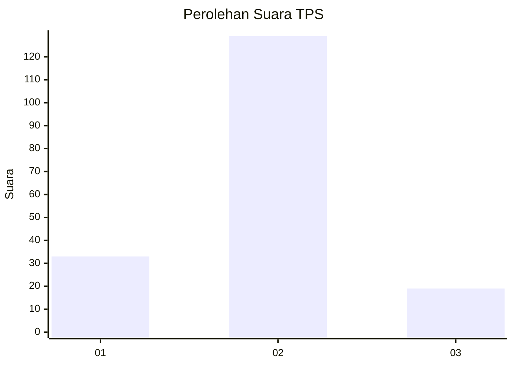
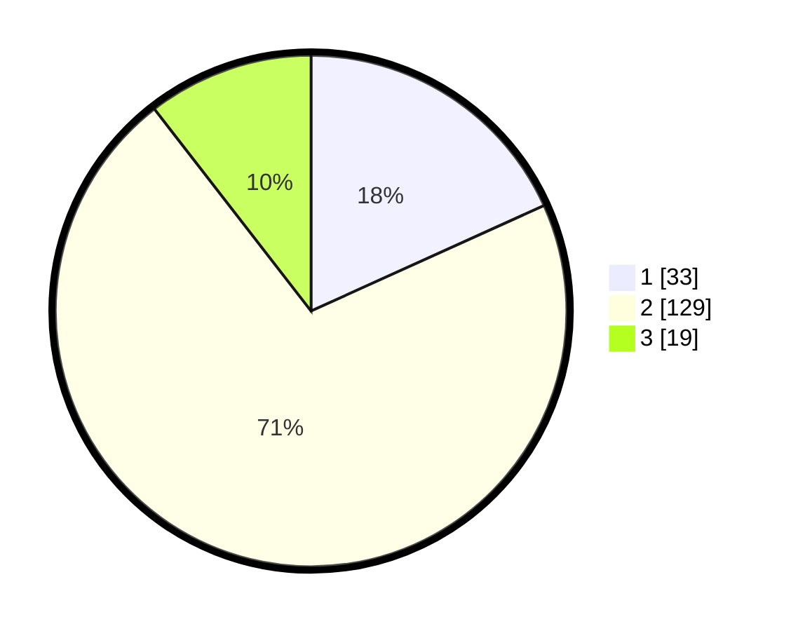

# Hasil

## Grafik

## Tabel

| No. | Nama Paslon    | Suara | Suara (raw) | Persentase |
|:--- |:-------------- | -----:| -----------:| ----------:|
| 1   | ANIES MUHAIMIN | 33    | [33][p-1]   | 18,23      |
| 2   | PRABOWO GIBRAN | 129   | [129][p-2]  | 71,27      |
| 3   | GANJAR MAHFUD  | 19    | [19][p-3]   | 10,50      |

[p-1]: https://github.com/gigit-pemilu/pemilu-2024-35-jawa-timur/blob/main/pilpres/hitung-suara/sub/35-jawa-timur/sub/09-jember/sub/03-sumberbaru/sub/2005-yosorati/sub/025-tps/sub/paslon-1.txt
[p-2]: https://github.com/gigit-pemilu/pemilu-2024-35-jawa-timur/blob/main/pilpres/hitung-suara/sub/35-jawa-timur/sub/09-jember/sub/03-sumberbaru/sub/2005-yosorati/sub/025-tps/sub/paslon-2.txt
[p-3]: https://github.com/gigit-pemilu/pemilu-2024-35-jawa-timur/blob/main/pilpres/hitung-suara/sub/35-jawa-timur/sub/09-jember/sub/03-sumberbaru/sub/2005-yosorati/sub/025-tps/sub/paslon-3.txt

## Foto C Plano

https://sirekap-obj-formc.kpu.go.id/6453/pemilu/ppwp/35/09/03/20/05/3509032005025-20240215-000245--b3bbc58a-5892-4906-9c40-896d9126cab4.jpg

https://sirekap-obj-formc.kpu.go.id/6453/pemilu/ppwp/35/09/03/20/05/3509032005025-20240215-000356--fa0fee6e-76fd-48ed-b672-e71aef8ede0a.jpg

https://sirekap-obj-formc.kpu.go.id/6453/pemilu/ppwp/35/09/03/20/05/3509032005025-20240215-000514--185cb6e8-85fb-47d6-b898-c54984309b9a.jpg

## Metadata

| Key        | Value               |
| ---------- | ------------------- |
| Time Stamp | 2024-02-24 22:31:28 |

