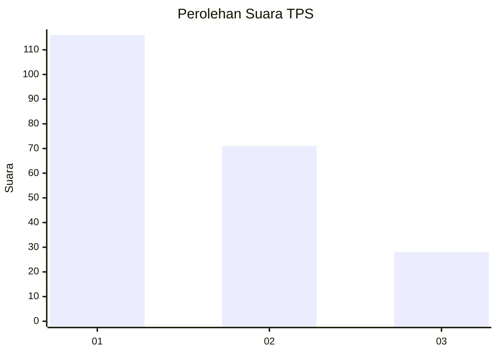
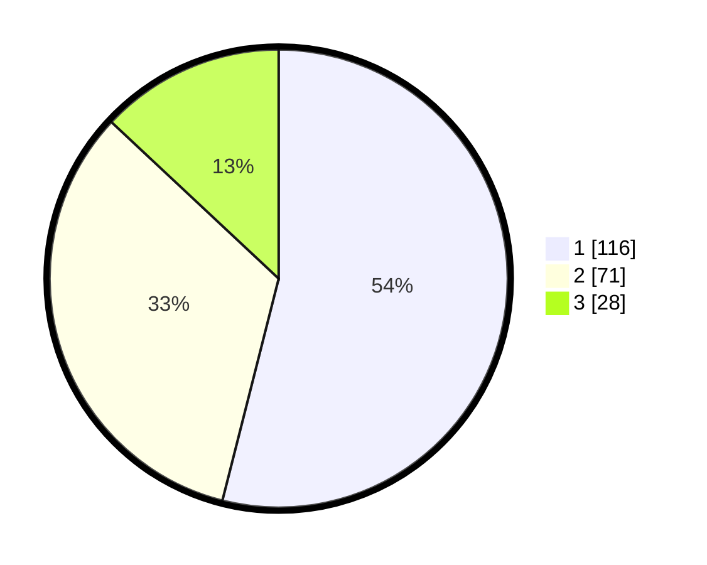

# Hasil

## Grafik

## Tabel

| No. | Nama Paslon    | Suara | Suara (raw) | Persentase |
|:--- |:-------------- | -----:| -----------:| ----------:|
| 1   | ANIES MUHAIMIN | 116   | [116][p-1]  | 53,95      |
| 2   | PRABOWO GIBRAN | 71    | [71][p-2]   | 33,02      |
| 3   | GANJAR MAHFUD  | 28    | [28][p-3]   | 13,02      |

[p-1]: https://github.com/gigit-pemilu/pemilu-2024-35-jawa-timur/blob/main/pilpres/hitung-suara/sub/35-jawa-timur/sub/09-jember/sub/03-sumberbaru/sub/2005-yosorati/sub/026-tps/sub/paslon-1.txt
[p-2]: https://github.com/gigit-pemilu/pemilu-2024-35-jawa-timur/blob/main/pilpres/hitung-suara/sub/35-jawa-timur/sub/09-jember/sub/03-sumberbaru/sub/2005-yosorati/sub/026-tps/sub/paslon-2.txt
[p-3]: https://github.com/gigit-pemilu/pemilu-2024-35-jawa-timur/blob/main/pilpres/hitung-suara/sub/35-jawa-timur/sub/09-jember/sub/03-sumberbaru/sub/2005-yosorati/sub/026-tps/sub/paslon-3.txt

## Foto C Plano

https://sirekap-obj-formc.kpu.go.id/6a0a/pemilu/ppwp/35/09/03/20/05/3509032005026-20240215-003451--d103a805-69ac-4d02-8dd8-61676daff619.jpg

https://sirekap-obj-formc.kpu.go.id/6a0a/pemilu/ppwp/35/09/03/20/05/3509032005026-20240215-003758--861385aa-31ff-46e0-a14e-2ceded4f8529.jpg

https://sirekap-obj-formc.kpu.go.id/6a0a/pemilu/ppwp/35/09/03/20/05/3509032005026-20240215-003831--f6352073-f141-4861-8c19-fde901a59cd3.jpg

## Metadata

| Key        | Value               |
| ---------- | ------------------- |
| Time Stamp | 2024-02-15 12:00:28 |

