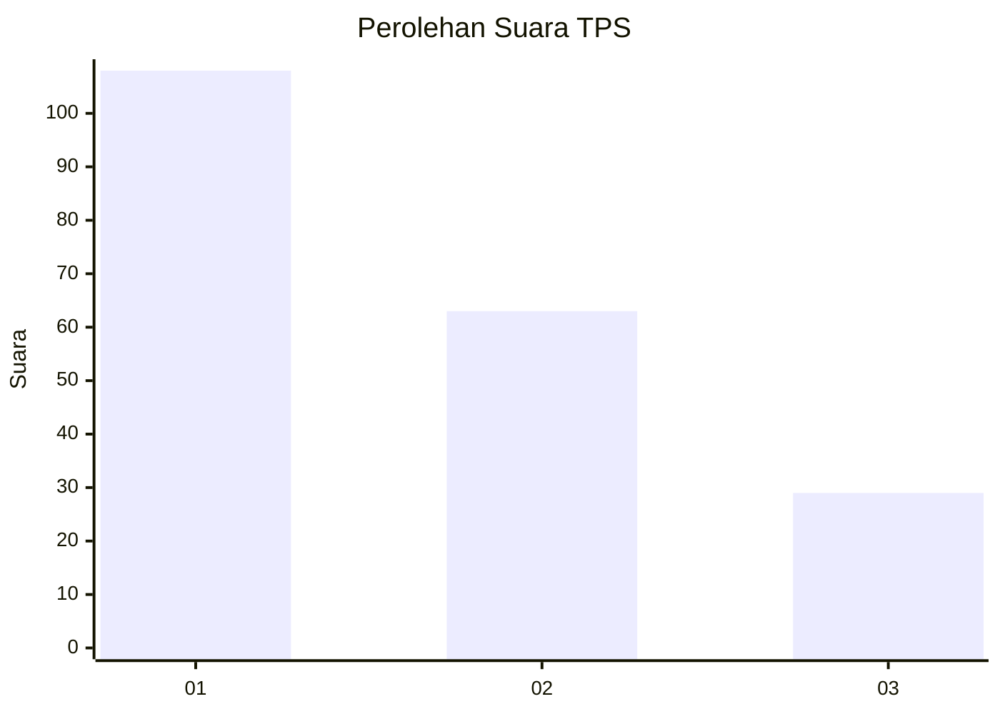
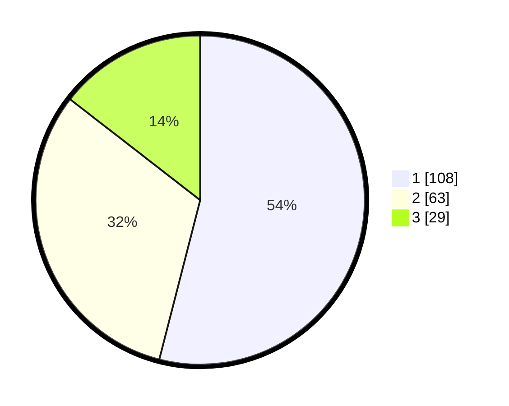

# Hasil

## Grafik

## Tabel

| No. | Nama Paslon    | Suara | Suara (raw) | Persentase |
|:--- |:-------------- | -----:| -----------:| ----------:|
| 1   | ANIES MUHAIMIN | 108   | [108][p-1]  | 54,00      |
| 2   | PRABOWO GIBRAN | 63    | [63][p-2]   | 31,50      |
| 3   | GANJAR MAHFUD  | 29    | [29][p-3]   | 14,50      |

[p-1]: https://github.com/gigit-pemilu/pemilu-2024-35-jawa-timur/blob/main/pilpres/hitung-suara/sub/35-jawa-timur/sub/09-jember/sub/03-sumberbaru/sub/2005-yosorati/sub/027-tps/sub/paslon-1.txt
[p-2]: https://github.com/gigit-pemilu/pemilu-2024-35-jawa-timur/blob/main/pilpres/hitung-suara/sub/35-jawa-timur/sub/09-jember/sub/03-sumberbaru/sub/2005-yosorati/sub/027-tps/sub/paslon-2.txt
[p-3]: https://github.com/gigit-pemilu/pemilu-2024-35-jawa-timur/blob/main/pilpres/hitung-suara/sub/35-jawa-timur/sub/09-jember/sub/03-sumberbaru/sub/2005-yosorati/sub/027-tps/sub/paslon-3.txt

## Foto C Plano

https://sirekap-obj-formc.kpu.go.id/ecb7/pemilu/ppwp/35/09/03/20/05/3509032005027-20240215-093010--fa3d9b97-c7d6-4a29-9eaa-d040f4a65540.jpg

https://sirekap-obj-formc.kpu.go.id/ecb7/pemilu/ppwp/35/09/03/20/05/3509032005027-20240215-092855--445f760c-5ca9-43af-a398-58932b70cf62.jpg

https://sirekap-obj-formc.kpu.go.id/ecb7/pemilu/ppwp/35/09/03/20/05/3509032005027-20240215-091544--3b6870c0-0694-4770-b9fd-d491c75dac05.jpg

## Metadata

| Key        | Value               |
| ---------- | ------------------- |
| Time Stamp | 2024-02-15 19:00:26 |

