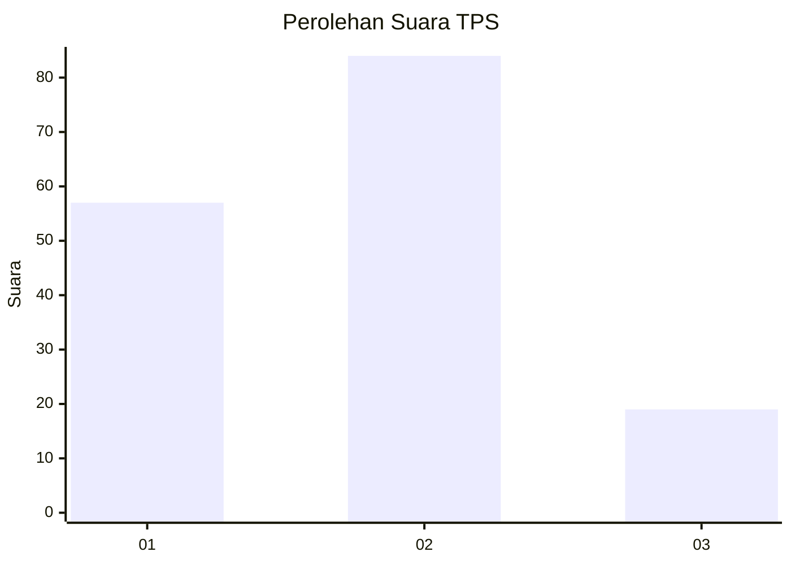
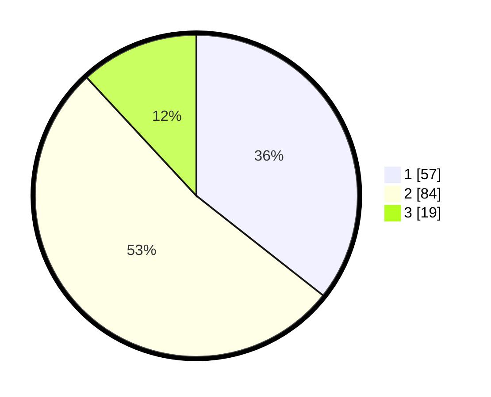

# Hasil

## Grafik

## Tabel

| No. | Nama Paslon    | Suara | Suara (raw) | Persentase |
|:--- |:-------------- | -----:| -----------:| ----------:|
| 1   | ANIES MUHAIMIN | 57    | [57][p-1]   | 35,63      |
| 2   | PRABOWO GIBRAN | 84    | [84][p-2]   | 52,50      |
| 3   | GANJAR MAHFUD  | 19    | [19][p-3]   | 11,88      |

[p-1]: https://github.com/gigit-pemilu/pemilu-2024/blob/main/pilpres/hitung-suara/sub/35-jawa-timur/sub/09-jember/sub/03-sumberbaru/sub/2005-yosorati/sub/030-tps/sub/paslon-1.txt
[p-2]: https://github.com/gigit-pemilu/pemilu-2024/blob/main/pilpres/hitung-suara/sub/35-jawa-timur/sub/09-jember/sub/03-sumberbaru/sub/2005-yosorati/sub/030-tps/sub/paslon-2.txt
[p-3]: https://github.com/gigit-pemilu/pemilu-2024/blob/main/pilpres/hitung-suara/sub/35-jawa-timur/sub/09-jember/sub/03-sumberbaru/sub/2005-yosorati/sub/030-tps/sub/paslon-3.txt

## Foto C Plano

https://sirekap-obj-formc.kpu.go.id/2d84/pemilu/ppwp/35/09/03/20/05/3509032005030-20240215-011006--dae7e9c9-c7f5-44ac-843d-88fcab7cb4b3.jpg

https://sirekap-obj-formc.kpu.go.id/2d84/pemilu/ppwp/35/09/03/20/05/3509032005030-20240215-011301--e51d90a0-6b6d-4a6b-bd4e-b916f6eef73d.jpg

https://sirekap-obj-formc.kpu.go.id/2d84/pemilu/ppwp/35/09/03/20/05/3509032005030-20240215-011423--50b6f478-17f6-49dd-8c04-b5e830dca00b.jpg

## Metadata

| Key        | Value               |
| ---------- | ------------------- |
| Time Stamp | 2024-02-15 12:00:28 |

