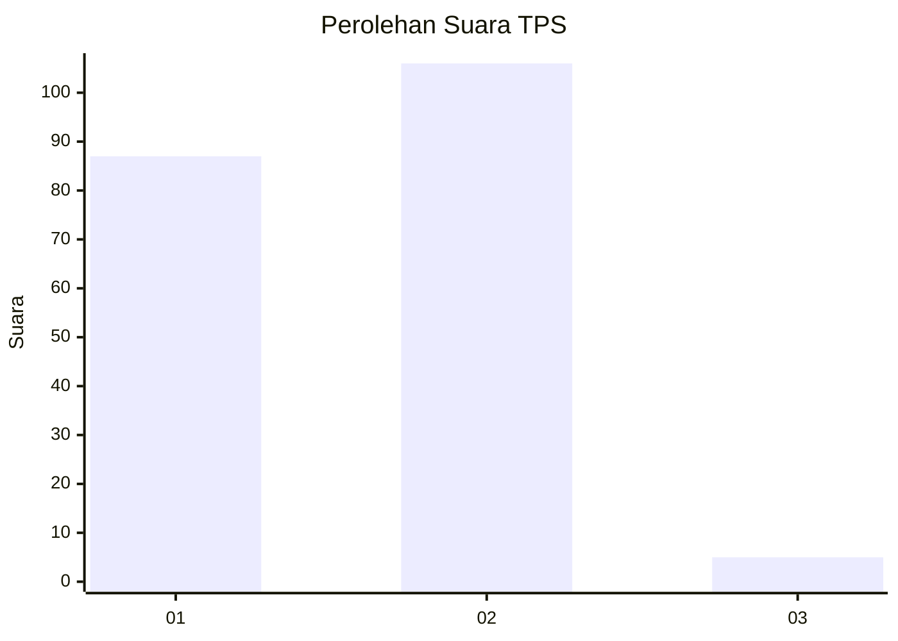
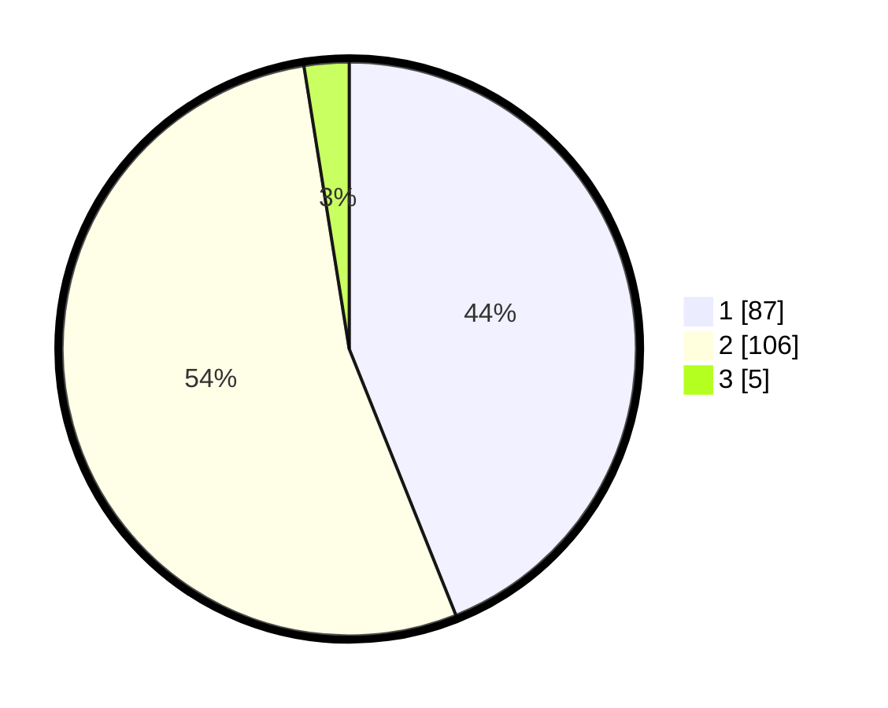

# Hasil

## Grafik

## Tabel

| No. | Nama Paslon    | Suara | Suara (raw) | Persentase |
|:--- |:-------------- | -----:| -----------:| ----------:|
| 1   | ANIES MUHAIMIN | 87    | [87][p-1]   | 43,94      |
| 2   | PRABOWO GIBRAN | 106   | [106][p-2]  | 53,54      |
| 3   | GANJAR MAHFUD  | 5     | [5][p-3]    | 2,53       |

[p-1]: https://github.com/gigit-pemilu/pemilu-2024-35-jawa-timur/blob/main/pilpres/hitung-suara/sub/35-jawa-timur/sub/09-jember/sub/03-sumberbaru/sub/2005-yosorati/sub/031-tps/sub/paslon-1.txt
[p-2]: https://github.com/gigit-pemilu/pemilu-2024-35-jawa-timur/blob/main/pilpres/hitung-suara/sub/35-jawa-timur/sub/09-jember/sub/03-sumberbaru/sub/2005-yosorati/sub/031-tps/sub/paslon-2.txt
[p-3]: https://github.com/gigit-pemilu/pemilu-2024-35-jawa-timur/blob/main/pilpres/hitung-suara/sub/35-jawa-timur/sub/09-jember/sub/03-sumberbaru/sub/2005-yosorati/sub/031-tps/sub/paslon-3.txt

## Foto C Plano

https://sirekap-obj-formc.kpu.go.id/223c/pemilu/ppwp/35/09/03/20/05/3509032005031-20240215-034205--000e7c84-367a-4dab-90a6-d5b122686868.jpg

https://sirekap-obj-formc.kpu.go.id/223c/pemilu/ppwp/35/09/03/20/05/3509032005031-20240215-034259--0fd25647-ba41-4df6-acbb-19930cd8fce8.jpg

https://sirekap-obj-formc.kpu.go.id/223c/pemilu/ppwp/35/09/03/20/05/3509032005031-20240215-034352--4864b56c-eafa-4749-82bf-0518b3b8da77.jpg

## Metadata

| Key        | Value               |
| ---------- | ------------------- |
| Time Stamp | 2024-02-15 15:00:29 |

