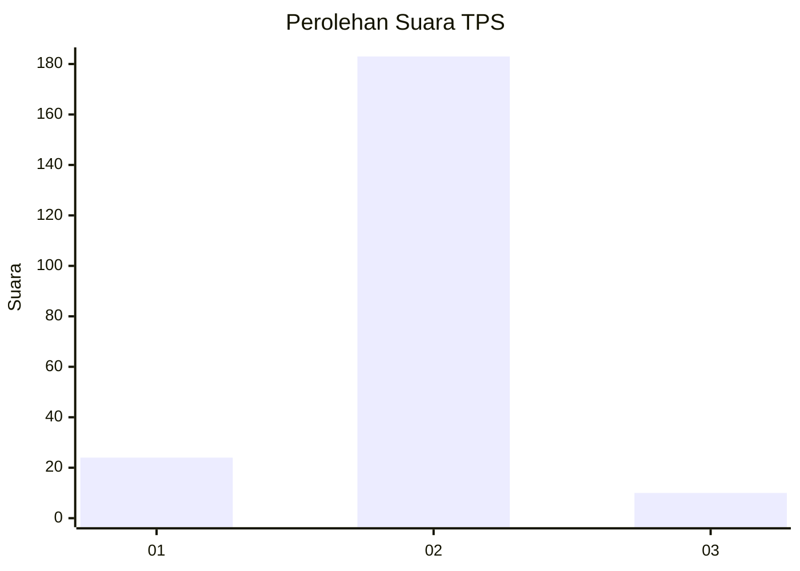
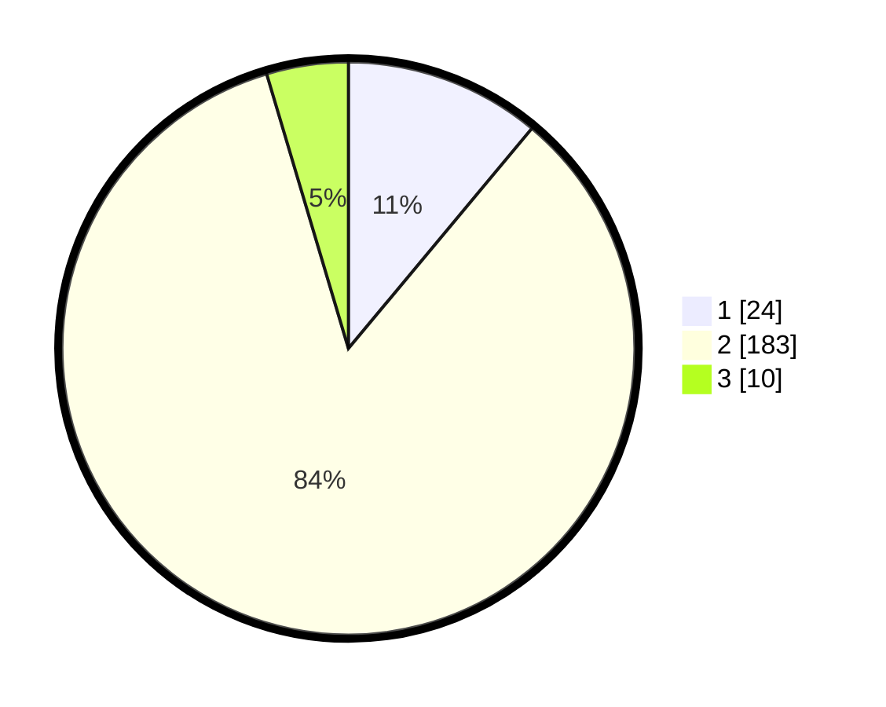

# Hasil

## Grafik

## Tabel

| No. | Nama Paslon    | Suara | Suara (raw) | Persentase |
|:--- |:-------------- | -----:| -----------:| ----------:|
| 1   | ANIES MUHAIMIN | 24    | [24][p-1]   | 11,06      |
| 2   | PRABOWO GIBRAN | 183   | [183][p-2]  | 84,33      |
| 3   | GANJAR MAHFUD  | 10    | [10][p-3]   | 4,61       |

[p-1]: https://github.com/gigit-pemilu/pemilu-2024/blob/main/pilpres/hitung-suara/sub/35-jawa-timur/sub/09-jember/sub/03-sumberbaru/sub/2005-yosorati/sub/036-tps/sub/paslon-1.txt
[p-2]: https://github.com/gigit-pemilu/pemilu-2024/blob/main/pilpres/hitung-suara/sub/35-jawa-timur/sub/09-jember/sub/03-sumberbaru/sub/2005-yosorati/sub/036-tps/sub/paslon-2.txt
[p-3]: https://github.com/gigit-pemilu/pemilu-2024/blob/main/pilpres/hitung-suara/sub/35-jawa-timur/sub/09-jember/sub/03-sumberbaru/sub/2005-yosorati/sub/036-tps/sub/paslon-3.txt

## Foto C Plano

https://sirekap-obj-formc.kpu.go.id/1ed2/pemilu/ppwp/35/09/03/20/05/3509032005036-20240215-003930--f2d4c37e-c6eb-4015-ac87-e4f10b4a09cb.jpg

https://sirekap-obj-formc.kpu.go.id/1ed2/pemilu/ppwp/35/09/03/20/05/3509032005036-20240215-004122--984dfd15-36d3-4e41-9e94-998865507b02.jpg

https://sirekap-obj-formc.kpu.go.id/1ed2/pemilu/ppwp/35/09/03/20/05/3509032005036-20240215-004511--819fc610-f9e3-487e-9ee7-12ec9d8f0e65.jpg

## Metadata

| Key        | Value               |
| ---------- | ------------------- |
| Time Stamp | 2024-02-15 15:00:29 |

